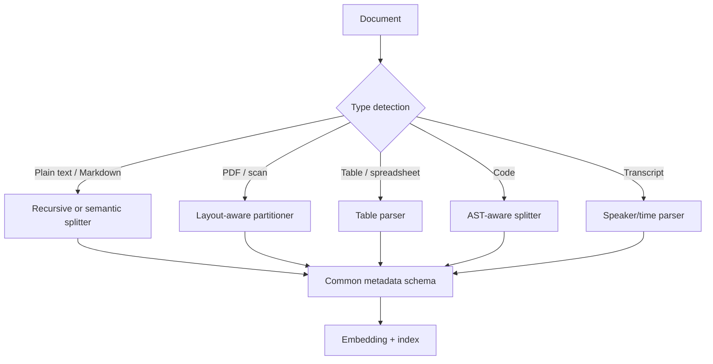

# 03 — Document-Type-Specific Parsing and Chunking

General-purpose chunking is not enough when documents have strong native structure. This file provides detailed guidance for code, tables/spreadsheets, PDFs/layout-rich documents, and transcripts.

## 1. Code and AST-aware chunking

### Why code is different

Code is not ordinary prose. Its meaning depends on syntax, scope, imports, symbols, inheritance, decorators, comments, tests, configuration files, and cross-file dependencies. A chunk that contains a function body but not its signature may be misleading. A chunk that contains a method but not the class state may be incomplete. A chunk that contains a call site but not the callee may be insufficient for code understanding.

### Parsing backbone

Use a language-aware parser when possible. Tree-sitter is a common option because it supports incremental parsing and many programming languages. AST-aware parsing can identify functions, classes, methods, imports, comments, docstrings, and blocks.

### Candidate chunking strategies for code

| Strategy | Description | Strength | Weakness |
|---|---|---|---|
| Fixed/sliding window | Split by characters, lines, or tokens with overlap. | Surprisingly strong baseline; captures local code continuity. | May split syntax units. |
| Function-level | One function/method per chunk. | Natural semantic unit for many tasks. | Can miss class/import/global context; recent evidence suggests it can underperform. |
| Class/module-level | One class or file-level section per chunk. | Preserves larger context. | Larger chunks can dilute retrieval. |
| AST-node chunking | Use syntax tree nodes subject to size constraints. | Preserves syntactic validity. | Parser complexity and language-specific behavior. |
| cAST-style chunking | Create chunks from compositional AST traversal. | Better syntax preservation than naive function chunks. | More complex to implement. |
| Dependency-aware | Attach imports, signatures, docstrings, or call graph metadata. | Improves context for understanding tasks. | Requires static analysis. |

### Key parameters

| Parameter | Meaning |
|---|---|
| `language` | Parser grammar and syntax rules. |
| `max_chars` / `max_tokens` | Prevent oversized code chunks. |
| `overlap_lines` | Preserve local context around boundaries. |
| `include_imports` | Whether to prepend relevant imports to chunks. |
| `include_docstrings` | Whether docstrings/comments are kept with code units. |
| `symbol_metadata` | Function/class/module names, path, namespace. |
| `cross_file_context_budget` | How much related code can be retrieved or expanded. |
| `parser_fallback` | What happens when parsing fails. |

### Failure modes

| Failure mode | Description | Mitigation |
|---|---|---|
| Syntax split | Chunk starts/ends inside a syntactic block. | AST-aware boundaries or overlap. |
| Context starvation | Function lacks imports, types, class state, or caller/callee context. | Parent expansion, dependency retrieval, cross-file context. |
| Function-only overconfidence | Treating functions as always optimal. | Compare against sliding window and AST variants. |
| Parser failure | Unsupported syntax or generated files break parser. | Fallback to line/token windows; log parse errors. |
| Repository-scale ambiguity | Same symbol appears in multiple files. | Store path, namespace, class, and import metadata. |

### Recommended default

For code RAG, start with two baselines:

1. A **sliding-window code splitter** with overlap.
2. An **AST-aware splitter** that preserves functions/classes/modules where possible.

Then evaluate against task-specific queries such as bug localization, API usage, code completion, documentation QA, and dependency tracing. Do not assume function-level chunks are optimal without testing.

### Evaluation ideas

- Retrieval recall of known relevant files/functions.
- Exact symbol recall.
- Answer faithfulness to retrieved code.
- Cross-file completion accuracy.
- Latency and token cost at repository scale.
- Duplicate retrieval rate caused by overlap.

## 2. Tables and spreadsheets

### Why tables are different

Tables encode meaning through structure. A cell value is usually uninterpretable without its row key, column header, sheet name, section title, or unit. Flattening a table into plain text often destroys this structure. For example, the value “12.4” may mean revenue, error rate, temperature, or sample size depending on its header.

### Parsing backbone

Prefer structured extraction formats over plain text:

- CSV rows with headers.
- XLSX sheets, tables, named ranges, and merged-cell metadata.
- HTML table representation.
- Markdown tables only if structure is simple.
- PDF table extraction with row/column geometry where available.

### Candidate chunking strategies for tables

| Strategy | Description | Best for |
|---|---|---|
| Whole-table chunk | Keep entire table together. | Small tables. |
| Row-preserving chunks | Group rows under repeated headers. | Medium/large tables. |
| Key-value linearization | Convert each row to `header: value` pairs. | Retrieval over records. |
| Sheet-level parent + row children | Index rows; return sheet/table parent. | QA requiring broader context. |
| Column-group chunking | Split wide tables by semantically related columns. | Very wide tables. |
| Hierarchical row tree | Preserve nested row/section hierarchy. | Complex spreadsheets. |

### Key parameters

| Parameter | Meaning |
|---|---|
| `header_policy` | Repeat headers in every chunk or store as metadata. |
| `row_group_size` | Number of rows per chunk. |
| `max_tokens` | Hard cap after linearization. |
| `wide_table_policy` | Split columns, summarize, or preserve HTML. |
| `merged_cell_policy` | How merged cells propagate to rows/columns. |
| `sheet_metadata` | Workbook, sheet name, table name, range. |
| `unit_normalization` | Whether units are repeated in row text. |

### Failure modes

| Failure mode | Description | Mitigation |
|---|---|---|
| Header detachment | Values indexed without column names. | Repeat headers or key-value linearize. |
| Row fragmentation | A record is split across chunks. | Row-preserving grouping. |
| Wide-table truncation | Too many columns exceed token budget. | Column grouping or HTML-aware summarization. |
| Merged-cell ambiguity | Category labels spanning rows are lost. | Propagate merged labels into each row. |
| Numeric lexical weakness | Dense embeddings may poorly match numbers. | Hybrid retrieval, metadata filters, exact search. |
| Unit loss | Values lack units/currency/time period. | Normalize and repeat units. |

### Recommended default

For structured tables and spreadsheets, use row-preserving, header-preserving chunking. For small tables, keep the whole table. For large tables, chunk by row groups and repeat column headers in every chunk. For each row, consider a key-value rendering:

```text
Sheet: Q4 Metrics
Table: Revenue by Region
Row 17:
Region: Ontario
Quarter: 2025-Q4
Revenue CAD: 12.4M
YoY growth: 8.1%
```

For complex spreadsheets, store sheet/table parents and row-level children.

### Evaluation ideas

- Header-value grounding accuracy.
- Row retrieval recall.
- Numeric exact-match accuracy.
- Robustness to wide tables.
- Ability to answer aggregation queries separately from lookup queries.

## 3. PDFs and layout-rich documents

### Why PDFs are different

PDFs are presentation formats, not clean text containers. Text extraction may produce broken reading order, repeated headers/footers, misplaced captions, fragmented tables, missing images, and OCR noise. Chunking raw extracted text can preserve the wrong order and lose the visual cues that humans rely on.

### Parsing backbone

A layout-aware pipeline should include:

1. File type detection.
2. Text extraction when available.
3. OCR for scanned or image-only pages.
4. Layout detection for columns, titles, tables, figures, captions, and page regions.
5. Reading-order reconstruction.
6. Element typing.
7. Metadata attachment: page number, coordinates, element type, section path.

Tools such as Unstructured expose partitioning and chunking strategies that treat documents as elements before chunking. Models such as LayoutLM and DocLLM motivate the use of layout information in document understanding.

### Candidate chunking strategies for PDFs

| Strategy | Description | Best for |
|---|---|---|
| By title/section | Group content under detected titles. | Reports, manuals, contracts. |
| By page | Keep page boundaries. | Forms, invoices, citation-critical PDFs. |
| By element | Index paragraphs, tables, titles, lists separately. | Mixed-layout documents. |
| Table-preserving | Keep tables as distinct chunks or structured data. | Financial/scientific PDFs. |
| Figure/caption linking | Store figure captions with nearby text. | Scientific reports. |
| Parent page + child elements | Retrieve elements, return page/section. | Layout-rich QA. |

### Key parameters

| Parameter | Meaning |
|---|---|
| `strategy` | Fast text extraction, high-resolution layout inference, OCR-only. |
| `chunking_strategy` | Basic, by-title, by-page, element-based. |
| `max_characters` | Hard maximum per chunk. |
| `new_after_n_chars` | Soft maximum encouraging a new chunk. |
| `combine_text_under_n_chars` | Merge tiny elements with neighbors. |
| `include_orig_elements` | Preserve element list inside chunks. |
| `extract_tables` | Whether to extract tables as structured elements. |
| `page_break_policy` | Whether page boundaries are hard or soft. |
| `boilerplate_filter` | Remove repeated headers/footers. |

### Failure modes

| Failure mode | Description | Mitigation |
|---|---|---|
| Reading-order error | Multi-column text is sequenced incorrectly. | Use layout inference and manual audits. |
| OCR corruption | Scanned text contains recognition errors. | OCR confidence filters, image preprocessing. |
| Table destruction | Tables become incoherent line text. | Table extraction and table-specific chunking. |
| Header/footer pollution | Repeated boilerplate appears in every chunk. | Detect repeated page regions. |
| Title misclassification | Section hierarchy is wrong. | Heading rules, font/layout features, validation. |
| Caption detachment | Figures/tables lose captions. | Link captions to nearby objects. |
| Page boundary split | A paragraph or table spans pages. | Soft page boundary with continuation detection. |

### Recommended default

For PDFs, parse first and chunk second. A good default is:

1. Use layout-aware partitioning.
2. Remove repeated headers/footers.
3. Preserve page and coordinate metadata.
4. Use by-title chunking for reports/manuals/contracts.
5. Use by-page or page-parent/element-child retrieval for forms and invoices.
6. Extract tables separately and apply table-specific chunking.

### Evaluation ideas

- Page-citation accuracy.
- Table extraction accuracy.
- Reading-order audit on sampled pages.
- OCR error rate in answer-bearing spans.
- Retrieval recall by page/section.
- Faithfulness conditioned on extracted layout elements.

## 4. Transcripts, meetings, podcasts, and speech-derived text

### Why transcripts are different

Transcripts are sequential, conversational, and often noisy. Meaning depends on speaker identity, turn adjacency, interruptions, timestamps, and sometimes audio context. ASR errors, diarization mistakes, filler words, and overlapping speech create parsing issues before chunking begins.

### Parsing backbone

A transcript parser should preserve:

- Speaker labels.
- Start and end timestamps.
- Turn boundaries.
- Confidence scores when available.
- ASR source and model metadata.
- Topic or agenda sections if available.
- Conversation-level metadata: meeting title, participants, date.

### Candidate chunking strategies for transcripts

| Strategy | Description | Best for |
|---|---|---|
| Fixed time window | Chunk every `n` seconds/minutes. | Audio-aligned retrieval. |
| Speaker-turn chunking | One or more turns per chunk. | Dialogue QA. |
| Sliding turn window | Retrieve a turn with neighboring turns. | Local conversational context. |
| Topic segmentation | Chunk by inferred topic shifts. | Long meetings/podcasts. |
| Agenda-section chunking | Use agenda or chapters. | Structured meetings. |
| Parent-child transcript | Index turns; return topic segment. | Precise retrieval + synthesis. |

### Key parameters

| Parameter | Meaning |
|---|---|
| `turn_window_size` | Number of previous/next turns included. |
| `time_window_seconds` | Fixed temporal segment length. |
| `speaker_merge_policy` | Merge short adjacent turns by same speaker. |
| `pause_threshold` | Time gap used to infer boundary. |
| `topic_threshold` | Sensitivity for topic segmentation. |
| `asr_confidence_filter` | Mark or remove low-confidence spans. |
| `overlap_policy` | Overlap turns or seconds between chunks. |

### Failure modes

| Failure mode | Description | Mitigation |
|---|---|---|
| Speaker ambiguity | Wrong diarization label. | Preserve confidence; allow correction. |
| Context crossing turns | Answer depends on previous question or later clarification. | Sentence/turn windows. |
| ASR error | Key terms are mistranscribed. | Hybrid lexical/fuzzy retrieval; domain vocabulary. |
| Filler noise | Chunks dominated by disfluency. | Light cleanup while preserving meaning. |
| Topic drift | Long windows mix agenda items. | Topic segmentation or agenda parsing. |
| Timestamp loss | Retrieved answer cannot be traced to audio. | Preserve timestamps in metadata. |

### Recommended default

For transcripts, start with speaker-turn chunking plus a sliding window of adjacent turns. For long meetings, add topic segmentation or agenda-section parents. Preserve timestamps and speakers in every chunk.

Example chunk rendering:

```text
Meeting: Product Sync
Time: 00:14:32–00:15:08
Speaker: Priya
Previous turn: Arjun asked whether the ingestion pipeline handles tombstones.
Current turn: Priya confirmed that deletes are emitted through CDC and queued for index deletion.
Next turn: James asked whether re-embedding happens on schema change.
```

### Evaluation ideas

- Answer span timestamp accuracy.
- Speaker attribution accuracy.
- Retrieval recall over multi-turn answers.
- Robustness to ASR errors.
- Ability to distinguish decisions, action items, and discussion.

## 5. Mixed-document corpora

Many production corpora contain all of the above: PDFs, HTML, Markdown, spreadsheets, code, tickets, chat logs, and transcripts. In such cases, do not force all documents through one splitter. Use a router:



A common metadata schema should include:

| Field | Description |
|---|---|
| `document_id` | Stable source identifier. |
| `chunk_id` | Stable chunk identifier. |
| `parent_id` | Parent document/section/page/table/function. |
| `source_type` | PDF, HTML, code, table, transcript, etc. |
| `section_path` | Hierarchical title path. |
| `page_number` | Page for PDFs. |
| `line_range` | Lines for code/text. |
| `row_range` | Rows for tables. |
| `timestamp_range` | Transcript/audio span. |
| `element_type` | Title, paragraph, table, code, speaker turn. |
| `parser_version` | Parser used for reproducibility. |
| `chunker_version` | Chunking config used for reproducibility. |
| `embedding_model` | Model used for vectorization. |
| `content_hash` | Hash for change detection. |

## 6. Document-type defaults

| Corpus type | Recommended baseline | Escalation path |
|---|---|---|
| Plain prose | Recursive chunking | Semantic, parent-child, proposition |
| Markdown/docs | Markdown-aware recursive | Section-parent + paragraph children |
| Academic PDFs | Layout-aware by-title | Late chunking, citation-aware parent-child |
| Scanned forms | OCR + layout-aware by-page | Human audit, field extraction |
| Tables/spreadsheets | Row/header-preserving | Sheet-parent + row children |
| Code repos | Sliding window + AST-aware | Dependency-aware retrieval |
| Meeting transcripts | Speaker-turn windows | Topic-parent + turn children |
| Legal/contracts | Layout/section-aware | Clause-level children + section parents |
| Support tickets/chats | Thread/message windows | Conversation summary parents |
