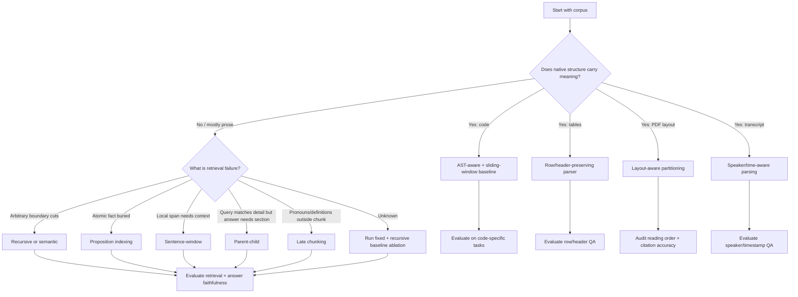

# 04 — Selection Framework and Decision Matrix

This file turns the literature review into a practical method-selection framework.

## 1. The central decision rule

Choose chunking and parsing based on the **dominant failure mode**, not based on whichever splitter is fashionable.

| Observed failure | Likely cause | First intervention |
|---|---|---|
| Correct document retrieved but answer unsupported | Chunk too large, noisy, or wrong generation context | Smaller child chunks, reranking, evidence filtering |
| Correct fact exists but not retrieved | Boundary split or embedding dilution | Recursive/semantic/proposition chunking |
| Retrieved sentence lacks enough context | Unit too small | Sentence-window or parent-child retrieval |
| Query refers to table values incorrectly | Header/row structure lost | Table-aware row/header chunking |
| PDF answers cite wrong section/page | Layout parser or metadata failure | Layout-aware parsing with page coordinates |
| Code answer misses imports/types/callees | Cross-file context missing | AST/dependency-aware chunking and parent expansion |
| Transcript answer misses who said what | Speaker/timestamp metadata lost | Speaker-turn parsing and turn windows |
| Top-k contains duplicate chunks | Overlap too high or near-duplicate indexing | Reduce overlap; add MMR/diversity; deduplicate |
| Model answers from irrelevant parent context | Parent expansion too broad | Smaller parents, automerge threshold, reranking |

## 2. Decision tree



## 3. Strategy selection matrix

| Application goal | Best starting point | Reason | Escalation |
|---|---|---|---|
| Basic semantic search over prose docs | Recursive | Strong simple default; preserves paragraphs better than fixed. | Semantic chunking if topic mixing is high. |
| Fast proof-of-concept RAG | Fixed + recursive ablation | Cheap and quick to implement. | Parent-child if answers lack context. |
| Citation-heavy QA | Sentence-window or small recursive chunks | Precise evidence localization. | Parent expansion with citation filtering. |
| Compliance/rules lookup | Proposition + parent source links | Atomic fact retrieval. | Human validation of propositions. |
| Long technical manuals | Section-aware + parent-child | Retrieves details but returns section context. | Late chunking if definitions/pronouns cause misses. |
| Research paper QA | Layout-aware by-title | Captures sections, captions, tables. | Late chunking or semantic sectioning. |
| Invoices/forms | Layout-aware by-page/field | Spatial structure defines meaning. | Field extraction and validation. |
| Spreadsheets | Row/header-preserving | Values require headers and row keys. | Sheet-parent + row children. |
| Code repository assistant | Sliding window + AST-aware | Avoids function-only assumptions. | Dependency-aware expansion. |
| Meeting transcript QA | Speaker-turn window | Preserves speaker and adjacency. | Topic parent segments. |
| Multi-hop QA | Small chunks + graph/parent expansion | Evidence may be distributed. | Reranking and multi-query retrieval. |

## 4. Parameter tuning principles

### 4.1 Chunk size

Chunk size determines the tradeoff between embedding specificity and context completeness.

- Smaller chunks improve precision and citation granularity.
- Larger chunks improve context completeness and reduce top-k fragmentation.
- Too-small chunks often require parent expansion.
- Too-large chunks often require reranking or compression.

Recommended tuning process:

1. Choose three sizes: small, medium, large.
2. Keep embedding model, retriever, reranker, and top-k constant.
3. Measure retrieval recall, answer faithfulness, context precision, duplicate rate, latency, and token cost.
4. Pick the smallest chunk size that does not damage answer completeness.

### 4.2 Overlap

Overlap protects against boundary cuts but creates duplicated evidence. Treat overlap as a cost parameter.

Good overlap values depend on the unit:

| Unit | Overlap approach |
|---|---|
| Character/token chunks | 5–20% of chunk size as a starting range. |
| Paragraph chunks | Repeat heading/section metadata rather than raw overlap. |
| Sentence windows | Use previous/next sentence metadata instead of textual overlap. |
| Code | Overlap by lines or include enclosing signature/imports. |
| Tables | Repeat headers, not arbitrary row overlap. |
| Transcripts | Overlap by adjacent turns or time intervals. |

### 4.3 Top-k and chunk granularity

Top-k is not independent of chunk size. Small chunks usually need larger top-k or parent expansion. Large chunks usually need smaller top-k but stronger reranking. Evaluate `chunk_size × top_k × reranker` jointly.

### 4.4 Metadata as context

Metadata can be more valuable than overlap. Important metadata includes:

- Document title.
- Section path.
- Page number.
- Heading hierarchy.
- Table name and headers.
- Code path and symbol name.
- Speaker and timestamp.
- Source version and parser version.

Do not treat metadata only as filters. Often it should be included in the embedded text or in the generation context.

## 5. When to use which method

### Use fixed chunking when...

- You need a controlled baseline.
- Documents are homogeneous and plain text.
- You need fast ingestion.
- You are doing an early benchmark.

Avoid fixed chunking when structure matters.

### Use recursive chunking when...

- You want a robust default for prose.
- Paragraphs and separators are meaningful.
- You need low complexity.

Avoid recursive chunking when raw text extraction is poor or structural units are non-textual.

### Use semantic chunking when...

- Topic boundaries are not explicitly marked.
- Recursive splitting creates mixed-topic chunks.
- You can afford boundary embedding cost.

Avoid semantic chunking when text is noisy, short, tabular, or code-like.

### Use sentence-window chunking when...

- Evidence is sentence-level.
- You need precise citations.
- Local context is enough for generation.

Avoid sentence-window when answers require long-range synthesis unless parent expansion is added.

### Use proposition chunking when...

- Queries target atomic facts.
- Source text is dense and multi-fact.
- Prompt budget is tight.
- You can validate generated propositions.

Avoid proposition-only retrieval when qualifiers and discourse relations are important.

### Use late chunking when...

- Independent chunk embeddings lose context.
- Documents are long.
- Pronouns, abbreviations, and earlier definitions matter.
- Long-context embedding is affordable.

Avoid it for short self-contained documents.

### Use parent-child retrieval when...

- Small chunks retrieve well but answers need broader context.
- You want precision plus synthesis.
- You can maintain hierarchy metadata.

Avoid it when context budget is extremely tight or parent chunks are noisy.

### Use layout-aware chunking when...

- PDFs, forms, pages, tables, captions, or layout affect meaning.
- Page citations matter.
- OCR or reading order can fail.

Avoid raw text chunking for scanned or complex PDFs.

## 6. Offline evaluation plan for choosing a method

A good chunking study should be factorial.

### 6.1 Candidate factors

| Factor | Levels |
|---|---|
| Parser | plain text, layout-aware, table-aware, AST-aware |
| Chunker | fixed, recursive, semantic, sentence-window, proposition, parent-child, late |
| Chunk size | small, medium, large |
| Overlap | none, low, medium |
| Retriever | BM25, dense, hybrid |
| Reranker | none, cross-encoder, LLM reranker |
| Top-k | 3, 5, 10, 20 |
| Context expansion | none, window, parent, sibling merge |

### 6.2 Metrics

Use both retrieval and generation metrics.

| Metric | Why it matters |
|---|---|
| Recall@k | Did retrieval find the gold evidence? |
| MRR / nDCG | Was the evidence ranked highly? |
| Context precision | How much retrieved context is actually useful? |
| Faithfulness / groundedness | Is the answer supported by retrieved evidence? |
| Citation accuracy | Does cited chunk/page/row/line support the claim? |
| Duplicate rate | Are overlapping chunks crowding top-k? |
| Latency | Does method fit production requirements? |
| Index size | How much storage and memory does it require? |
| Ingestion cost | How expensive is preprocessing? |
| Update cost | How hard is incremental refresh? |

### 6.3 Gold-set construction

For chunking evaluation, gold sets should include evidence labels, not just answers.

Each test item should contain:

```yaml
question: "What does the policy say about re-embedding after a model upgrade?"
expected_answer: "Documents should be re-embedded when the embedding model changes, usually through blue-green index versioning."
gold_evidence:
  - document_id: "rag_ops_guide"
    section_path: ["Operations", "Re-embedding", "Model upgrades"]
    page: 17
    span: "..."
answer_type: "procedural"
difficulty: "medium"
failure_target: "section context"
```

Include hard cases:

- Boundary-crossing answers.
- Multi-hop questions.
- Table lookups.
- No-answer questions.
- Similar distractor sections.
- Abbreviations and pronouns.
- Updated/deprecated documents.
- Long documents with repeated headings.

## 7. Operational selection checklist

Before choosing a chunker, answer these questions:

1. What document types are in the corpus?
2. Does native structure carry meaning?
3. What is the target answer granularity?
4. Is citation or provenance required?
5. Are there tables, code, images, forms, or transcripts?
6. Is the retrieval target usually one fact, one paragraph, one section, or multiple documents?
7. What is the context budget?
8. What is the latency budget?
9. How often does the corpus update?
10. Can you afford LLM-based preprocessing?
11. Can you preserve source-span links after transformation?
12. What failure mode are you actually trying to fix?

## 8. Recommended starting configurations

### General prose RAG

```yaml
parser: text_or_markdown
chunker: recursive
chunk_size_tokens: [384, 768, 1200]
overlap_tokens: [50, 100]
metadata: [document_title, section_path, source_url, version]
retrieval: hybrid_dense_bm25
reranking: cross_encoder_optional
```

### Citation-heavy policy QA

```yaml
parser: layout_or_markdown_aware
chunker: sentence_window
window_size_sentences: [2, 3, 5]
embed: sentence_only_plus_section_metadata
llm_context: expanded_sentence_window
metadata: [document_title, section_path, page, paragraph_id]
```

### Fact-dense knowledge base

```yaml
parser: recursive_base_chunks
chunker: proposition
base_chunk_size_tokens: [512, 1024]
validation: llm_or_human_sample
retrieval_unit: proposition
context_unit: parent_source_chunk
metadata: [source_span, proposition_id, parent_id]
```

### Complex PDF corpus

```yaml
parser: layout_aware_partitioning
ocr: enabled_for_scans
chunker: by_title_or_by_page
table_handling: separate_structured_table_chunks
metadata: [page, coordinates, element_type, section_path]
quality_audit: reading_order_sample
```

### Code repository

```yaml
parser: tree_sitter_or_language_server
chunkers: [sliding_window, ast_aware]
chunk_size_chars: [1000, 2000, 3000]
overlap_lines: [20, 50]
metadata: [repo, path, language, symbol, line_range]
context_expansion: imports_and_parent_class_optional
```

### Transcript QA

```yaml
parser: speaker_time_turns
chunker: turn_window
window_turns: [2, 4, 6]
metadata: [speaker, start_time, end_time, meeting_id, participants]
parent: topic_segment_optional
```

## 9. Final practical recommendation

For a serious system, do not make chunking a one-time engineering choice. Treat it as an experimental factor. The minimum defensible process is:

1. Build fixed and recursive baselines.
2. Add document-type-specific parsers where structure matters.
3. Build a gold set with evidence labels.
4. Run chunking × top-k × reranking ablations.
5. Inspect failure cases manually.
6. Escalate only to semantic, proposition, late, or hierarchical methods when they fix measured failures.
7. Version chunking configs so index changes are reproducible.
