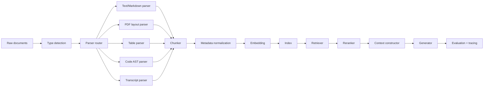

# 05 — Implementation Blueprints, Pseudocode, and Ablation Plans

This file provides implementation-oriented guidance for building and evaluating chunking/parsing pipelines.

## 1. Reference pipeline architecture



## 2. Common data model

A robust chunk object should separate content, metadata, relationships, and processing versions.

```json
{
  "chunk_id": "doc123:sec4:p2:chunk7",
  "document_id": "doc123",
  "parent_id": "doc123:sec4",
  "content": "The visible text used for embedding and generation.",
  "content_for_embedding": "Optional rewritten or metadata-enriched text.",
  "content_for_generation": "Optional source-faithful text passed to the LLM.",
  "source_type": "pdf",
  "element_type": "narrative_text",
  "section_path": ["Operations", "Freshness", "Re-embedding"],
  "page_range": [12, 13],
  "line_range": null,
  "row_range": null,
  "timestamp_range": null,
  "coordinates": null,
  "relationships": {
    "previous": "...",
    "next": "...",
    "children": [],
    "parent": "doc123:sec4"
  },
  "parser_version": "layout-parser-v2",
  "chunker_version": "by-title-768tok-v1",
  "embedding_model": "text-embedding-model-name",
  "content_hash": "sha256..."
}
```

### Key design principle

Keep three forms separate:

1. **Source-faithful text**: what the document actually says.
2. **Embedding text**: may include metadata-enriched context.
3. **Generation text**: what is shown to the LLM and cited.

For example, a table row may embed as key-value text but generate as a markdown table row with headers.

## 3. Parser router pseudocode

```python
def route_document(doc):
    doc_type = detect_type(doc)

    if doc_type in {"py", "js", "ts", "java", "go", "rs", "cpp"}:
        return parse_code_with_ast(doc)

    if doc_type in {"csv", "xlsx", "parquet"}:
        return parse_table_or_spreadsheet(doc)

    if doc_type == "pdf":
        if is_scanned(doc) or has_complex_layout(doc):
            return parse_pdf_layout_aware(doc)
        return parse_pdf_text_with_layout_metadata(doc)

    if doc_type in {"vtt", "srt", "transcript", "audio_transcript"}:
        return parse_transcript_turns(doc)

    if doc_type in {"md", "html", "txt"}:
        return parse_text_or_markdown(doc)

    return parse_generic_text(doc)
```

## 4. Recursive chunking pseudocode

```python
def recursive_split(text, separators, chunk_size, overlap, length_fn):
    if length_fn(text) <= chunk_size:
        return [text]

    if not separators:
        return fixed_split(text, chunk_size, overlap, length_fn)

    sep = separators[0]
    pieces = text.split(sep) if sep else list(text)

    chunks = []
    buffer = []

    for piece in pieces:
        candidate = sep.join(buffer + [piece]) if sep else "".join(buffer + [piece])
        if length_fn(candidate) <= chunk_size:
            buffer.append(piece)
        else:
            if buffer:
                chunks.extend(merge_with_overlap(buffer, sep, chunk_size, overlap, length_fn))
            if length_fn(piece) > chunk_size:
                chunks.extend(recursive_split(piece, separators[1:], chunk_size, overlap, length_fn))
                buffer = []
            else:
                buffer = [piece]

    if buffer:
        chunks.extend(merge_with_overlap(buffer, sep, chunk_size, overlap, length_fn))

    return chunks
```

## 5. Semantic chunking pseudocode

```python
def semantic_chunk(sentences, embed, buffer_size=1, percentile=95, max_tokens=1000):
    # Build buffered sentence units.
    units = []
    for i in range(len(sentences)):
        left = max(0, i - buffer_size)
        right = min(len(sentences), i + buffer_size + 1)
        units.append(" ".join(sentences[left:right]))

    vectors = embed(units)

    # Compute adjacent semantic distances.
    distances = []
    for i in range(len(vectors) - 1):
        distances.append(1 - cosine_similarity(vectors[i], vectors[i + 1]))

    threshold = percentile_value(distances, percentile)
    breakpoints = {i + 1 for i, d in enumerate(distances) if d >= threshold}

    # Merge sentences until breakpoint or max token limit.
    chunks = []
    current = []
    for i, sent in enumerate(sentences):
        current.append(sent)
        if (i + 1 in breakpoints) or token_len(current) >= max_tokens:
            chunks.append(" ".join(current))
            current = []

    if current:
        chunks.append(" ".join(current))

    return chunks
```

## 6. Proposition extraction blueprint

### Prompt sketch

```text
You are extracting retrieval propositions from a source passage.
Return atomic, self-contained propositions that are directly supported by the passage.
Do not infer unstated facts.
Include necessary entities, dates, units, and qualifiers.
Avoid pronouns unless the referent is explicit.
Return JSON with: proposition, source_quote, confidence.
```

### Pseudocode

```python
def proposition_index(document):
    parent_chunks = recursive_split(document.text, chunk_size=800, overlap=100)
    proposition_nodes = []

    for parent in parent_chunks:
        props = llm_extract_propositions(parent.text)
        for p in props:
            if validate_supported(p, parent.text):
                proposition_nodes.append({
                    "content": p["proposition"],
                    "parent_id": parent.id,
                    "source_quote": p.get("source_quote"),
                    "metadata": parent.metadata,
                })

    return proposition_nodes
```

### Validation checks

- Proposition contains explicit subject.
- Proposition contains necessary qualifier.
- Proposition can be traced to source quote.
- Proposition is not a summary of multiple unrelated facts.
- Proposition does not introduce external knowledge.

## 7. Parent-child retrieval blueprint

```python
def build_parent_child_index(document):
    parents = split_by_section(document)
    children = []

    for parent in parents:
        child_chunks = recursive_split(parent.text, chunk_size=300, overlap=50)
        for child in child_chunks:
            children.append({
                "content": child,
                "parent_id": parent.id,
                "section_path": parent.section_path,
                "metadata": parent.metadata,
            })

    embed_and_index(children)
    store_parents(parents)
```

```python
def retrieve_parent_child(query, top_k_children=10, max_parents=4):
    child_hits = vector_search(query, top_k=top_k_children)
    parent_ids = rank_parent_ids(child_hits)
    parents = fetch_parents(parent_ids[:max_parents])
    return parents
```

### Practical variants

| Variant | Behavior |
|---|---|
| Child-only | Retrieve and generate from child chunks. |
| Child-to-parent | Retrieve child, replace with parent. |
| Child-plus-window | Retrieve child plus sibling chunks. |
| Automerge | Merge parent only when enough children are retrieved. |
| Section-path expansion | Retrieve child plus heading hierarchy. |

## 8. Layout-aware PDF blueprint

```python
def process_pdf(pdf):
    elements = partition_pdf(
        pdf,
        strategy="hi_res_if_needed",
        extract_tables=True,
        include_page_breaks=True,
    )

    elements = remove_repeated_headers_footers(elements)
    elements = repair_reading_order(elements)
    elements = attach_section_hierarchy(elements)

    chunks = []
    for section in group_by_title(elements):
        section_chunks = chunk_elements(
            section.elements,
            max_characters=1500,
            combine_text_under_n_chars=200,
            keep_tables_separate=True,
        )
        chunks.extend(section_chunks)

    return chunks
```

### PDF quality audit

Sample 20–50 pages and check:

- Does extracted text match visual reading order?
- Are titles correct?
- Are tables preserved?
- Are captions attached?
- Are headers/footers removed?
- Are page numbers correct?
- Are OCR errors concentrated in answer-bearing regions?

## 9. Table chunking blueprint

```python
def chunk_table(table, max_tokens=700):
    chunks = []
    current_rows = []

    for row in table.rows:
        rendered = render_row_as_key_values(row, headers=table.headers)
        candidate = render_table_chunk(table, current_rows + [rendered])

        if token_len(candidate) > max_tokens and current_rows:
            chunks.append(render_table_chunk(table, current_rows))
            current_rows = [rendered]
        else:
            current_rows.append(rendered)

    if current_rows:
        chunks.append(render_table_chunk(table, current_rows))

    return chunks
```

### Header-preserving rendering

```text
Workbook: sales_forecast.xlsx
Sheet: North America
Table: Quarterly Forecast
Columns: Region | Quarter | Revenue CAD | Forecast Confidence
Rows:
- Region: Ontario; Quarter: 2026-Q1; Revenue CAD: 12.4M; Forecast Confidence: 0.82
- Region: Quebec; Quarter: 2026-Q1; Revenue CAD: 9.8M; Forecast Confidence: 0.78
```

## 10. Code chunking blueprint

```python
def chunk_code_file(path, text, language):
    tree = try_parse_with_tree_sitter(text, language)

    if tree is None:
        return sliding_window_by_lines(text, window_lines=80, overlap_lines=20)

    chunks = []
    imports = extract_imports(tree, text)
    symbols = extract_symbols(tree, text)

    for symbol in symbols:
        symbol_text = extract_text(symbol.span, text)
        enriched = imports + "\n" + symbol_text if should_include_imports(symbol) else symbol_text

        if token_len(enriched) <= 1200:
            chunks.append(make_code_chunk(enriched, path, symbol))
        else:
            chunks.extend(split_large_symbol(symbol_text, path, symbol))

    if not chunks:
        chunks = sliding_window_by_lines(text, window_lines=80, overlap_lines=20)

    return chunks
```

### Code metadata

```yaml
repo: my-repo
path: src/retrieval/indexer.py
language: python
symbol_type: function
symbol_name: build_index
class_name: null
line_start: 42
line_end: 118
imports_included: true
parser: tree-sitter-python
```

## 11. Transcript chunking blueprint

```python
def chunk_transcript(turns, window_size=2):
    chunks = []
    for i, turn in enumerate(turns):
        left = max(0, i - window_size)
        right = min(len(turns), i + window_size + 1)
        context_turns = turns[left:right]

        chunks.append({
            "content": render_turn_window(context_turns, focus=i-left),
            "focus_speaker": turn.speaker,
            "start_time": context_turns[0].start,
            "end_time": context_turns[-1].end,
            "turn_ids": [t.id for t in context_turns],
        })

    return chunks
```

## 12. Ablation plan

### 12.1 Minimum viable chunking experiment

Run the following strategies on the same corpus and gold set:

1. Fixed 512-token chunks, 64-token overlap.
2. Fixed 1024-token chunks, 128-token overlap.
3. Recursive 768-token chunks, 100-token overlap.
4. Recursive 1200-token chunks, 150-token overlap.
5. Semantic chunking with medium threshold.
6. Parent-child: 300-token children, section parents.
7. Document-specific parser variant if applicable.

Keep constant:

- Embedding model.
- Vector database/index settings.
- Retriever top-k.
- Reranker.
- Prompt/context construction.
- Generator model.

Measure:

- Retrieval recall@k.
- nDCG@k or MRR.
- Context precision.
- Answer faithfulness.
- Citation correctness.
- Average prompt tokens.
- P50/P95 latency.
- Index size.
- Ingestion cost.

### 12.2 Factorial design

```yaml
factors:
  parser:
    - plain_text
    - layout_aware
  chunker:
    - fixed
    - recursive
    - semantic
    - parent_child
  chunk_size:
    - 384
    - 768
    - 1200
  overlap:
    - 0
    - 64
    - 128
  retriever:
    - dense
    - hybrid
  reranker:
    - none
    - cross_encoder
```

This design can be large. Use a staged approach:

1. Screen chunk size and parser first.
2. Fix the best two parsers/chunkers.
3. Tune top-k and reranker.
4. Evaluate final candidates on a held-out gold set.

## 13. Failure analysis template

For every failed query, record:

```yaml
query_id: q_042
question: "..."
expected_answer: "..."
failure_stage: retrieval | reranking | context_construction | generation | citation
retrieved_gold_evidence: false
top_retrieved_chunks:
  - chunk_id: "..."
    relevance: partial
    issue: "right document, wrong section"
chunking_issue:
  boundary_cut: true
  chunk_too_large: false
  chunk_too_small: true
  lost_metadata: false
  parser_error: false
recommended_fix: "parent-child retrieval with section parent"
```

## 14. Production monitoring

Chunking quality can drift when:

- Corpus format changes.
- New document templates appear.
- OCR quality changes.
- Embedding model changes.
- Parser version changes.
- Overlap/chunk size is reconfigured.
- Documents are updated incrementally.

Monitor:

| Signal | What it catches |
|---|---|
| Average chunks per document | Parser/chunker regression. |
| Average chunk token length | Broken splitting. |
| Empty/short chunk rate | Title-only or OCR artifacts. |
| Duplicate chunk rate | Excess overlap or boilerplate. |
| Retrieval no-hit rate | Embedding/chunk mismatch. |
| Citation support rate | Context and parsing failures. |
| Parser error rate | File format drift. |
| OCR confidence distribution | Scan quality drift. |

## 15. Versioning and reproducibility

Every indexed chunk should be reproducible from:

```yaml
source_document_version: sha256_or_etag
parser_name: unstructured_partition_pdf
parser_version: 0.x.y
parser_config:
  strategy: hi_res
  extract_tables: true
chunker_name: by_title
chunker_version: v3
chunker_config:
  max_characters: 1500
  combine_text_under_n_chars: 200
embedding_model: model_name_and_version
embedding_dim: 1024
index_version: corpus_2026_05_18_v4
```

Without this metadata, it is hard to explain why retrieval changed after a deployment.

## 16. Practical implementation rules

1. Always preserve source metadata.
2. Separate parser output from chunker output.
3. Never flatten tables blindly.
4. Never process PDFs as plain text without sampling reading order.
5. Never assume function-level code chunks are optimal.
6. Use sentence or parent windows instead of large raw overlap when possible.
7. Measure duplicate retrieval caused by overlap.
8. Include no-answer and hard-negative examples in the gold set.
9. Keep chunker configs versioned.
10. Re-index with blue-green index versions when changing chunking strategy.
