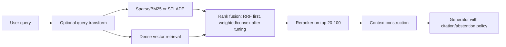

# Matching, Retrieval Pipelines, Reranking, and Cloud Platform Mapping

Generated: 2026-05-19

This Markdown bundle turns the research notes into a reusable technical report package. It is organized as separate files so each topic can be edited, cited, or given to an advisor/interviewer independently.

## Files

1. [`01_matching.md`](01_matching.md)  
   Dense retrieval, sparse retrieval, learned sparse models, late interaction, SPLADE, ColBERT, ColBERTv2, and practical matching-selection rules.

2. [`02_retrieval_pipelines.md`](02_retrieval_pipelines.md)  
   End-to-end retrieval architecture patterns, fusion, query transforms, adaptive/agentic retrieval, GraphRAG/KG-augmented retrieval, and pipeline decision flows.

3. [`03_reranking.md`](03_reranking.md)  
   Cross-encoders, listwise reranking, LLM-as-reranker, model-card style notes for BGE, Mixedbread, Cohere, Jina, and operational tuning.

4. [`04_cloud_platform_mapping.md`](04_cloud_platform_mapping.md)  
   AWS/GCP/Azure mapping across managed vector options, model hosting, serverless inference, private networking, KMS, IAM, observability, cost and residency drivers, plus Hugging Face Spaces.

5. [`05_decision_guide.md`](05_decision_guide.md)  
   Short, applied “when to use which” guide for retrieval design and cloud selection.

6. [`06_references.md`](06_references.md)  
   Primary papers, vendor docs, model cards, and implementation references.

## Recommended baseline

For most enterprise RAG/search systems, start with:

Default stack:

- **Retriever**: hybrid sparse + dense.
- **Fusion**: RRF unless scores are well normalized and alpha can be tuned.
- **Query transform**: use only when it solves a known failure mode.
- **Reranker**: cross-encoder for routine traffic, listwise/LLM reranker only for premium or hard queries.
- **Cloud**: choose based on existing commitment, residency/security constraints, managed-vs-control preference, and cost/latency profile.
