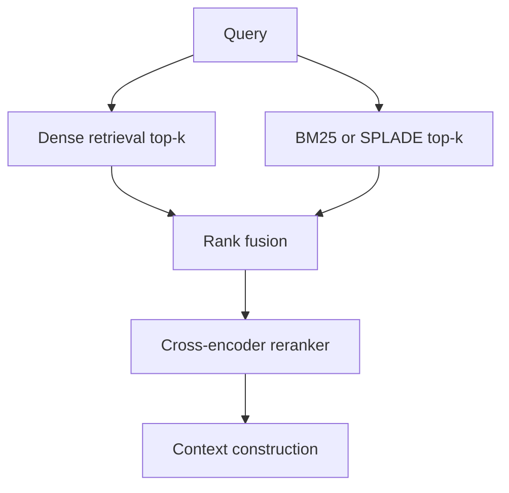

# Matching Methods in Neural Search

## 1. What “matching” means

Matching is the first relevance decision in a retrieval system. It answers: **which documents, chunks, passages, entities, or graph nodes should be considered candidates for this query?**

In RAG systems, matching is not merely a search concern. It shapes the entire downstream answer because the generator can only ground itself in what the retrieval stage exposes. Poor first-stage recall cannot usually be fixed by prompt engineering.

A production retrieval system normally separates matching into:

1. **Candidate generation**: retrieve a broad set of candidates quickly.
2. **Fusion / merging**: combine candidates from multiple retrieval channels.
3. **Reranking**: apply a more expensive relevance model on a smaller candidate set.
4. **Context construction**: choose what finally enters the LLM context window.

This file focuses on the first part: matching families.

---

## 2. Matching families

| Family | Representation | Retrieval structure | Main strength | Main weakness | Best use |
|---|---|---|---|---|---|
| Lexical sparse | Terms/postings, BM25-style scoring | Inverted index | Exact match, IDs, rare terms, transparent behavior | Weak synonym/semantic generalization | Enterprise search, legal, policy, code, product catalogs |
| Dense single-vector | One embedding per query/chunk | ANN/vector index | Semantic recall, simple serving, broad ecosystem | Can miss exact terms, IDs, numbers, negations | General RAG baseline, FAQ, knowledge bases |
| Learned sparse | Learned vocabulary activations, e.g. SPLADE | Inverted index / sparse vector infra | Lexical + semantic expansion, interpretable terms | Heavier indexing/training, vocabulary tied | Hybrid search where lexical cues matter |
| Late interaction | Multi-vector/token-level representation, e.g. ColBERT | Multi-vector index + MaxSim scoring | High first-stage quality, token-level matching | Larger index, heavier query-time scoring | Quality-first retrieval and hard semantic search |
| Cross-encoder matching | Joint query-document encoding | No full-corpus search; rerank only | Highest local relevance accuracy | Too slow for first-stage full search | Reranking top-k candidates |

---

## 3. Dense retrieval

Dense retrieval encodes query and document chunks into a shared vector space. Search is usually approximate nearest neighbor over vector similarity.

Typical scoring:

\[
s(q, d) = \cos(E_q(q), E_d(d))
\]

or dot product:

\[
s(q, d) = E_q(q)^\top E_d(d)
\]

### Strengths

Dense retrieval is the easiest neural-search default because it is:

- simple to deploy with managed vector databases;
- language-flexible if the embedding model is multilingual;
- good at synonymy and paraphrase;
- cheap enough for high-throughput first-stage retrieval;
- compatible with chunk-level RAG pipelines.

### Weaknesses

Dense retrieval can fail on:

- exact IDs, SKUs, ticket numbers, version numbers;
- legal clauses where wording matters;
- negation and fine-grained logical contrast;
- table headers and schema names;
- short ambiguous queries;
- queries that require rare terms.

### When dense retrieval is enough

Dense-only retrieval can be enough when:

- the corpus is semantically redundant;
- queries are natural-language questions;
- exact lexical constraints are not central;
- latency and simplicity dominate;
- you have a strong modern embedding model and good chunking.

Dense-only should be treated as a **baseline**, not as the final architecture for enterprise search.

---

## 4. Lexical retrieval and BM25

BM25 remains useful because it rewards exact term overlap while accounting for term frequency, inverse document frequency, and document length.

Canonical BM25 form:

\[
\text{BM25}(q,d) = \sum_{t \in q} IDF(t)
\cdot
\frac{f(t,d)(k_1+1)}
{f(t,d)+k_1(1-b+b\cdot |d|/\text{avgdl})}
\]

### Why BM25 still matters in RAG

BM25 is strong when the query contains terms that should not be semantically smoothed away:

- error codes;
- laws and policies;
- names and titles;
- software APIs;
- product names;
- structured metadata embedded in text;
- domain jargon.

In many enterprise systems, BM25 is not the “old baseline”; it is a **necessary safety rail** against dense retrieval’s tendency to blur exact constraints.

---

## 5. Learned sparse retrieval: SPLADE

SPLADE learns sparse term-weighted representations from transformers while preserving inverted-index compatibility.

The core idea is to convert text into a sparse vector over the vocabulary:

\[
\phi(d) \in \mathbb{R}^{|V|}
\]

where most entries are zero, and nonzero entries correspond to terms the model believes are relevant expansions or lexical anchors.

### What SPLADE buys you

SPLADE offers a middle ground:

- keeps sparse/inverted-index retrieval;
- supports learned expansion;
- improves recall for semantically related terms;
- maintains some interpretability because activations map to vocabulary terms;
- often works well on BEIR-style zero-shot retrieval benchmarks.

### Operational implications

SPLADE is attractive when:

- BM25 is too brittle;
- dense retrieval misses exact terms;
- you want learned expansion but still want sparse infrastructure;
- explainability and lexical anchoring matter;
- you can tolerate heavier indexing than BM25.

### Failure modes

SPLADE can be less ideal when:

- the vocabulary does not cover domain-specific strings well;
- index size becomes large due to expansion;
- the team lacks infrastructure for sparse neural indexing;
- dense retrieval already solves the problem cheaply.

---

## 6. Late interaction: ColBERT and ColBERTv2

ColBERT encodes query and document separately but keeps token-level vectors. Instead of compressing each document into one vector, it stores multiple token vectors.

A simplified ColBERT scoring function:

\[
s(q,d) = \sum_{i \in q} \max_{j \in d} E(q_i)^\top E(d_j)
\]

This is often called **MaxSim**.

### Why late interaction is powerful

Late interaction avoids the most severe bottleneck of dense retrieval: collapsing the entire document into one vector. It lets each query token find its strongest match among document tokens.

This improves:

- fine-grained relevance;
- multi-aspect queries;
- rare but meaningful terms;
- multilingual retrieval;
- compositional matching;
- first-stage quality before reranking.

### Why it is expensive

Late interaction creates an operational burden:

- more vectors per document;
- larger index;
- more query-time computation;
- more complex serving stack;
- harder incremental indexing;
- more memory pressure.

ColBERTv2 reduces the footprint through compression and improved supervision, but late interaction is still more expensive than single-vector dense retrieval.

### When to use ColBERT-style retrieval

Use late interaction when:

- first-stage quality is the bottleneck;
- you can afford a larger index;
- queries are complex and multi-faceted;
- dense+sparse hybrid still misses important candidates;
- you need a quality-first search system rather than the cheapest scalable baseline.

---

## 7. Matching-selection decision matrix

| Corpus/query condition | Recommended matching strategy |
|---|---|
| Short natural-language questions over explanatory docs | Dense baseline; add BM25 if exact terms appear |
| Enterprise docs with IDs, names, policies, and jargon | Hybrid BM25/SPLADE + dense |
| Legal/compliance corpus | BM25 or learned sparse + dense; rerank aggressively |
| Code/API documentation | Sparse lexical + dense; consider specialized code embeddings |
| Multilingual semantic search | Multilingual dense; consider ColBERT-style late interaction if quality matters |
| High update frequency | Dense or BM25 first; avoid heavy late-interaction unless needed |
| Quality-first, low QPS | Late interaction + cross-encoder reranking |
| Cost-first, high QPS | Dense or hybrid with shallow rerank |
| Multi-hop questions | Matching alone is not enough; use decomposition + fusion + reranking |
| Metadata-rich corpus | Self-query or structured filters before/alongside matching |

---

## 8. Implementation notes

### Candidate pool size

Common first-stage candidate sizes:

| Stage | Typical top-k |
|---|---:|
| Dense retrieval | 50-500 |
| BM25/SPLADE retrieval | 50-500 |
| Hybrid fused pool | 100-1000 before dedup |
| Reranker input | 20-100 |
| Final context chunks | 3-20 |

The exact number depends on latency, chunk size, reranker cost, and generator context budget.

### Chunking interaction

Matching quality depends on chunking:

- too small: loses context and semantic coherence;
- too large: dense vectors become diluted;
- no parent-child linking: final answer lacks surrounding context;
- no metadata: filtering and provenance become weak.

For RAG, chunking should be optimized jointly with retrieval and reranking, not treated as a preprocessing afterthought.

### Embedding drift

Embedding model upgrades require:

- re-embedding;
- index migration;
- shadow evaluation;
- regression tests on known query sets;
- versioned index names;
- fallback path to previous index.

---

## 9. Recommended baseline

Start here unless evidence says otherwise:

Then specialize:

- add HyDE/multi-query for vocabulary mismatch;
- add decomposition for multi-hop;
- add metadata filters for structured corpora;
- add late interaction when first-stage quality is still insufficient;
- add adaptive routing when traffic varies widely in complexity.
