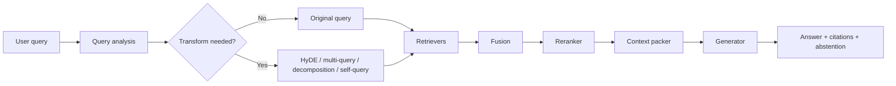
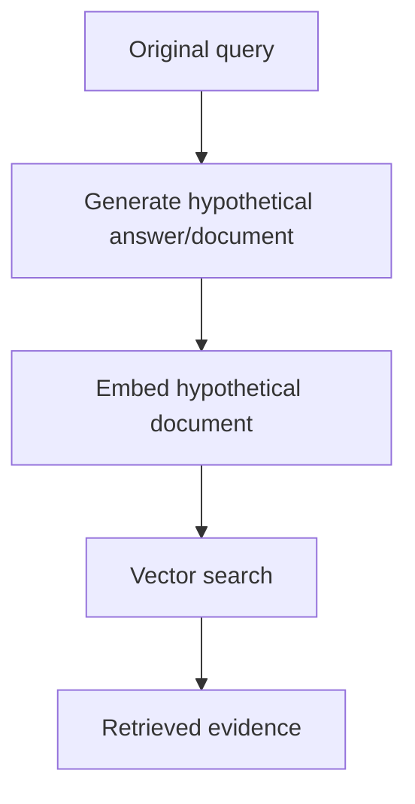
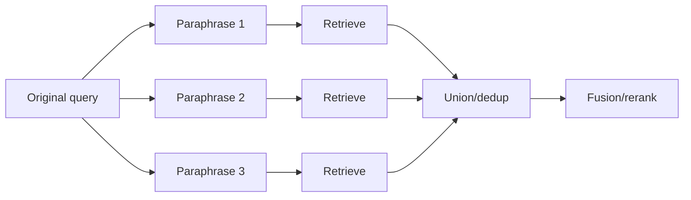
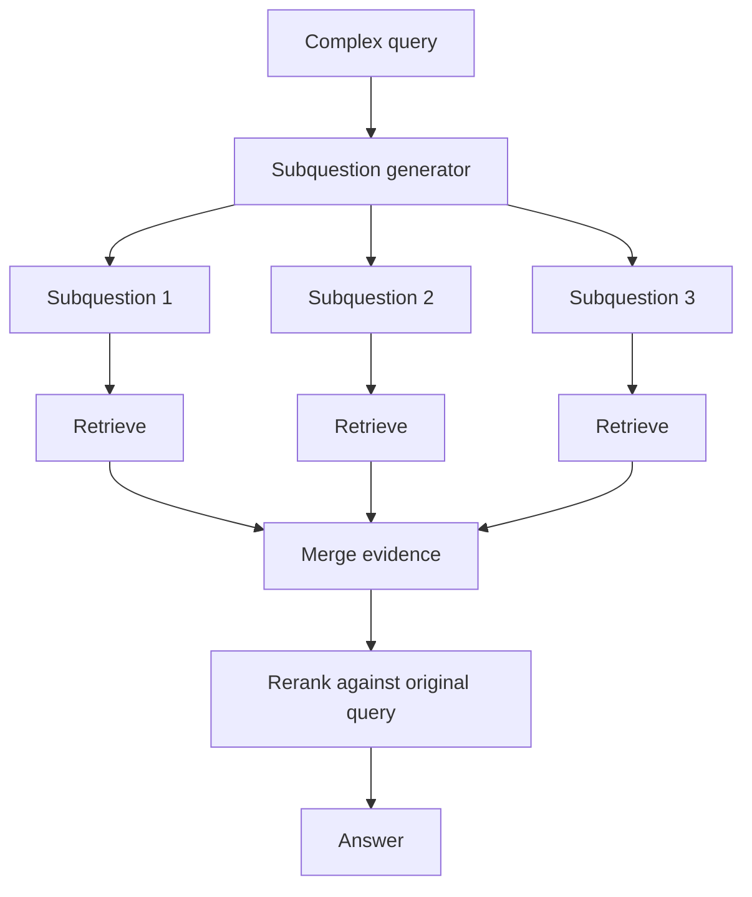
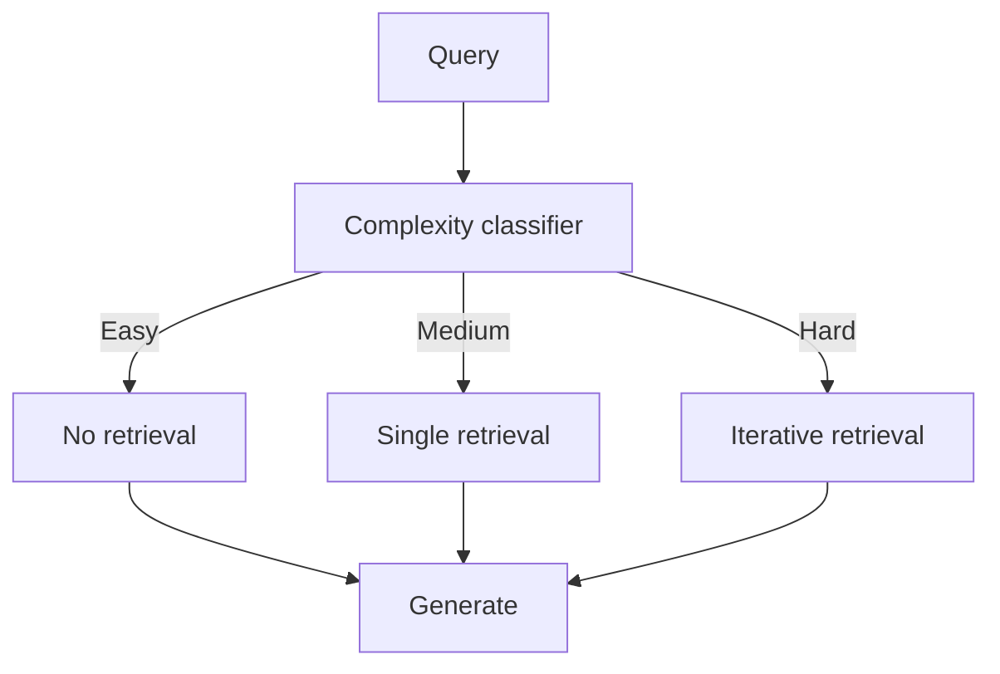
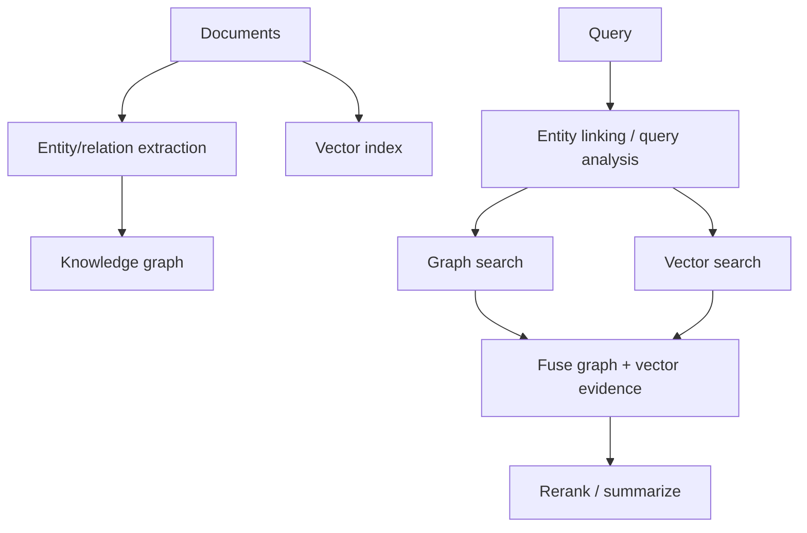
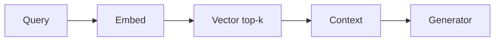
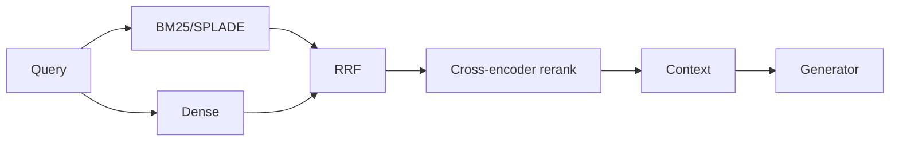
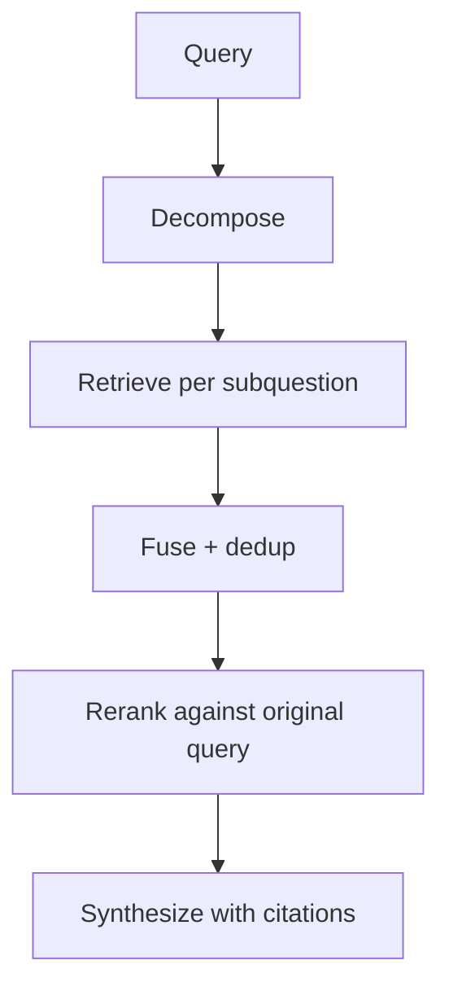
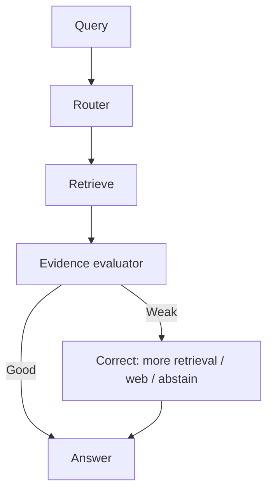

# Retrieval Pipelines

## 1. Pipeline as a sequence of relevance decisions

A retrieval pipeline is not just “embed, search, answer.” It is a chain of relevance decisions:

1. **Query interpretation**: what does the user actually need?
2. **Query transformation**: should the query be rewritten, decomposed, expanded, or structured?
3. **Candidate generation**: which retrieval channels should run?
4. **Fusion**: how should multiple candidate lists be merged?
5. **Reranking**: which candidates are strongest under a deeper relevance model?
6. **Context construction**: what evidence enters the generator prompt?
7. **Generation with grounding**: how does the model cite, abstain, or ask for clarification?
8. **Evaluation/monitoring**: how do we know the pipeline is working?



---

## 2. Fusion methods

Fusion combines results from different retrievers or transformed queries.

### 2.1 Reciprocal Rank Fusion

RRF uses ranks, not raw scores:

\[
\text{RRF}(d) = \sum_i \frac{1}{k + r_i(d)}
\]

where:

- \(d\) is a document/chunk;
- \(i\) indexes retrieval lists;
- \(r_i(d)\) is the rank of \(d\) in list \(i\);
- \(k\) is a damping constant, often set near 60 but worth tuning.

### Why RRF is usually the safest default

RRF is robust because it does not assume that BM25 scores, dense cosine scores, SPLADE scores, and transformed-query scores live on comparable scales.

Use RRF when:

- combining BM25 + dense;
- combining multiple vector indexes;
- combining query expansions;
- raw scores are poorly calibrated;
- you want a simple production default.

### Failure mode

RRF ignores score magnitude. A barely relevant document ranked 2 in a weak retrieval channel can receive too much credit.

---

### 2.2 Weighted fusion

Weighted fusion uses normalized scores:

\[
s(d) = \sum_i w_i \hat{s_i}(d)
\]

where \(w_i \ge 0\), and \(\hat{s_i}\) is a normalized score from retrieval channel \(i\).

Use weighted fusion when:

- raw scores can be normalized consistently;
- you have validation data;
- some channels are known to be more reliable;
- business rules need explicit control.

---

### 2.3 Convex sparse+dense fusion

A common two-channel version is:

\[
s(d) = \alpha \cdot \hat{s}_{sparse}(d) + (1-\alpha) \cdot \hat{s}_{dense}(d)
\]

Alpha interpretation:

| Alpha | Meaning |
|---:|---|
| 0.0 | Dense only |
| 0.25 | Dense-heavy hybrid |
| 0.50 | Balanced sparse/dense |
| 0.75 | Sparse-heavy hybrid |
| 1.0 | Sparse only |

### Alpha-tuning process

1. Build a judged query set.
2. Run sparse and dense retrieval separately.
3. Normalize scores consistently.
4. Grid search alpha values: 0.0, 0.1, …, 1.0.
5. Evaluate recall@k, nDCG@k, MRR, and downstream answer quality.
6. Pick the best alpha under latency/cost constraints.
7. Re-check after corpus or embedding model changes.

---

## 3. Query transforms

Query transforms are useful only when they solve a specific retrieval failure mode.

| Transform | Problem solved | Mechanism | Best use | Risk |
|---|---|---|---|---|
| HyDE | User query is too short or vocabulary-mismatched | Generate hypothetical answer/document, embed that | Semantic retrieval over explanatory corpora | Hallucinated hypothetical answer can drift |
| Multi-query | One wording misses relevant docs | Generate several paraphrases and retrieve each | Ambiguous wording, broad recall | Redundant or drifting queries |
| Decomposition | Query requires multiple facts/subquestions | Break into subquestions and retrieve separately | Multi-hop, comparisons, composed questions | Bad decomposition can lose intent |
| Step-back | Query is over-specific and needs abstraction | Ask a higher-level conceptual question first | Explanations, principles, abstractions | Over-abstraction |
| RAG-Fusion | Need recall from multiple query variants | Generate queries, retrieve, fuse with RRF | Recall-heavy tasks | Higher latency; retrieval gains may not improve answer |
| Self-query | Natural query contains filters | Convert query into semantic part + metadata filters | Structured corpora | Incorrect filters can over-prune |

---

## 4. HyDE

HyDE stands for **Hypothetical Document Embeddings**.

Workflow:



HyDE works because the generated hypothetical answer often uses language closer to the target documents than the user’s short query.

Use HyDE when:

- queries are short;
- users ask in informal language;
- corpus is written in formal/explanatory language;
- dense retrieval is missing obvious semantic matches.

Avoid HyDE when:

- precision matters more than recall;
- hallucinated details would be dangerous;
- the user query contains exact constraints;
- latency is very tight.

---

## 5. Multi-query retrieval

Multi-query retrieval generates several query variants:



Use it when one wording under-specifies the information need.

Good guardrails:

- cap generated query count;
- reject query variants that introduce new entities;
- deduplicate aggressively;
- fuse results using RRF;
- rerank against the original query, not each paraphrase.

---

## 6. Decomposition

Decomposition is most useful for multi-hop questions.

Example:

> “How does model A compare to model B on latency and multilingual retrieval quality?”

Subquestions:

1. What is model A’s latency profile?
2. What is model B’s latency profile?
3. What is model A’s multilingual retrieval quality?
4. What is model B’s multilingual retrieval quality?
5. What comparison can be supported by retrieved evidence?

Pipeline:



Key principle: **rerank against the original user query after retrieving subquestion evidence**. Otherwise the system may optimize local subquestion relevance while losing the global intent.

---

## 7. Step-back prompting

Step-back prompting asks for a more abstract version of the problem before retrieval.

Example:

Original query:

> “Why does my dense retriever fail on policy exceptions involving exact eligibility terms?”

Step-back query:

> “What retrieval failure modes occur when semantic retrieval encounters exact legal or policy constraints?”

Use step-back when:

- user asks “why” or “how”;
- answer requires principles, not only facts;
- exact query wording is too narrow;
- retrieval needs conceptual framing.

Do not use step-back when the user asks for a precise document, ID, or clause.

---

## 8. Self-query retrieval

Self-query retrieval translates natural language into:

1. semantic search text;
2. structured filters.

Example:

User query:

> “Find SOC2-related engineering docs from 2024 about logging.”

Structured form:

```json
{
  "query": "SOC2 engineering logging",
  "filters": {
    "year": 2024,
    "department": "engineering",
    "topic": "SOC2"
  }
}
```

Use self-query when:

- metadata is reliable;
- documents have fields like date, department, author, region, product, ACL;
- filters are central to relevance.

Failure mode: an LLM may infer a filter too aggressively and remove the best documents.

---

## 9. Adaptive and agentic retrieval

### Self-RAG

Self-RAG trains or configures the generator to decide when to retrieve and critique its own evidence use. It is more model-centric than orchestration-centric.

Best fit:

- high-stakes grounded generation;
- model customization available;
- retrieval decisions should be internal to generation.

### CRAG

Corrective RAG inserts an evaluator after retrieval. If evidence is weak, the system can correct by retrieving more, using web search, decomposing evidence, or abstaining.

Best fit:

- brittle internal corpora;
- high hallucination risk;
- need for retrieval quality checks.

### FLARE

FLARE retrieves during generation when the model anticipates low-confidence future content.

Best fit:

- long-form answers;
- evolving information needs;
- report generation.

Cost risk: multiple retrieval calls during generation.

### Adaptive-RAG

Adaptive-RAG routes queries by complexity:



Best fit:

- mixed query traffic;
- cost-sensitive systems;
- clear complexity labels or heuristics.

---

## 10. GraphRAG and KG-augmented retrieval

GraphRAG and knowledge-graph retrieval add structured relationships to retrieval.

### Why graph retrieval matters

Vector search is strong at similarity. Graph retrieval is strong at:

- relationship traversal;
- entity disambiguation;
- multi-hop reasoning;
- provenance;
- community summaries;
- document-level relationship structure.

### Common GraphRAG pattern



### KG-augmented retrieval modes

| Mode | Description | Best use |
|---|---|---|
| Entity-first retrieval | Link query entities, retrieve documents attached to graph nodes | Known entities, customer/product/org search |
| Path retrieval | Traverse graph paths between query entities | Multi-hop relationship questions |
| Community summary retrieval | Retrieve precomputed graph/community summaries | Large corpora with many connected documents |
| Graph-filtered vector search | Use graph to constrain vector search space | Disambiguation and ACL/domain filtering |
| Vector-then-graph expansion | Retrieve seed docs, expand to related nodes | Broader context around an initial result |

### When GraphRAG helps

GraphRAG is worth considering when:

- documents form a network of entities/events;
- multi-hop relationships matter;
- entity disambiguation is central;
- citation/provenance needs are strong;
- pure vector search retrieves similar but incomplete chunks;
- users ask relationship-heavy questions.

GraphRAG is often overkill when:

- corpus is small;
- questions are mostly direct lookup;
- entity extraction quality is poor;
- relationship schema is unstable;
- latency budget is strict.

---

## 11. Recommended pipeline templates

### Template A: simple semantic RAG

Use for demos and low-complexity corpora.



### Template B: production hybrid RAG

Use as default.



### Template C: multi-hop RAG

Use for complex questions.



### Template D: corrective/adaptive RAG

Use when retrieval quality varies.


