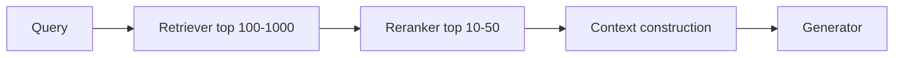
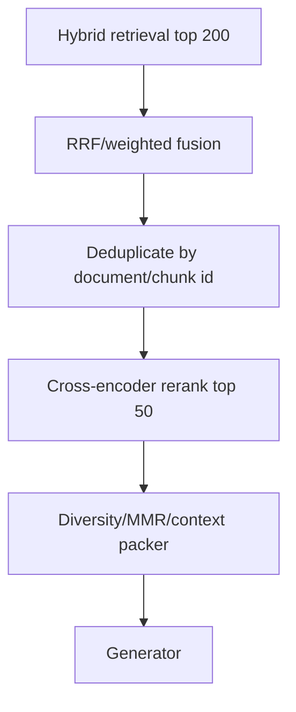
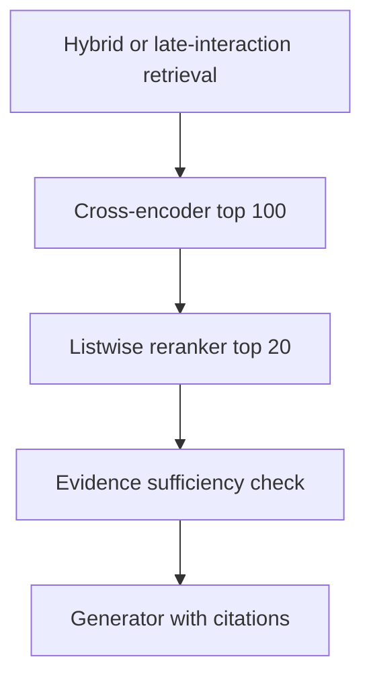
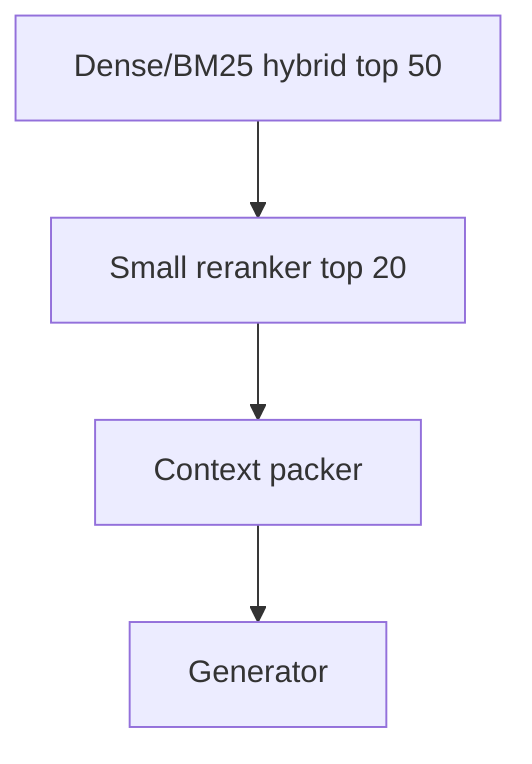

# Reranking in Neural Search

## 1. Why reranking exists

First-stage retrievers must be fast. They use approximations: lexical term matching, vector similarity, sparse expansions, or late-interaction indexes. Rerankers are slower but more accurate models applied to a small candidate set.

Reranking answers:

> Given a query and a candidate list, which candidates are truly most relevant?

A common production architecture:

---

## 2. Reranker families

| Family | Input shape | Output | Strength | Weakness | Best use |
|---|---|---|---|---|---|
| Cross-encoder | Query + one document | Scalar relevance score | Strong local relevance | Linear cost in candidate count | Default production reranking |
| Bi-encoder rerank-like scoring | Query vector + document vector | Similarity | Fast | Less accurate than cross-encoder | Cheap second pass |
| Listwise reranker | Query + list of documents | Ordered list | Captures candidate interactions | Context/cost limits | Small candidate sets |
| Pairwise LLM reranker | Query + two docs | Preference | Strong judgments | Many comparisons | High-value small sets |
| LLM listwise reranker | Query + candidate list | Ordered list/rationale | Flexible, instruction-following | Expensive, variable, harder to calibrate | Premium queries, evaluators, agents |

---

## 3. Cross-encoder reranking

A cross-encoder jointly encodes query and document:

\[
s(q,d) = f_{\theta}([q; d])
\]

Unlike dense retrieval, it can attend across query and document tokens directly.

### Advantages

- strong relevance quality;
- easy to insert after any retriever;
- score for each query-document pair;
- works with hybrid retrieval;
- cheaper than full LLM reranking.

### Disadvantages

- cost grows with candidate count;
- context length is limited;
- raw scores are not calibrated probabilities;
- long documents must be chunked or truncated;
- reranker can amplify retriever bias if candidate pool is weak.

### Candidate count guidance

| Latency budget | Rerank candidates |
|---|---:|
| Very tight interactive search | 10-20 |
| Standard RAG | 20-50 |
| Quality-focused RAG | 50-100 |
| Offline/high-value search | 100-500 |

---

## 4. Model cards and operational notes

### 4.1 BGE rerankers

Representative models:

- `BAAI/bge-reranker-base`
- `BAAI/bge-reranker-large`
- `BAAI/bge-reranker-v2-m3`
- `BAAI/bge-reranker-v2-gemma`

#### Strengths

- open weights;
- strong default reranking family;
- multilingual options;
- easy to self-host;
- widely used in retrieval stacks.

#### Operational notes

- Works as query-passage pair scoring.
- Use GPU inference for production throughput.
- Scores should be treated as relative relevance scores, not probabilities.
- For long passages, chunk or truncate consistently.
- Good option when you need open-source control and do not want a managed rerank API.

#### Best fit

Use BGE when:

- self-hosting is preferred;
- model governance requires open weights;
- cost control matters;
- multilingual reranking is needed;
- candidate sets are modest.

---

### 4.2 Mixedbread rerankers

Representative models:

- `mxbai-rerank-base-v2`
- `mxbai-rerank-large-v2`
- `mxbai-rerank-v3` / listwise variants depending on release channel

#### Strengths

- strong retrieval/reranking focus;
- multilingual support;
- good fit for text and code search;
- managed and self-hosting options may be possible depending on model/license.

#### Operational notes

- Base vs large is a latency/quality trade-off.
- Listwise variants should be evaluated differently from scalar cross-encoders.
- Use a smaller candidate set for listwise reranking.
- For thresholding workflows, scalar cross-encoder style models are usually easier.

#### Best fit

Use Mixedbread when:

- you want a strong modern reranker family;
- code or technical retrieval matters;
- multilingual quality matters;
- you can benchmark base vs large under your latency constraints.

---

### 4.3 Cohere Rerank

Representative models:

- Cohere Rerank v3.5
- Cohere Rerank v4.0 fast/pro variants, depending on availability and current product docs

#### Strengths

- managed API;
- strong enterprise ergonomics;
- simple integration;
- supports semi-structured inputs such as JSON-like documents;
- avoids self-hosting burden.

#### Operational notes

- Best when the team wants managed service reliability.
- Watch request-size limits and candidate count limits.
- Costs scale with rerank requests and candidate documents.
- Scores are best interpreted within the same request.
- Data governance and residency requirements should be checked against Cohere’s current deployment options.

#### Best fit

Use Cohere when:

- you want a managed reranker;
- you do not want to host GPUs;
- semi-structured document ranking matters;
- enterprise support and API simplicity matter.

---

### 4.4 Jina rerankers

Representative models:

- `jina-reranker-v2-base-multilingual`
- `jina-reranker-v3`

#### Strengths

- multilingual focus;
- long-context/listwise options;
- strong fit for agentic and RAG pipelines;
- API-first usage with model documentation.

#### Operational notes

- Pointwise/scalar models are easier to monitor and threshold.
- Listwise models can reason over candidate interactions but are harder to calibrate.
- Long-context inputs can increase cost and latency.
- Evaluate with both ranking metrics and downstream answer faithfulness.

#### Best fit

Use Jina when:

- multilingual retrieval matters;
- long or semi-structured inputs appear frequently;
- listwise reranking is useful;
- managed API integration is acceptable.

---

### 4.5 LLM-as-reranker

LLM rerankers use an LLM to judge documents. Common forms:

1. **Pointwise**: score each document independently.
2. **Pairwise**: compare document A vs B.
3. **Listwise**: rank a list of documents.
4. **Setwise / tournament**: compare subsets and merge.

#### Pairwise preference

\[
d_i \succ d_j \mid q
\]

The model decides which document better answers the query.

#### Listwise prompt

Input:

- query;
- 5-20 candidate snippets;
- ranking criteria.

Output:

- ordered list;
- optional rationale.

### Strengths

- flexible instructions;
- can incorporate task-specific criteria;
- strong for complex relevance judgments;
- can reason about citation usefulness, contradiction, and sufficiency;
- useful as an evaluator or high-value reranker.

### Weaknesses

- expensive;
- high latency;
- variable formatting;
- sensitive to prompt wording and candidate order;
- hard to calibrate;
- not ideal for every request.

### Best fit

Use LLM reranking when:

- candidate set is small;
- query is high-value;
- relevance depends on subtle reasoning;
- you need task-specific ranking criteria;
- the output supports an agentic workflow.

Do not use it as a blanket reranker unless cost and latency are not concerns.

---

## 5. Calibration and score interpretation

Reranker scores are usually **within-query ranking signals**, not globally calibrated probabilities.

Bad use:

> “Score > 0.8 means relevant across all queries.”

Better use:

> “Sort candidates by score, evaluate top-k, and tune thresholds on a labeled validation set.”

### Why calibration is hard

- score distributions differ by query;
- candidate pools differ by retriever;
- chunk lengths differ;
- models are trained with ranking losses;
- listwise rerankers produce relative judgments.

### Practical approach

1. Use scores primarily for ordering.
2. Tune thresholds only with judged examples.
3. Track score distributions by query type.
4. Evaluate answer-level quality, not only rerank nDCG.
5. Recalibrate after changing retrievers, chunking, or embedding models.

---

## 6. Reranker evaluation

Use both retrieval-level and answer-level metrics.

### Retrieval-level metrics

| Metric | Meaning |
|---|---|
| Recall@k | Whether at least one relevant item appears in top-k |
| Precision@k | Fraction of top-k that is relevant |
| MRR | Rank of first relevant result |
| nDCG@k | Ranking quality with graded relevance |
| MAP | Mean average precision across relevant docs |

### Answer-level metrics

| Metric | Meaning |
|---|---|
| Faithfulness | Answer supported by retrieved context |
| Citation accuracy | Citations point to supporting evidence |
| Answer relevance | Answer addresses the question |
| Context precision | Retrieved context is relevant |
| Context recall | Retrieved context contains required evidence |
| Abstention quality | Model refuses when evidence is insufficient |

Rerankers should be evaluated by whether they improve the **final RAG answer**, not only whether they improve search metrics.

---

## 7. Reranker selection guide

| Constraint | Recommended reranker |
|---|---|
| Open-source, controllable | BGE or Mixedbread |
| Managed API, enterprise usage | Cohere or Jina |
| Multilingual | BGE v2-m3, Mixedbread, Jina, Cohere multilingual models |
| Very low latency | Smaller cross-encoder, small top-k |
| Highest quality, low QPS | Large cross-encoder or LLM/listwise reranker |
| Semi-structured docs | Cohere/Jina or custom LLM reranker |
| Need score thresholds | Scalar cross-encoder preferred |
| Need nuanced reasoning | LLM-as-reranker on small candidate set |

---

## 8. Recommended reranking stack

Default production stack:

Quality-first stack:

Cost-first stack:

