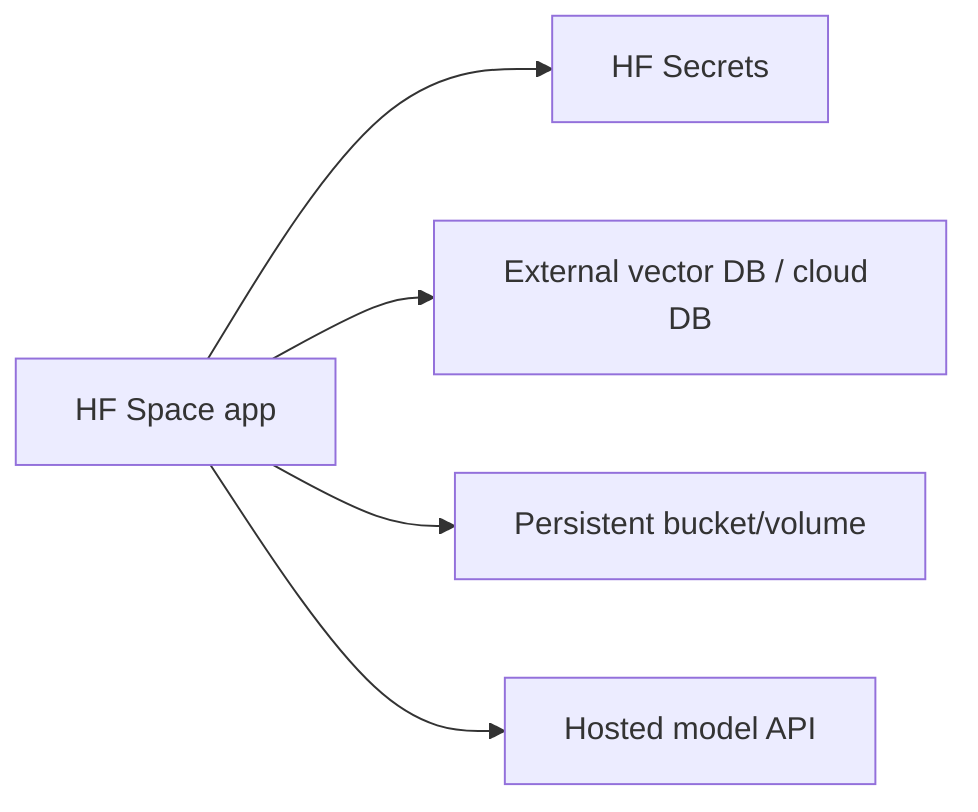

# Cloud Platform Mapping for RAG, Neural Search, and Model Serving

## 1. What the platform decision really controls

For RAG and neural search, the cloud platform decision controls:

1. **Where vectors live**: managed vector search, database-native vector, or self-hosted index.
2. **Where models run**: managed foundation model APIs, managed endpoints, serverless inference, or self-hosted GPUs.
3. **How private the network is**: public API, private endpoint, VPC/VNet/PSC/PrivateLink.
4. **How identity works**: IAM policies, RBAC, service accounts, managed identities.
5. **How encryption is controlled**: cloud-managed keys vs customer-managed KMS keys.
6. **How observability is wired**: logs, traces, metrics, audit logs, model monitoring.
7. **How cost scales**: storage, replicas, QPS, GPU hours, token/API usage, egress, private networking.

No single cloud is best for every RAG system. The right choice depends on residency, existing commitment, managed-vs-control preference, cost, and operational maturity.

---

## 2. Summary matrix

| Dimension | AWS | GCP | Azure |
|---|---|---|---|
| Managed vector options | OpenSearch Service/Serverless vector search, Aurora PostgreSQL pgvector, MemoryDB vector search, other AWS vector DB patterns | Vertex AI Vector Search, AlloyDB AI/vector search, Cloud SQL/Postgres extensions depending stack | Azure AI Search vector/hybrid, Azure Database for PostgreSQL vector, Cosmos DB vector options |
| Model hosting | SageMaker endpoints, SageMaker Serverless Inference, Bedrock for managed foundation models | Vertex AI endpoints, Model Garden, online prediction, serverless-like managed APIs depending model | Azure Machine Learning endpoints, Azure AI Foundry/serverless model deployments, Azure OpenAI where available |
| Serverless inference | SageMaker Serverless Inference; Bedrock managed API style | Vertex AI managed online prediction / serverless model APIs depending product | Azure ML serverless deployments / managed endpoints; Azure OpenAI managed API style |
| Private networking | VPC endpoints, AWS PrivateLink, security groups, VPC-only access patterns | VPC, Private Service Connect, private endpoints for Vertex services | VNet, Private Link, Private Endpoint, managed identities |
| KMS | AWS KMS, service-specific CMKs | Cloud KMS, CMEK on supported services | Azure Key Vault / Managed HSM, customer-managed keys on supported services |
| IAM model | IAM users/roles/policies, resource policies, STS, service-linked roles | IAM roles/bindings, service accounts, workload identity | Microsoft Entra ID, RBAC, managed identities |
| Observability | CloudWatch, CloudTrail, X-Ray, OpenSearch logs, SageMaker Model Monitor | Cloud Logging, Cloud Monitoring, Cloud Trace, Audit Logs, Vertex AI monitoring | Azure Monitor, Log Analytics, Application Insights, Activity Logs, ML monitoring |
| Best fit | AWS-committed teams needing composable control | Teams wanting purpose-built managed vector + Vertex AI integration | Enterprise search/RAG with Azure AI Search and Microsoft security stack |

---

## 3. AWS mapping

### 3.1 Managed vector options

#### Amazon OpenSearch Service / OpenSearch Serverless

Best for:

- hybrid lexical + vector search;
- teams already using OpenSearch/Elasticsearch;
- search workloads requiring filters, text search, and vector retrieval;
- managed operational experience without building a vector service from scratch.

OpenSearch Serverless vector collections are especially relevant when the team wants a managed serverless-style search surface.

#### Aurora PostgreSQL with pgvector

Best for:

- moderate-sized vector workloads;
- applications already storing operational data in Postgres;
- transactional consistency with embeddings;
- simpler architecture where one database can handle metadata + vectors.

Trade-off: database-native vector search may be simpler but not always the highest-performance choice at very large ANN scale.

#### MemoryDB vector search

Best for:

- very low-latency online retrieval;
- rapidly changing vectors;
- cache-like retrieval layers;
- workloads where Redis-compatible operational patterns matter.

Trade-off: cost and memory footprint can become central.

---

### 3.2 Model hosting and serverless inference

#### SageMaker endpoints

Best for:

- self-hosted open-source models;
- custom embedding/reranker/generator endpoints;
- GPU-backed inference;
- MLOps integration.

#### SageMaker Serverless Inference

Best for:

- intermittent workloads;
- internal tools;
- bursty reranker endpoints;
- cost control when traffic has idle periods.

Watch out for cold starts and maximum payload/runtime constraints.

#### Bedrock

Best for:

- managed foundation model access;
- enterprise controls around model APIs;
- avoiding direct GPU hosting.

---

### 3.3 Private networking

AWS primitives:

- VPC;
- subnets/security groups;
- VPC endpoints;
- AWS PrivateLink;
- IAM and resource policies.

For RAG, private networking matters for:

- keeping document retrieval private;
- avoiding public exposure of search endpoints;
- controlling model endpoint access;
- meeting enterprise compliance requirements.

---

### 3.4 KMS and encryption

AWS KMS supports customer-managed keys on many services. The exact support depends on the chosen vector/search/model services. For architecture review, verify:

- encryption at rest;
- customer-managed key support;
- key rotation;
- cross-account key policies;
- audit events for key usage.

---

### 3.5 Observability

AWS observability stack:

- CloudWatch metrics/logs;
- CloudTrail audit logs;
- X-Ray tracing where integrated;
- SageMaker Model Monitor for model drift/quality monitoring;
- OpenSearch dashboard/logs for search-level diagnostics.

RAG-specific telemetry to add:

- retrieval latency;
- retriever channel hit rates;
- top-k overlap;
- reranker latency;
- context token counts;
- citation quality;
- answer abstention rate.

---

## 4. GCP mapping

### 4.1 Managed vector options

#### Vertex AI Vector Search

Best for:

- managed ANN at scale;
- high-performance semantic retrieval;
- integration with Vertex AI workflows;
- private connectivity via Private Service Connect;
- hybrid search patterns where supported.

This is the most purpose-built managed vector option among the three cloud mappings.

#### AlloyDB AI / vector search

Best for:

- Postgres-compatible operational data;
- keeping embeddings near relational records;
- moderate-to-large vector search with database integration;
- applications that need SQL + vector together.

AlloyDB-style vector search is useful when architecture simplicity and relational integration matter more than having a separate vector service.

---

### 4.2 Model hosting and inference

GCP primitives:

- Vertex AI online prediction;
- Vertex AI Model Garden;
- custom model endpoints;
- managed model APIs depending on the model;
- private service connectivity for online prediction.

Best fit:

- teams already using Vertex AI;
- unified ML lifecycle on GCP;
- managed model deployment with private endpoints;
- strong integration with GCP logging/audit.

---

### 4.3 Private networking

GCP primitives:

- VPC;
- Private Service Connect;
- VPC Service Controls for perimeter-style controls;
- service accounts and IAM bindings.

Private Service Connect is central for private access to Vertex services.

---

### 4.4 KMS and encryption

GCP Cloud KMS and CMEK support vary by service. For review, verify:

- CMEK support for Vertex AI resources;
- CMEK support for vector/search indexes;
- logging of key operations;
- region compatibility;
- service agent permissions.

---

### 4.5 Observability

GCP observability stack:

- Cloud Logging;
- Cloud Monitoring;
- Cloud Trace;
- Cloud Audit Logs;
- Vertex AI Model Monitoring;
- online prediction logging.

For RAG, add application-level traces linking:

```text
request_id
query
query_transform
retriever_versions
retrieved_doc_ids
reranker_version
context_chunk_ids
generator_model
citations
latency_breakdown
```

---

## 5. Azure mapping

### 5.1 Managed vector options

#### Azure AI Search

Best for:

- enterprise search;
- hybrid keyword + vector retrieval;
- filters/facets;
- RAG over enterprise documents;
- integration with Microsoft identity/security patterns.

Azure AI Search is often the most retrieval-opinionated service in this comparison. It provides a unified search layer rather than only a raw vector index.

#### Azure Database for PostgreSQL vector

Best for:

- embeddings near relational records;
- teams using PostgreSQL;
- moderate vector workloads;
- simpler data architecture.

#### Cosmos DB vector options

Best for:

- globally distributed application data;
- NoSQL data + vector retrieval;
- low-latency app-centric retrieval.

---

### 5.2 Model hosting and serverless inference

Azure primitives:

- Azure Machine Learning managed online endpoints;
- Azure ML serverless model deployments;
- Azure AI Foundry model catalog/serverless APIs where available;
- Azure OpenAI Service where available and approved.

Best fit:

- Microsoft-centric enterprises;
- Entra ID / RBAC integration;
- governance-heavy deployments;
- enterprise RAG over Microsoft data estate.

---

### 5.3 Private networking

Azure primitives:

- Virtual Network;
- Private Endpoint;
- Private Link;
- Network Security Groups;
- managed identities;
- Microsoft Entra ID.

Private Endpoint/Private Link patterns are especially mature for enterprise deployments.

---

### 5.4 KMS and encryption

Azure uses:

- platform-managed keys by default in many services;
- customer-managed keys through Azure Key Vault or Managed HSM where supported;
- role assignments through Entra ID/RBAC.

For RAG, verify CMK support for:

- search service;
- storage accounts;
- model hosting workspace;
- logs/telemetry sinks;
- databases.

---

### 5.5 Observability

Azure observability stack:

- Azure Monitor;
- Log Analytics;
- Application Insights;
- Activity Logs;
- Azure ML monitoring;
- diagnostic settings.

RAG-specific additions:

- retriever/reranker/generator latency;
- failed retrievals;
- empty-context answers;
- hallucination/citation audit samples;
- prompt injection detector results;
- ACL filtering decisions.

---

## 6. Hugging Face Spaces as deploy target

Hugging Face Spaces is a hosted application surface for demos, prototypes, evaluation apps, and lightweight ML products.

It is not a full enterprise private serving plane, but it is extremely useful for:

- advisor-facing demos;
- portfolio projects;
- internal tools;
- RAG evaluation dashboards;
- reproducible prototypes;
- lightweight Gradio/Streamlit apps.

---

### 6.1 SDKs

Common Spaces SDK choices:

- Gradio;
- Streamlit;
- Docker;
- static HTML depending on use case.

Best practice:

- use Gradio for ML demos;
- use Streamlit for dashboard-like interfaces;
- use Docker when dependencies are complex;
- keep secrets out of source code.

---

### 6.2 Hardware tiers

HF Spaces hardware can include CPU tiers, GPU tiers, and ZeroGPU-style access depending on current availability and account plan.

General tier logic:

| Tier | Best use |
|---|---|
| CPU Basic | Static/light demos, evaluation UIs, small apps |
| CPU upgraded | Lightweight inference, better responsiveness |
| T4/L4/A10G-style GPUs | Embedding/reranking/model demos |
| A100/H100/H200-class tiers where available | Heavy inference, large model demos, high-performance experiments |
| ZeroGPU | Intermittent GPU access for compatible apps |

Always verify current hardware and pricing on the official Hugging Face pricing page because tiers and rates can change.

---

### 6.3 Ephemeral vs persistent storage

Default local disk in Spaces should be treated as ephemeral.

Implications:

- do not store important user data only on local disk;
- generated indexes may disappear after restart;
- vector indexes should be rebuilt or stored externally;
- persistent storage/volumes should be used for durable state;
- external databases are better for production-like retrieval.

Recommended pattern:



---

### 6.4 Secrets

Use Spaces secrets for:

- API keys;
- database credentials;
- cloud credentials;
- model provider keys;
- webhook tokens.

Do not commit secrets to the repository.

---

### 6.5 Sleep behavior

Spaces may sleep or pause depending on tier, inactivity, and configuration. Upgraded hardware may incur hourly cost while running, so pause behavior is a cost-control feature.

Design implications:

- first request after sleep may be slower;
- in-memory indexes may need reload;
- background state may be lost;
- use persistent storage or external services for durable data.

---

### 6.6 When HF Spaces is appropriate

Use HF Spaces when:

- you need a demo quickly;
- you want a public/portfolio artifact;
- you need a UI around an evaluation pipeline;
- traffic is modest;
- data is non-sensitive or sanitized;
- private networking is not required.

Avoid HF Spaces as the primary deploy target when:

- strict private networking is required;
- regulated data is involved;
- high concurrency is required;
- autoscaling requirements are complex;
- enterprise IAM/KMS integration is mandatory;
- SLA-backed production serving is required.

---

## 7. Decision drivers

### 7.1 Residency

Choose based on where data and model inference must legally occur.

Questions:

- Does data need to remain in Canada, EU, US, or a specific region?
- Does the vector index contain personal or regulated data?
- Are embeddings considered derived personal data under the compliance regime?
- Can a managed model API process the text?
- Are logs allowed to contain prompts or retrieved chunks?

### 7.2 Existing commitment

If the organization already has cloud commitments, the default answer is often to stay inside that cloud unless there is a strong reason not to.

Reasons:

- discounts/committed spend;
- existing security review;
- existing IAM patterns;
- existing networking;
- team skill;
- approved vendors.

### 7.3 Managed vs control

Managed services reduce operational burden but reduce low-level control.

| Preference | Better fit |
|---|---|
| fastest enterprise RAG | Azure AI Search / Vertex AI / managed APIs |
| maximum control | self-hosted vector DB + custom model endpoints |
| AWS-native composition | OpenSearch + Aurora/MemoryDB + SageMaker/Bedrock |
| prototype/demo | Hugging Face Spaces |
| heavy governance | Azure/GCP/AWS managed enterprise services |

### 7.4 Cost

Cost drivers:

- vector count and dimensionality;
- replicas and availability zones;
- ANN index memory;
- update frequency;
- reranker candidate count;
- generator token usage;
- GPU endpoint idle time;
- serverless cold starts;
- logging volume;
- egress/private networking.

Cost-control levers:

- reduce chunk count;
- use hybrid retrieval to improve recall with smaller top-k;
- rerank fewer candidates;
- route easy queries away from expensive models;
- cache embeddings and retrieval results;
- use serverless endpoints for bursty workloads;
- downshift model size for routine traffic.

---

## 8. Cloud selection playbook

| Scenario | Recommended platform tendency |
|---|---|
| Microsoft-heavy enterprise, SharePoint/Office docs, strong RBAC | Azure AI Search + Azure OpenAI/Azure ML |
| GCP ML platform already adopted | Vertex AI Vector Search + Vertex AI endpoints |
| AWS committed spend and composable infra preference | OpenSearch/Aurora/MemoryDB + SageMaker/Bedrock |
| Fast demo for advisor/interview | HF Spaces + managed model API/vector DB |
| Need database-native vector with relational consistency | Aurora pgvector / AlloyDB / Azure PostgreSQL |
| Need enterprise search features more than raw ANN | Azure AI Search or OpenSearch |
| Need highest control over retrieval algorithms | Self-hosted vector DB / ColBERT / custom reranker endpoints |
| Need low idle cost for sporadic inference | serverless inference or managed APIs |
