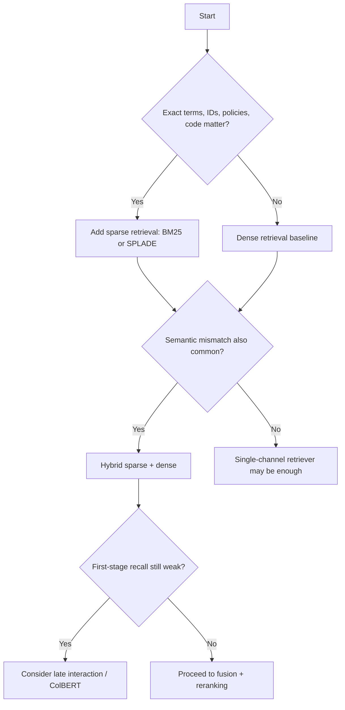
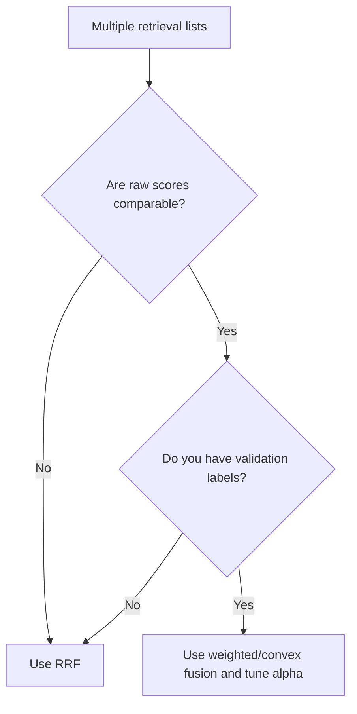
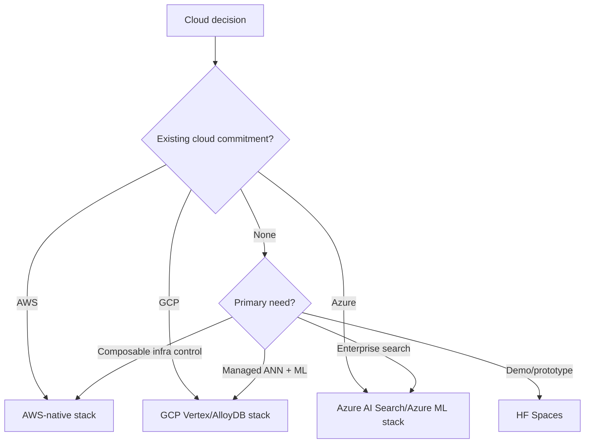

# Decision Guide: When to Use Which

## 1. Retrieval matching decision

### Practical default

Use **hybrid sparse + dense** unless you have a strong reason not to.

---

## 2. Query transform decision

| Symptom | Use |
|---|---|
| Short vague query | HyDE or multi-query |
| Query wording does not match corpus wording | HyDE |
| Multiple possible phrasings | Multi-query |
| Multi-hop/comparison question | Decomposition |
| Abstract “why/how” question | Step-back |
| Query includes filters like date/author/region | Self-query |
| Need recall from many query variants | RAG-Fusion |
| Query complexity varies widely | Adaptive-RAG router |

---

## 3. Fusion decision

Rules:

- Start with RRF.
- Move to weighted fusion only after normalization and validation.
- Tune alpha by query type if sparse/dense importance varies.
- Re-tune after changing embedding model, chunking, or corpus.

---

## 4. Reranker decision

| Constraint | Recommendation |
|---|---|
| Need cheap default | Small cross-encoder |
| Need strong open-source | BGE / Mixedbread |
| Need managed API | Cohere / Jina |
| Need multilingual | BGE v2-m3, Mixedbread, Cohere, Jina |
| Need long/semi-structured ranking | Cohere/Jina or LLM reranker |
| Need premium reasoning | LLM listwise reranker on small candidate set |
| Need thresholding | Scalar cross-encoder, not listwise LLM |
| Very high QPS | Smaller candidate pool + small reranker + caching |

---

## 5. Cloud decision

### Use AWS when

- AWS committed spend exists;
- OpenSearch/SageMaker/Bedrock already approved;
- composable infrastructure is preferred;
- application teams already know VPC/IAM/KMS patterns.

### Use GCP when

- Vertex AI is the ML standard;
- managed ANN/vector search is central;
- Private Service Connect fits the network model;
- AlloyDB is already part of the data stack.

### Use Azure when

- enterprise search and Microsoft identity matter;
- Azure AI Search is a natural fit;
- SharePoint/Office/Entra integrations matter;
- governance and private endpoints are central.

### Use HF Spaces when

- demo speed matters;
- public/internal prototype is enough;
- data is non-sensitive;
- traffic is modest;
- you need a polished UI quickly.

---

## 6. Recommended phased roadmap

### Phase 1: baseline

- Dense retrieval.
- Basic chunking.
- Small top-k.
- Manual evaluation set.
- Simple answer prompt with citations.

### Phase 2: production baseline

- Add BM25/SPLADE.
- Add RRF fusion.
- Add cross-encoder reranker.
- Add metadata filters.
- Add trace logging.
- Evaluate recall@k, nDCG@k, faithfulness, and citation accuracy.

### Phase 3: hard-query optimization

- Add query transforms.
- Add decomposition for multi-hop.
- Add self-query for filters.
- Add adaptive routing.
- Add GraphRAG/KG retrieval if relationship reasoning matters.

### Phase 4: optimization and governance

- Tune fusion alpha.
- Tune reranker top-k.
- Add caching.
- Add ACL-aware retrieval.
- Add PII and prompt-injection defenses.
- Add cost dashboards and latency SLOs.
