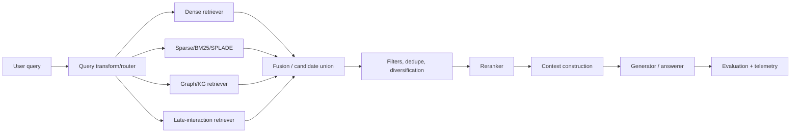

# Matching, Retrieval Pipelines, and Reranking in Neural Search

**Last updated:** 2026-05-18  
**Scope:** matching methods, retrieval pipeline design, fusion, query transformation, adaptive/agentic retrieval, GraphRAG/KG-augmented retrieval, reranker model cards, decision rules, and implementation/evaluation checklists.

This bundle is designed as a practical research-and-implementation guide for neural search and RAG systems. It assumes the broader system already has ingestion, chunking, embedding, indexing, and generation components; this report focuses on the *retrieval-time path*: how queries are matched, transformed, fused, reranked, routed, and evaluated.

## Files

| File | Purpose |
|---|---|
| [`01_matching_methods.md`](01_matching_methods.md) | Dense, sparse, learned sparse, late-interaction, hybrid, and KG/graph-aware matching methods. |
| [`02_fusion_and_query_transforms.md`](02_fusion_and_query_transforms.md) | RRF, weighted/convex fusion, alpha tuning, HyDE, multi-query, decomposition, step-back, RAG-Fusion, self-query. |
| [`03_retrieval_pipeline_patterns.md`](03_retrieval_pipeline_patterns.md) | End-to-end pipeline patterns: static RAG, multi-stage retrieval, adaptive/agentic RAG, CRAG, FLARE, Self-RAG, Adaptive-RAG, GraphRAG. |
| [`04_reranking_model_cards.md`](04_reranking_model_cards.md) | Practical reranker model cards for BGE, Mixedbread, Cohere, Jina, and LLM-as-reranker. |
| [`05_decision_playbooks.md`](05_decision_playbooks.md) | When to use which retrieval/reranking pattern by corpus, query class, latency, compliance, and budget. |
| [`06_implementation_and_evaluation.md`](06_implementation_and_evaluation.md) | Implementation blueprints, pseudo-code, metrics, ablations, online/offline evaluation, monitoring. |
| [`07_references.md`](07_references.md) | Papers, official docs, and articles used as source grounding. |

## Core thesis

The strongest default for production neural search is not “dense vectors only.” A robust retrieval system usually uses a **multi-stage architecture**:

1. **First-stage candidate generation** with dense, lexical/sparse, learned sparse, late-interaction, graph, or hybrid retrieval.
2. **Fusion** if multiple candidate lists are produced.
3. **Filtering and policy constraints** before expensive model calls.
4. **Reranking** with a cross-encoder, listwise reranker, or LLM-as-reranker.
5. **Context assembly** with deduplication, diversity, source grouping, and budget-aware packing.
6. **Evaluation/monitoring** across retrieval metrics, answer quality, latency, cost, and safety.



## Default production recommendation

For most enterprise corpora, begin with:

```text
BM25 or learned sparse + dense vector retrieval
→ RRF or tuned convex fusion
→ cross-encoder reranker on top 30–100
→ context dedupe/diversity/source grouping
→ generator with citation and abstention rules
```

Then specialize only when the evaluation says you should:

- Add **SPLADE** when exact lexical cues, IDs, rare terms, code symbols, legal language, or product names matter.
- Add **ColBERT/late interaction** when first-stage quality is the bottleneck and storage/latency budget allows multi-vector indexing.
- Add **query transforms** when query wording is short, vague, multi-hop, or schema-constrained.
- Add **adaptive routing** when traffic mixes easy questions with complex multi-hop questions.
- Add **GraphRAG/KG retrieval** when questions require global sensemaking, entity relationships, provenance, and multi-document synthesis.
- Add **LLM reranking** only for small candidate sets or high-value queries where token cost and latency are justified.

## Key decision axes

| Axis | Low-complexity choice | Higher-control / higher-quality choice |
|---|---|---|
| Query type | Single dense retrieval | Query routing + query transforms |
| Corpus style | Dense embeddings | Hybrid sparse+dense, SPLADE, or ColBERT |
| Entity-heavy data | Metadata filters | KG/GraphRAG + entity linking |
| Need for precision | Cross-encoder rerank | Listwise or LLM rerank |
| Latency target | Top-k small, no transform | Adaptive routing by query complexity |
| Evaluation maturity | RRF default | Tuned weighted/convex fusion + learned ranker |
| Operations burden | Managed vector DB + API reranker | Self-hosted hybrid stack + custom reranker |

## Minimal benchmark plan

Before choosing a retrieval architecture, build a gold set with at least:

- 50–100 factoid queries
- 50–100 entity/metadata queries
- 50–100 long-tail lexical queries
- 50–100 multi-hop or comparison queries
- 25–50 global/summarization questions if GraphRAG is in scope
- known positive documents and hard negatives
- answer-level labels, not just document labels

Track:

- **Recall@k** for first-stage retrieval
- **MRR / nDCG@k** after reranking
- **answer faithfulness / citation precision** after generation
- **P50/P95/P99 latency**
- **cost/query**
- **failure taxonomy** by query type

## How to read this bundle

Read in this order:

1. `01_matching_methods.md` to understand retrieval primitives.
2. `02_fusion_and_query_transforms.md` to understand how candidate lists are generated and merged.
3. `03_retrieval_pipeline_patterns.md` to assemble these primitives into system architectures.
4. `04_reranking_model_cards.md` to select rerankers.
5. `05_decision_playbooks.md` to map use cases to choices.
6. `06_implementation_and_evaluation.md` to build and test.
7. `07_references.md` for source links.
