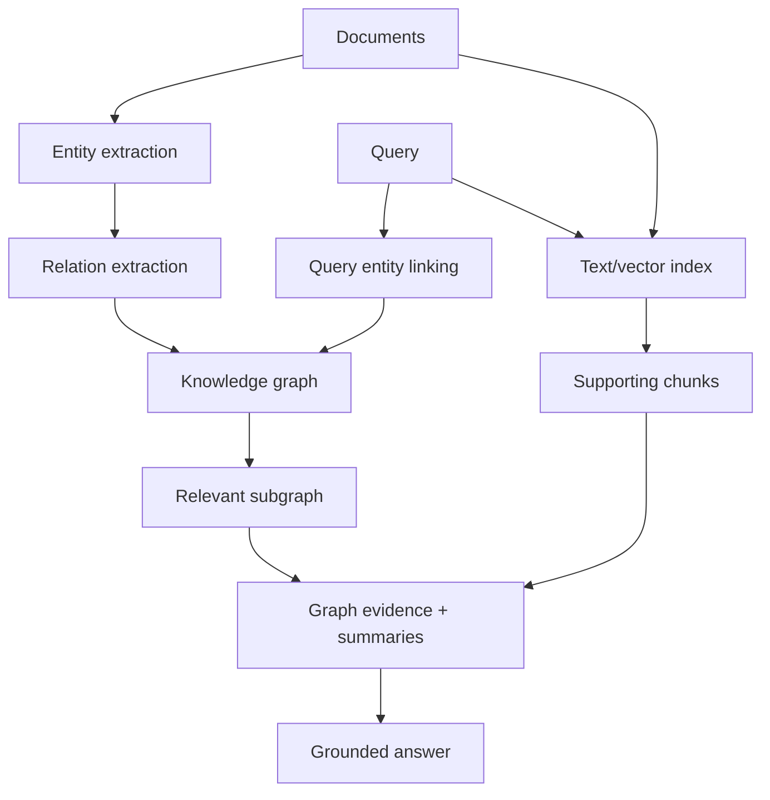

# 01 — Matching Methods in Neural Search

## 1. What “matching” means

In neural search, *matching* is the process that maps a query to candidate documents, passages, chunks, rows, entities, tools, or graph neighborhoods. The matching layer is not only a similarity function; it encodes assumptions about what “relevance” means.

A retrieval system can match by:

- exact lexical overlap;
- learned lexical expansion;
- dense semantic similarity;
- token-level late interaction;
- structured metadata constraints;
- graph neighborhood proximity;
- personalized or behavioral signals;
- cross-encoder judgment in a second stage.

The mistake in many RAG systems is treating dense vector similarity as synonymous with retrieval. Dense retrieval is one matching family, not the whole retrieval problem.

## 2. Matching families

| Family | Core representation | Query-time operation | Strengths | Weaknesses | Best use |
|---|---|---|---|---|---|
| Lexical BM25 | sparse term counts / postings | inverted index scoring | robust, cheap, exact tokens | weak semantic recall | identifiers, rare terms, exact legal/product/code terms |
| Learned sparse / SPLADE | learned sparse vocabulary weights | inverted index scoring | lexical + semantic expansion | more complex indexing/training than BM25 | hybrid enterprise search, code/docs/legal/policy corpora |
| Dense single-vector | one embedding per query/doc | ANN nearest-neighbor search | semantic recall, mature vector DB support | misses exact terms, IDs, negation, rare entities | general semantic retrieval and RAG defaults |
| Late interaction / ColBERT | multiple token vectors per doc | token-level max-sim aggregation | high first-stage quality | larger indexes, heavier serving | quality-first search, hard queries, multilingual retrieval |
| Cross-encoder | query+doc jointly encoded | pairwise relevance score | strong precision | too expensive for full-corpus retrieval | reranking top candidates |
| Graph/KG matching | entities, relations, communities | graph traversal + entity/text retrieval | relational/global reasoning | expensive build/update; entity errors propagate | global sensemaking, relationship-heavy corpora |
| Hybrid matching | multiple channels | fusion + reranking | robust across failure modes | more tuning/ops | production default |

## 3. Dense retrieval

Dense retrieval encodes query and document/chunk into vectors:

\[
q = f_\theta(\text{query}), \quad d_i = f_\theta(\text{document}_i)
\]

Then scores are commonly computed by cosine similarity, dot product, or negative distance:

\[
s(q,d_i) = \frac{q \cdot d_i}{\|q\|\|d_i\|}
\]

Approximate nearest neighbor indexes such as HNSW, IVF, ScaNN, or DiskANN are usually used for scale.

### Strengths

Dense retrieval is strong when relevance depends on semantic paraphrase rather than exact overlap. It is easy to plug into modern vector stores, simple to update incrementally, and generally the fastest path to a working RAG baseline.

### Failure modes

Dense retrieval often struggles with:

- rare strings, SKUs, IDs, table names, API endpoints;
- exact legal clauses where wording matters;
- negation and small wording changes;
- questions requiring multiple documents;
- long documents compressed into a single vector;
- out-of-domain terminology;
- chunk boundary artifacts.

### Operational profile

| Dimension | Dense retrieval profile |
|---|---|
| Index size | usually one vector per chunk; predictable |
| Incremental updates | simple upsert/delete in most vector DBs |
| Filtering | depends on vector DB metadata filter quality |
| Latency | very good with ANN; tunable recall/latency trade-off |
| Interpretability | low; vector similarity rarely explains match |
| Best first-stage k | often 20–200 before reranking |

## 4. Classical sparse retrieval: BM25

BM25 remains a production-grade baseline. It scores documents using term frequency, inverse document frequency, and length normalization:

\[
\mathrm{BM25}(q,d) = \sum_{t \in q} \mathrm{IDF}(t) \cdot \frac{f(t,d)(k_1+1)}{f(t,d)+k_1(1-b+b\cdot |d|/\mathrm{avgdl})}
\]

BM25 is often better than dense retrieval on:

- exact strings;
- acronyms;
- code tokens;
- legal references;
- product catalog attributes;
- user queries containing precise named entities.

BM25 should rarely be removed from an enterprise search stack unless evaluation proves it is unnecessary.

## 5. Learned sparse retrieval and SPLADE

SPLADE stands for **Sparse Lexical and Expansion Model**. It learns sparse vocabulary-weight vectors for queries and documents, preserving inverted-index compatibility while adding contextual expansion.

Instead of assigning dense coordinates, SPLADE produces vocabulary-aligned sparse vectors:

\[
\phi(x) \in \mathbb{R}^{|V|}, \quad \text{where most entries are zero}
\]

A simplified scoring function is:

\[
s(q,d)=\sum_{t \in V} \phi(q)_t \phi(d)_t
\]

SPLADE uses transformer activations plus sparsity regularization, allowing it to activate expansion terms that may not appear literally in the input.

### Why SPLADE matters

SPLADE is useful because it occupies the middle ground between BM25 and dense retrieval:

- It preserves lexical-style exact matching.
- It supports semantic expansion.
- It can use inverted index infrastructure.
- It is more interpretable than dense vectors because active dimensions correspond to terms.

### SPLADE vs BM25 vs dense

| Feature | BM25 | SPLADE | Dense embeddings |
|---|---:|---:|---:|
| Exact term match | excellent | excellent | weak unless hybridized |
| Semantic expansion | weak | strong | strong |
| Inverted index compatibility | yes | yes | no |
| Vector DB compatibility | no | sometimes via sparse vector support | yes |
| Interpretability | high | medium/high | low |
| Training dependence | none | high | high |
| Updates | simple | index sparse activations | simple vector upsert |
| Best use | lexical baseline | lexical-semantic hybrid | semantic baseline |

### When to choose SPLADE

Choose SPLADE when:

- BM25 is too literal but dense misses exact cues.
- You have many rare terms, IDs, entities, or domain-specific expressions.
- Your infrastructure already supports inverted indexes or sparse vectors.
- You need lexical interpretability.
- You can tolerate heavier indexing than BM25.

Avoid SPLADE as the first option when:

- you need the simplest proof of concept;
- you do not have infrastructure for sparse vectors/postings;
- the corpus is small enough that dense + cross-encoder is already sufficient;
- model licensing or training constraints are problematic.

## 6. Late interaction and ColBERT

ColBERT introduced **contextualized late interaction**. Instead of compressing a document into one vector, it stores multiple token-level vectors. The query is also represented as token vectors. Relevance is computed by a MaxSim operation:

\[
s(q,d)=\sum_{i \in q} \max_{j \in d} q_i^\top d_j
\]

This preserves token-level matching while allowing document representations to be precomputed.

### Why late interaction is different

A dense single-vector retriever asks:

> Is the query vector close to the document vector?

A late-interaction retriever asks:

> For each important query token, is there a contextualized token in the document that strongly matches it?

This makes it much better for nuanced matching, but it increases index size and serving complexity.

### ColBERT / ColBERTv2 operational trade-offs

| Dimension | Late interaction profile |
|---|---|
| Quality | often much stronger than single-vector retrieval |
| Index size | much larger due to multi-vector storage |
| Latency | higher than dense; optimized systems reduce this |
| Updates | more expensive than one-vector-per-chunk |
| Hardware | benefits from GPU or optimized vector engines |
| Complexity | substantially higher than dense/BM25 |
| Best use | first-stage quality bottleneck, premium search |

ColBERTv2 reduces the space burden using residual compression and improved supervision, but late interaction remains a quality-for-cost trade.

## 7. Cross-encoder matching

Cross-encoders jointly encode query and document:

```text
[CLS] query [SEP] document [SEP] → relevance score
```

Because query and document tokens attend to one another directly, cross-encoders are strong relevance judges. But they cannot be used over millions of documents at query time. They are therefore usually used as **rerankers**, not first-stage retrievers.

### Candidate-set sizing

| Rerank top-k | Use case |
|---:|---|
| 10–20 | strict latency, high first-stage confidence |
| 30–50 | common enterprise RAG default |
| 100 | quality-focused RAG, offline or moderate latency |
| 200+ | offline evaluation, batch jobs, very high-value queries |

## 8. Hybrid matching

Hybrid matching combines two or more candidate generators. The default production hybrid is:

```text
BM25 or SPLADE + dense vector retrieval → fusion → reranking
```

Hybrid retrieval improves robustness because sparse and dense methods fail differently.

### Common hybrid variants

| Variant | Candidate generation | Fusion | Reranking | Best fit |
|---|---|---|---|---|
| BM25 + dense | cheap lexical + semantic | RRF | cross-encoder | baseline enterprise RAG |
| SPLADE + dense | learned sparse + semantic | RRF or convex | cross-encoder | higher quality hybrid |
| Dense + ColBERT | semantic broad recall + late interaction | union or learned ranker | cross-encoder optional | premium search |
| BM25 + dense + graph | text + semantic + entity graph | RRF + graph features | cross/listwise | relationship-heavy corpora |
| Multi-query hybrid | several transformed queries across channels | RRF | reranker | ambiguous or under-specified queries |

## 9. Graph/KG-aware matching

Graph and knowledge-graph retrieval are matching methods where relevance is mediated by entities and relationships, not just chunks.

A KG-augmented search system often performs:

1. entity extraction and normalization;
2. entity linking to canonical nodes;
3. relation extraction;
4. graph storage;
5. query entity detection;
6. graph traversal or subgraph expansion;
7. text retrieval over supporting passages;
8. answer generation with graph provenance.



### GraphRAG

GraphRAG is most useful for **global questions** over a corpus. Traditional vector RAG works well when the answer is localized in a few chunks. It struggles when the question asks for corpus-level themes, communities, trends, or relationships that are distributed across many documents.

GraphRAG-style approaches typically build:

- an entity graph;
- clusters/communities of related entities;
- precomputed community summaries;
- global and local retrieval paths.

### When graph retrieval helps

Use graph/KG retrieval when:

- questions require relationships among entities;
- answers require evidence spread across many documents;
- corpus-level summarization is common;
- the domain has stable entity types and relationships;
- provenance and explainability matter;
- you need graph analytics features such as centrality, communities, paths, or neighborhoods.

Avoid or delay graph retrieval when:

- the corpus is small and flat;
- questions are mostly lookup-style;
- entity extraction is unreliable;
- the domain changes too quickly for graph maintenance;
- the team cannot support graph ingestion and reconciliation;
- latency budget is extremely tight.

## 10. Matching decision matrix

| Requirement | Recommended matching layer |
|---|---|
| General semantic Q&A | Dense retrieval + reranking |
| Exact IDs, part numbers, legal references | BM25 + dense hybrid |
| Strong lexical and semantic matching | SPLADE + dense hybrid |
| Highest first-stage quality | ColBERT/late interaction |
| Global themes over corpus | GraphRAG/global summaries |
| Entity relationship questions | KG retrieval + text evidence |
| Low-latency high-QPS | BM25/dense only, small top-k |
| Hard multi-hop QA | decomposition + hybrid retrieval + rerank |
| Multilingual corpus | multilingual dense + multilingual reranker; consider ColBERT/Jina/Mixedbread |
| Code/API docs | BM25/SPLADE + dense + code-aware reranker |

## 11. Practical ablation plan

A minimal ablation should test:

| Experiment | What it reveals |
|---|---|
| BM25 only | lexical baseline and rare-term coverage |
| dense only | semantic baseline |
| BM25+dense with RRF | hybrid gain without tuning |
| BM25+dense with convex alpha | gain from validation tuning |
| SPLADE+dense | learned sparse benefit |
| ColBERT first-stage | late-interaction benefit/cost |
| graph retrieval path | relationship/global question benefit |
| reranker on/off | precision gain from second stage |

Report:

- Recall@20/50/100 before rerank;
- nDCG@10 after rerank;
- answer correctness/faithfulness;
- P50/P95/P99 latency;
- memory/storage cost;
- index build/update time;
- failure categories.

## 12. Key references

- SPLADE: Sparse Lexical and Expansion Model for First Stage Ranking — https://arxiv.org/abs/2107.05720
- SPLADE v2 — https://arxiv.org/abs/2109.10086
- ColBERT — https://arxiv.org/abs/2004.12832
- ColBERTv2 — https://arxiv.org/abs/2112.01488
- BEIR benchmark — https://arxiv.org/abs/2104.08663
- GraphRAG / From Local to Global — https://arxiv.org/abs/2404.16130
- LightRAG — https://arxiv.org/abs/2410.05779
