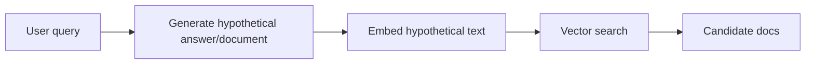
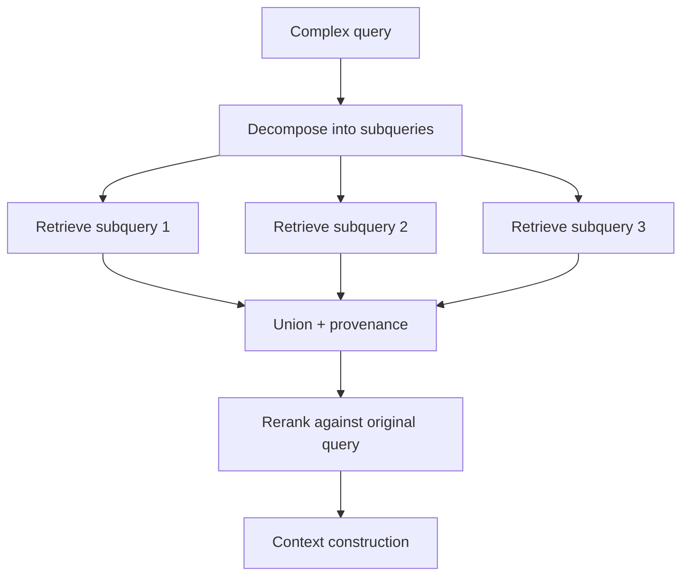
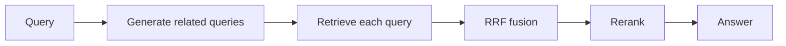

# 02 — Fusion Methods and Query Transforms

## 1. Why fusion exists

Production retrieval rarely relies on one candidate list. A single user query might be sent to:

- BM25;
- dense vector search;
- SPLADE sparse retrieval;
- ColBERT late interaction;
- graph retrieval;
- metadata-filtered retrieval;
- multiple query rewrites;
- multiple indexes or namespaces.

Fusion merges these candidate lists into one ranked candidate set.

The challenge is that retrieval channels often emit incomparable scores. BM25 scores, cosine similarity, SPLADE dot products, graph scores, and reranker logits do not live on the same scale. Fusion is the method that decides how to combine them.

## 2. Reciprocal Rank Fusion (RRF)

RRF fuses rank lists using ranks, not raw scores:

\[
\mathrm{RRF}(d)=\sum_{i=1}^{m}\frac{1}{k+r_i(d)}
\]

where:

- \(m\) = number of retrievers/query variants;
- \(r_i(d)\) = rank of document \(d\) in list \(i\);
- \(k\) = damping constant, commonly around 60 but worth tuning.

### Why RRF is robust

RRF is robust because it avoids score calibration. A document that appears high in multiple lists gets boosted, while a document that appears high in only one list still has a chance to survive.

### RRF parameters

| Parameter | Effect |
|---|---|
| `k` high | flattens the difference between high and lower ranks; more forgiving |
| `k` low | rewards top positions more sharply |
| top-k per channel | controls candidate diversity and cost |
| dedupe key | strongly affects fusion correctness |
| channel inclusion | more channels can help recall but add noise |

### RRF pseudo-code

```python
def reciprocal_rank_fusion(rank_lists, k=60):
    scores = {}
    for rank_list in rank_lists:
        for rank, doc_id in enumerate(rank_list, start=1):
            scores[doc_id] = scores.get(doc_id, 0.0) + 1.0 / (k + rank)
    return sorted(scores.items(), key=lambda x: x[1], reverse=True)
```

### When to use RRF

Use RRF when:

- channels have incomparable scores;
- you are combining BM25 and vector search;
- you are combining multiple generated queries;
- you have limited labeled validation data;
- you need a safe production baseline;
- you need robustness before learning weights.

Avoid relying only on RRF when:

- you have strong judged data;
- one channel is known to be much more reliable;
- scores can be calibrated well;
- ranking should reflect business priors or personalization.

## 3. Weighted and convex fusion

Weighted fusion uses normalized scores:

\[
s(d)=\sum_i w_i \hat{s}_i(d)
\]

For two channels, convex fusion is:

\[
s(d)=\alpha \hat{s}_{\text{sparse}}(d)+(1-\alpha)\hat{s}_{\text{dense}}(d), \quad \alpha \in [0,1]
\]

### Score normalization options

| Normalization | Formula | Strength | Weakness |
|---|---|---|---|
| Min-max | \((s-min)/(max-min)\) | simple | sensitive to outliers |
| Z-score | \((s-\mu)/\sigma\) | stable if score distributions are normal-ish | not bounded |
| Softmax | \(e^{s_i}/\sum_j e^{s_j}\) | converts list to distribution | temperature-sensitive |
| Rank-based | convert rank to score | robust | discards score magnitude |
| Learned calibration | fit logistic/isotonic model | strongest with labels | needs data and monitoring |

### Alpha tuning

For sparse+dense fusion:

```text
alpha = 1.0 → all sparse
alpha = 0.0 → all dense
alpha = 0.5 → equal weighted after normalization
```

A practical tuning grid:

```text
alpha ∈ {0.0, 0.1, 0.2, ..., 1.0}
```

Tune separately by query class:

| Query class | Expected alpha direction |
|---|---|
| exact ID / SKU / legal citation | higher sparse alpha |
| natural-language semantic question | lower sparse alpha / higher dense |
| code/API symbol | higher sparse/SPLADE alpha |
| broad conceptual query | higher dense alpha |
| entity relationship query | add graph channel; alpha alone is insufficient |

### Weighted fusion pseudo-code

```python
def minmax(xs):
    lo, hi = min(xs), max(xs)
    if hi == lo:
        return [0.0 for _ in xs]
    return [(x - lo) / (hi - lo) for x in xs]

# doc_id -> raw score dictionaries
sparse = {"d1": 9.2, "d2": 8.1}
dense = {"d2": 0.84, "d3": 0.79}

alpha = 0.55
all_docs = set(sparse) | set(dense)
# normalize per channel over retrieved docs, then fill missing as 0
```

## 4. Choosing RRF vs weighted/convex fusion

| Condition | Use RRF | Use weighted/convex |
|---|---:|---:|
| no labels | yes | no / weak |
| score scales incomparable | yes | no |
| multiple query rewrites | yes | sometimes |
| two stable channels | good | yes, if validated |
| need business weighting | weak | yes |
| production robustness | high | medium |
| best possible tuned quality | medium/high | high with labels |

The safest path is:

```text
start with RRF → collect labels/logs → tune convex weights → consider learned fusion/ranking
```

## 5. Query transforms

A query transform changes the user query before retrieval. It should be selected based on the failure mode.

| Transform | Solves | Cost | Risk |
|---|---|---:|---|
| HyDE | vocabulary mismatch, short queries | medium | hallucinated hypothetical answer can drift |
| Multi-query | under-specified or ambiguous wording | medium/high | redundant or off-topic variants |
| Decomposition | multi-hop/comparison questions | high | bad subquestions lose intent |
| Step-back | over-specific queries needing abstraction | medium | abstraction may omit key constraints |
| RAG-Fusion | recall bottleneck | high | high recall can add noise |
| Self-query | metadata/schema filters | medium | incorrect filters over-prune |
| Query rewriting | grammar/spelling/domain normalization | low/medium | changes user intent |

## 6. HyDE

HyDE means **Hypothetical Document Embeddings**. Instead of embedding the raw query, the system asks an LLM to generate a hypothetical answer or document, embeds that generated text, and retrieves documents close to it.



### Best for

- short vague queries;
- conceptual questions;
- corpora where relevant chunks look like answers, not questions;
- semantic mismatch between user wording and corpus wording.

### Failure modes

- generated hypothetical content may hallucinate entities;
- retrieval can chase the hallucination;
- HyDE may be worse for exact lookup questions;
- cost increases due to generation before retrieval.

### Guardrails

- use a short, neutral hypothetical document prompt;
- prevent named-entity invention when exactness matters;
- combine HyDE retrieval with original-query retrieval via RRF;
- rerank against the original user query, not the hypothetical answer.

## 7. Multi-query retrieval

Multi-query retrieval generates several paraphrases or perspectives, retrieves for each, then merges.

```text
Q → [q1, q2, q3, q4] → retrieve each → RRF/union → rerank
```

### Best for

- ambiguous natural language queries;
- recall-sensitive systems;
- user queries with many possible phrasings;
- exploratory search.

### Design parameters

| Parameter | Typical value |
|---|---|
| number of generated queries | 3–8 |
| retrieval top-k per query | 10–50 |
| fusion method | RRF |
| dedupe key | source id + chunk id |
| final rerank top-k | 20–100 |

### Prompt pattern

```text
Generate 5 diverse search queries that preserve the user's intent.
Do not answer the question.
Keep named entities, dates, numbers, and constraints unchanged.
Return only the queries.
```

## 8. Decomposition

Decomposition breaks a complex question into subquestions.

Example:

```text
Question: How did policy X change after event Y, and what were the consequences for group Z?
Subqueries:
1. What was policy X before event Y?
2. What happened during event Y?
3. What changed in policy X after event Y?
4. What evidence describes consequences for group Z?
```

### Best for

- multi-hop QA;
- comparisons;
- causal/explanatory questions;
- “find A, then use A to find B” questions;
- long reports and synthesis.

### Pipeline



### Key rule

Always rerank the merged candidate pool against the **original full query**, not only the subqueries. Otherwise, decomposition may optimize subgoals while losing the final intent.

## 9. Step-back prompting

Step-back prompting asks the model to formulate a more abstract version of the question before retrieval.

Example:

```text
Original: Why did transformer LoRA updates work better than full fine-tuning in my small clinical dataset?
Step-back: What factors determine whether parameter-efficient fine-tuning outperforms full fine-tuning on small domain-specific datasets?
```

Use it when the query is too narrow and the corpus contains general principles rather than directly matching phrasing.

## 10. RAG-Fusion

RAG-Fusion combines multi-query generation with RRF.



### When it helps

- the first-stage retriever is recall-limited;
- the question can be phrased from multiple angles;
- users ask broad exploratory questions;
- you can afford multiple retrieval calls.

### When it hurts

- generated queries drift;
- latency budget is tight;
- the corpus is small and the base retriever already has high recall;
- the generator cannot preserve constraints;
- answer quality is limited by synthesis rather than retrieval.

## 11. Self-query retrieval

Self-query retrieval converts a natural language query into:

1. semantic query text; and
2. structured metadata filters.

Example:

```json
{
  "semantic_query": "latency optimization strategies for reranking",
  "filters": {
    "document_type": "engineering_report",
    "date": {"gte": "2024-01-01"},
    "team": "search-platform"
  }
}
```

### Best for

- corpora with reliable metadata;
- date/version filtering;
- product categories;
- permissions/security filters;
- domain schemas;
- “show me papers after 2023 about X” queries.

### Failure modes

- wrong filter excludes the answer;
- metadata values are inconsistent;
- schema is unknown to the LLM;
- user intent mixes semantic and structured constraints ambiguously.

### Guardrails

- give the model an explicit schema;
- validate filter values against allowed enums;
- preserve original query for reranking;
- fall back to no-filter retrieval if the filtered set is empty;
- separate security filters from LLM-generated filters.

## 12. Query transform routing matrix

| Query condition | Transform |
|---|---|
| short/vague query | HyDE or multi-query |
| exact lookup | no transform; use lexical/sparse |
| metadata constraint | self-query |
| multi-hop | decomposition |
| broad abstract explanation | step-back |
| recall clearly too low | RAG-Fusion |
| user asks for relationship/path | graph query expansion |
| high-value query | combine decomposition + hybrid + rerank |
| low-latency query | skip transform; retrieve directly |

## 13. Implementation template

```python
def retrieve(query, profile):
    if profile.needs_metadata:
        semantic_query, filters = self_query(query)
    else:
        semantic_query, filters = query, {}

    query_variants = [semantic_query]

    if profile.is_multi_hop:
        query_variants += decompose(query)
    elif profile.is_vague:
        query_variants += multi_query(query, n=4)
    elif profile.needs_abstraction:
        query_variants.append(step_back(query))

    rank_lists = []
    for q in query_variants:
        rank_lists.append(bm25.search(q, filters=filters, k=50))
        rank_lists.append(vector.search(q, filters=filters, k=50))

    fused = reciprocal_rank_fusion(rank_lists, k=60)
    candidates = dedupe_and_trim(fused, max_candidates=100)
    reranked = reranker.rank(query, candidates, top_n=20)
    return reranked
```

## 14. References

- Azure AI Search hybrid search and RRF — https://learn.microsoft.com/en-us/azure/search/hybrid-search-overview
- HyDE — https://arxiv.org/abs/2212.10496 and LangChain HyDE docs https://docs.langchain.com/oss/javascript/integrations/retrievers/hyde
- RAG-Fusion — https://arxiv.org/abs/2402.03367
- Step-Back Prompting — https://arxiv.org/abs/2310.06117
- Decomposition for RAG / multi-hop retrieval examples — https://arxiv.org/abs/2507.00355
- Self-query retriever docs — https://reference.langchain.com/python/langchain-classic/retrievers/self_query/base/SelfQueryRetriever
