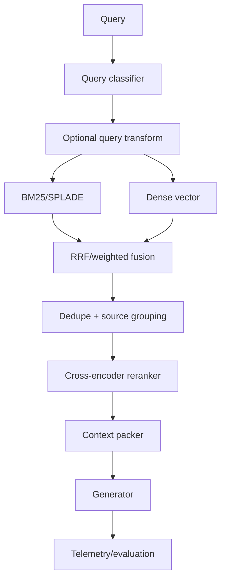
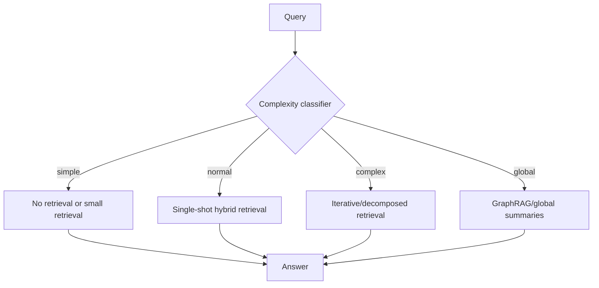
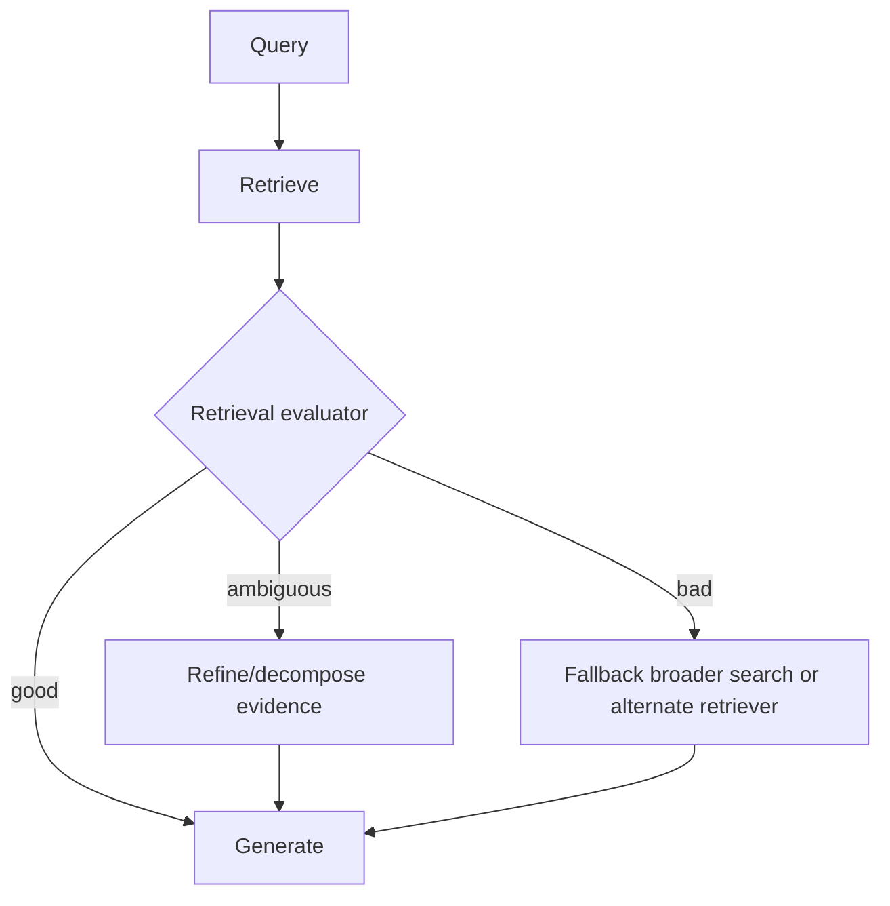
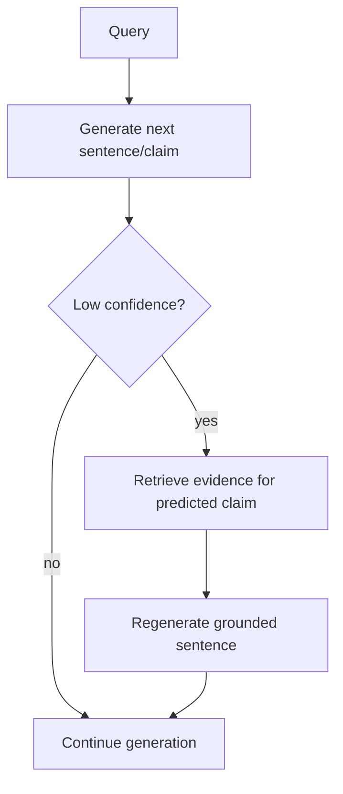
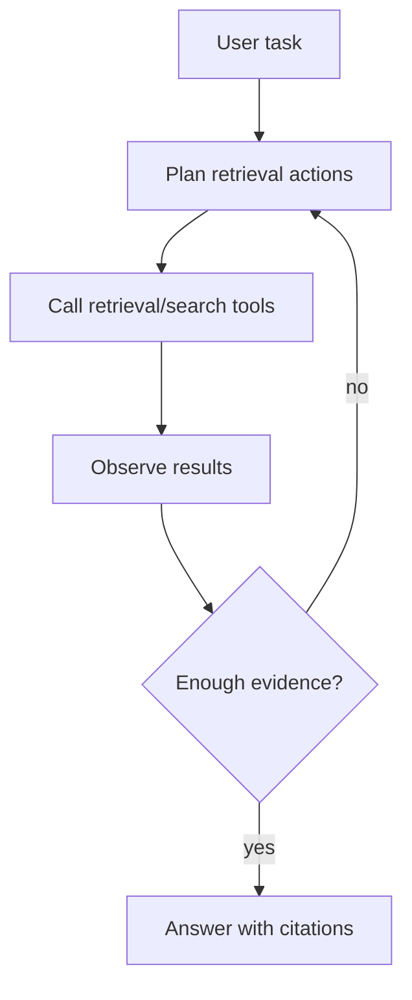
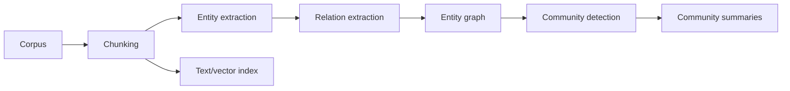
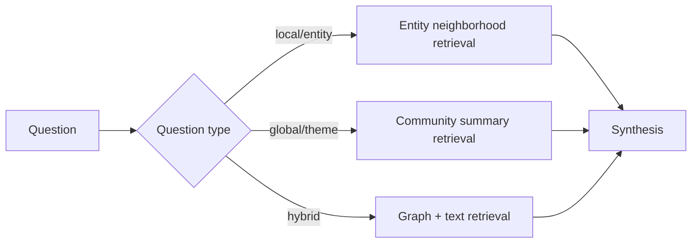

# 03 — Retrieval Pipeline Patterns

## 1. Pipeline design philosophy

A retrieval pipeline is the full chain from user query to ranked evidence. It should not be treated as a single retriever call. The pipeline controls:

- query routing;
- query transformation;
- candidate generation;
- metadata/security filters;
- fusion;
- deduplication;
- reranking;
- context packing;
- provenance tracking;
- abstention and fallback.

The best pipeline is the simplest one that meets recall, precision, latency, cost, and safety requirements.

## 2. Static baseline RAG pipeline


### Advantages

- easy to build;
- low moving parts;
- good for demos;
- good for homogeneous corpora;
- low orchestration cost.

### Weaknesses

- poor lexical exactness;
- limited multi-hop ability;
- no adaptive cost control;
- no robust handling of bad retrieval;
- weak for global/corpus-level questions.

Use this only as a baseline.

## 3. Production hybrid RAG pipeline



### Default settings

| Component | Default |
|---|---|
| Sparse channel | BM25 first; SPLADE when justified |
| Dense channel | domain-appropriate embedding model |
| Fusion | RRF initially |
| First-stage top-k | 50 per channel |
| Rerank top-k | 30–100 candidates |
| Context top-n | 5–20 chunks depending on window |
| Context packing | dedupe, diversify, group by source |
| Metrics | Recall@50, nDCG@10, answer faithfulness, latency, cost |

## 4. Two-stage and three-stage ranking

### Two-stage ranking

```text
candidate generation → reranking
```

Two-stage ranking is the common default. The first stage maximizes recall cheaply; the reranker maximizes precision over a small set.

### Three-stage ranking

```text
candidate generation → cheap rerank/filter → expensive rerank/generator selection
```

Use three stages when:

- top-k is large;
- reranker is expensive;
- you need policy filtering;
- LLM-as-reranker is used only on the final small candidate set.

Example:

```text
BM25+dense top 200 → small cross-encoder top 50 → LLM/listwise reranker top 10
```

## 5. Adaptive retrieval

Adaptive retrieval routes queries to different pipelines based on predicted difficulty.



### Query complexity classes

| Class | Example | Pipeline |
|---|---|---|
| no-retrieval | “Rewrite this paragraph” | no retrieval |
| simple lookup | “What is the vacation policy?” | sparse+dense top-k small |
| semantic factoid | “How do we handle tombstones?” | hybrid + rerank |
| multi-hop | “Compare X and Y across docs A and B” | decomposition + hybrid + rerank |
| global | “What are the main themes in these reports?” | GraphRAG/global summaries |
| uncertain | “Why did the system fail last quarter?” | adaptive iterative retrieval |

## 6. Self-RAG pattern

Self-RAG trains or uses a model that can decide whether to retrieve, generate, and critique using reflection signals.

### Pipeline idea

```text
query → model decides retrieve? → retrieve if needed → generate → critique/support → revise
```

### Best fit

- when you can use or train a Self-RAG-style model;
- high-stakes factuality;
- tasks where retrieval is not always needed;
- systems needing citation/factual self-checking.

### Operational caution

Self-RAG is not merely a prompt pattern. The original approach relies on training models with reflection tokens. A prompt-only imitation may be useful, but it should not be treated as equivalent.

## 7. CRAG pattern

CRAG means **Corrective Retrieval-Augmented Generation**. It adds a retrieval evaluator.



### Best fit

- corpora with uneven retrieval quality;
- systems where bad retrieval is worse than no answer;
- applications that can use fallback search;
- long-form generation where evidence quality varies.

### Implementation options

| Evaluator type | Pros | Cons |
|---|---|---|
| small classifier | cheap | requires labels |
| cross-encoder relevance score | easy if reranker exists | not a complete quality signal |
| LLM judge | flexible | cost and consistency concerns |
| heuristic | cheap | brittle |

## 8. FLARE pattern

FLARE means **Forward-Looking Active Retrieval-Augmented Generation**. It retrieves during generation rather than only before generation.



### Best fit

- long-form reports;
- evolving information needs;
- generation where each section needs different evidence;
- summarization with many claims.

### Costs

- many retrieval calls;
- complicated state management;
- harder citation alignment;
- more evaluation complexity.

## 9. Adaptive-RAG pattern

Adaptive-RAG routes by question complexity:

```text
simple → no retrieval
medium → single retrieval
complex → iterative retrieval
```

### Best fit

- mixed workloads;
- product systems with cost constraints;
- environments where many queries are easy but some are hard;
- systems needing dynamic trade-offs between latency and answer quality.

### Implementation sketch

```python
def route(query):
    label = complexity_classifier.predict(query)
    if label == "simple":
        return no_retrieval_or_small_context(query)
    if label == "medium":
        return hybrid_retrieve_rerank(query)
    if label == "complex":
        return decompose_iterative_retrieve(query)
    if label == "global":
        return graph_rag(query)
```

## 10. Agentic retrieval

Agentic retrieval gives an LLM or controller access to tools:

- search index;
- vector DB;
- SQL database;
- graph database;
- web search;
- reranker;
- citation verifier.

### Agentic loop



### When agentic retrieval helps

- tasks need multiple search steps;
- evidence type is unknown up front;
- the model must choose between tools;
- questions involve database + documents + graph;
- answer requires verification.

### When to avoid it

- high-QPS low-latency APIs;
- weak tool-evaluation telemetry;
- no budget for iterative calls;
- safety constraints require deterministic retrieval.

## 11. GraphRAG pipeline

GraphRAG is a retrieval pipeline optimized for global and relational questions.

### Index-time



### Query-time



### Local vs global GraphRAG

| Mode | Purpose | Retrieval unit | Example question |
|---|---|---|---|
| Local | answer about specific entities/relations | entity neighborhoods + supporting chunks | “How is A connected to B?” |
| Global | corpus-wide sensemaking | community summaries | “What are the main themes?” |
| Hybrid | combine graph and text | subgraphs + chunks | “What evidence supports this relationship?” |

### GraphRAG risks

- entity extraction errors;
- duplicate entities;
- relation hallucination;
- stale graph after document updates;
- high indexing cost;
- hard evaluation;
- graph summaries can hide source-level nuance.

## 12. Context construction after retrieval

Retrieval is not done after reranking. You still need to pack context.

### Packing rules

| Rule | Why it matters |
|---|---|
| dedupe near-identical chunks | avoid wasting context |
| group by source | preserve provenance |
| include neighboring chunks only when needed | avoid chunk-boundary loss |
| diversify sources | reduce single-document tunnel vision |
| preserve rank order but avoid middle loss | improve model attention |
| include metadata | dates, authors, versions, permissions |
| enforce token budget | prevent truncation |

### Candidate-to-context strategy

```text
reranked candidates
→ remove duplicates
→ group by source
→ optionally add parent/neighbor chunks
→ sort by relevance + source diversity
→ compress if needed
→ pack with citations
```

## 13. Pipeline selection matrix

| User/corpus pattern | Pipeline |
|---|---|
| small corpus, simple questions | dense retrieval + reranker optional |
| enterprise docs, mixed queries | BM25+dense hybrid + RRF + reranker |
| legal/policy corpus | BM25/SPLADE+dense + strict metadata filters + reranker |
| technical docs/code | BM25/SPLADE + dense + code-aware reranker |
| multi-hop QA | decomposition + hybrid retrieval + rerank against original query |
| global corpus analysis | GraphRAG + community summaries + source-level verification |
| high-value reports | FLARE/iterative retrieval + citation verification |
| cost-sensitive production | Adaptive-RAG routing |
| unreliable retrieval | CRAG-style retrieval evaluator/fallback |

## 14. References

- Self-RAG — https://arxiv.org/abs/2310.11511
- CRAG — https://arxiv.org/abs/2401.15884
- FLARE / Active RAG — https://arxiv.org/abs/2305.06983
- Adaptive-RAG — https://arxiv.org/abs/2403.14403
- GraphRAG / From Local to Global — https://arxiv.org/abs/2404.16130
- LightRAG — https://arxiv.org/abs/2410.05779
- Retrieval-Augmented Generation for Knowledge-Intensive NLP Tasks — https://arxiv.org/abs/2005.11401
