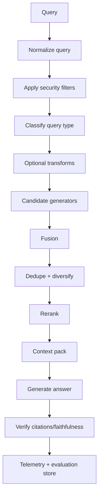

# 06 — Implementation and Evaluation Guide

## 1. Reference architecture



## 2. Query normalization

Normalize without changing intent:

- trim whitespace;
- standardize Unicode;
- preserve casing when IDs/code may be case-sensitive;
- correct obvious spelling only if safe;
- extract quoted terms;
- detect dates, versions, product names, IDs;
- classify query type.

Do **not** rewrite away numbers, names, dates, versions, negations, or quoted text.

## 3. Security and metadata filters

Security filters must be deterministic and non-LLM-controlled. LLM-generated self-query filters are relevance filters, not authorization filters.

```text
final_filter = security_filter(user) AND system_filter(app) AND optional_llm_relevance_filter(query)
```

Recommended filter order:

1. tenant/user authorization;
2. document visibility;
3. data residency/environment;
4. document lifecycle state;
5. query-derived relevance filters.

## 4. Candidate generation implementation

### Hybrid retrieval template

```python
def candidate_generation(query, filters):
    bm25_hits = bm25.search(query, filters=filters, k=50)
    dense_hits = vector.search(embed(query), filters=filters, k=50)
    return {
        "bm25": bm25_hits,
        "dense": dense_hits,
    }
```

### With query variants

```python
def candidate_generation_variants(query, variants, filters):
    rank_lists = []
    for variant in variants:
        rank_lists.append(bm25.search(variant, filters=filters, k=50))
        rank_lists.append(vector.search(embed(variant), filters=filters, k=50))
    return rank_lists
```

## 5. Fusion implementation

### RRF with provenance

```python
def rrf(rank_lists, k=60):
    scores = {}
    provenance = {}
    for source_name, docs in rank_lists:
        for rank, doc in enumerate(docs, start=1):
            doc_id = doc["doc_id"]
            scores[doc_id] = scores.get(doc_id, 0.0) + 1.0 / (k + rank)
            provenance.setdefault(doc_id, []).append({
                "source": source_name,
                "rank": rank,
                "raw_score": doc.get("score")
            })
    fused = sorted(scores.items(), key=lambda x: x[1], reverse=True)
    return [{"doc_id": d, "rrf_score": s, "provenance": provenance[d]} for d, s in fused]
```

### Convex fusion with alpha

```python
def convex_score(sparse_score, dense_score, alpha):
    return alpha * sparse_score + (1 - alpha) * dense_score
```

Use only after score normalization and validation.

## 6. Deduplication and diversification

Deduplicate by:

- exact chunk ID;
- source document ID;
- canonical URL/path;
- content hash;
- near-duplicate similarity;
- parent document grouping.

Diversification strategies:

| Strategy | Use |
|---|---|
| max one chunk per source until coverage reached | avoids one document dominating |
| MMR | balances relevance and novelty |
| section-aware grouping | preserves document structure |
| entity-aware coverage | ensures all key entities are represented |
| time-aware diversity | useful for evolving topics |

### MMR formula

\[
\mathrm{MMR}(d)=\lambda \cdot \mathrm{Rel}(d,q) - (1-\lambda) \cdot \max_{d'\in S}\mathrm{Sim}(d,d')
\]

where \(S\) is the already-selected set.

## 7. Reranking implementation

```python
def rerank(query, candidates, model, top_n=20):
    pairs = [(query, c["text"]) for c in candidates]
    scores = model.score(pairs)
    for c, s in zip(candidates, scores):
        c["rerank_score"] = float(s)
    return sorted(candidates, key=lambda c: c["rerank_score"], reverse=True)[:top_n]
```

### Reranking guardrails

- rerank against the original user query;
- include metadata only if useful and consistently formatted;
- truncate carefully;
- keep source IDs for citations;
- log both pre-rank and post-rank positions;
- monitor score drift after model upgrades.

## 8. Context packing

### Basic packer

```python
def pack_context(reranked, token_budget):
    selected = []
    used_tokens = 0
    seen_sources = set()
    for item in reranked:
        tokens = count_tokens(item["text"])
        if used_tokens + tokens > token_budget:
            continue
        selected.append(item)
        used_tokens += tokens
    return selected
```

### Better packer

```text
1. keep top evidence chunks;
2. remove duplicates;
3. add parent/neighbor chunks only when chunk boundary requires it;
4. diversify across sources;
5. sort into a reader-friendly order;
6. include citation metadata;
7. reserve answer-generation tokens.
```

## 9. Offline evaluation

### Retrieval metrics

| Metric | Measures | Use |
|---|---|---|
| Recall@k | whether any relevant doc appears in top-k | candidate generation quality |
| Precision@k | fraction of top-k relevant | first-stage precision |
| MRR | reciprocal rank of first relevant result | factoid lookup |
| nDCG@k | graded ranking quality | reranking and ranking quality |
| MAP | average precision over recall curve | search evaluation |

### RAG answer metrics

| Metric | Measures |
|---|---|
| answer correctness | final answer matches gold answer |
| faithfulness | answer is supported by retrieved context |
| citation precision | cited chunks support cited claims |
| citation recall | important answer claims have citations |
| abstention quality | refuses when evidence insufficient |
| context utilization | model uses the right retrieved evidence |

## 10. Gold set construction

A strong evaluation set includes:

- query text;
- query type;
- expected answer;
- relevant document IDs;
- graded relevance labels;
- hard negatives;
- required metadata filters;
- answer support spans;
- source recency/version requirements.

### Query type stratification

| Bucket | Minimum examples |
|---|---:|
| exact lookup | 50 |
| semantic factoid | 50 |
| policy/legal clause | 50 |
| code/API | 50 if applicable |
| metadata/date/version | 50 |
| multi-hop/comparison | 50 |
| global/GraphRAG | 25–50 |
| adversarial/ambiguous | 25–50 |

## 11. Ablation matrix

| Ablation | Purpose |
|---|---|
| dense only | semantic baseline |
| BM25 only | lexical baseline |
| BM25+dense RRF | hybrid gain |
| BM25+dense convex | tuning gain |
| SPLADE+dense | learned sparse gain |
| ColBERT | late-interaction gain |
| no transform vs HyDE | vocabulary mismatch gain |
| no transform vs multi-query | recall gain |
| no transform vs decomposition | multi-hop gain |
| no rerank vs rerank | precision gain |
| cross-encoder vs LLM rerank | premium rerank gain |
| static vs adaptive routing | cost-quality routing gain |
| vanilla RAG vs GraphRAG | global/relational gain |

## 12. Online evaluation

Track:

- click-through or result selection;
- query reformulation rate;
- answer thumbs up/down;
- citation click rate;
- abandonment;
- latency and timeout rate;
- cost per successful answer;
- human review score;
- escalation rate.

Use interleaving or A/B tests cautiously. Retrieval changes can affect generation, citation behavior, and user trust all at once.

## 13. Monitoring

### Retrieval telemetry schema

```json
{
  "query_id": "...",
  "query_text_hash": "...",
  "query_type": "multi_hop",
  "tenant_id": "...",
  "retrievers": ["bm25", "dense"],
  "query_transforms": ["decomposition"],
  "fusion": "rrf_k_60",
  "first_stage_top_k": 50,
  "reranker": "bge-reranker-v2-m3",
  "rerank_top_k": 50,
  "context_docs": ["doc1", "doc2"],
  "latency_ms": {
    "retrieval": 82,
    "rerank": 310,
    "generation": 1200
  },
  "cost_estimate": 0.012,
  "answer_feedback": null
}
```

### Alerts

Alert on:

- sudden drop in recall proxy;
- reranker latency spikes;
- empty retrieval results;
- filter over-pruning;
- top source dominance;
- citation mismatch;
- high abstention rate;
- cost/query drift;
- model version mismatch;
- index freshness lag.

## 14. Caching

Cache layers:

| Cache | Key | Invalidation |
|---|---|---|
| embedding cache | normalized text + embedder version | embedder upgrade/text change |
| retrieval cache | query + filters + index version | index update/filter change |
| rerank cache | query + doc IDs + doc versions + reranker version | doc/reranker change |
| answer cache | query + context IDs + generator version | context/generator change |
| graph cache | entity query + graph version | graph update |

## 15. Production rollout sequence

1. Build gold set.
2. Implement dense baseline.
3. Add BM25 baseline.
4. Add hybrid RRF.
5. Add reranker.
6. Tune top-k and context packing.
7. Add query transforms for measured failure classes.
8. Add adaptive routing.
9. Add GraphRAG only if global/relational queries justify it.
10. Add LLM reranker only for premium query classes.
11. Add monitoring and drift dashboards before broad launch.

## 16. Minimum viable dashboard

| Panel | Metrics |
|---|---|
| quality | Recall@k, nDCG@k, answer score, citation support |
| latency | P50/P95/P99 by component |
| cost | cost/query, cost/successful answer |
| traffic | query types, top tenants, top filters |
| failures | no results, low rerank confidence, unsupported answer |
| freshness | index lag, stale document hits |
| safety/security | permission filter misses, blocked docs |

## 17. References

- BEIR benchmark — https://arxiv.org/abs/2104.08663
- RAG original paper — https://arxiv.org/abs/2005.11401
- Azure hybrid search/RRF docs — https://learn.microsoft.com/en-us/azure/search/hybrid-search-overview
- Self-RAG — https://arxiv.org/abs/2310.11511
- CRAG — https://arxiv.org/abs/2401.15884
- FLARE — https://arxiv.org/abs/2305.06983
- Adaptive-RAG — https://arxiv.org/abs/2403.14403
