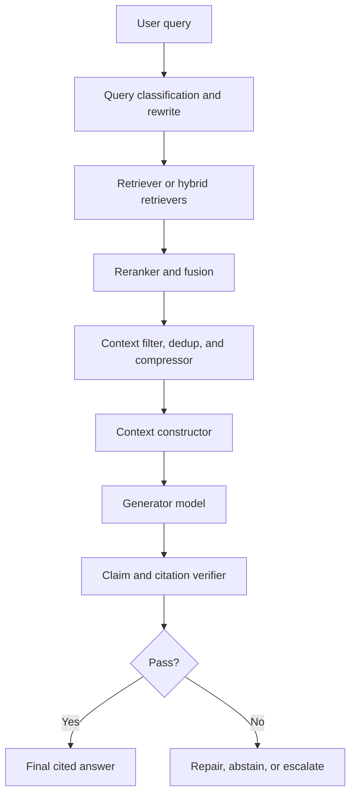

# RAG Design Choices for Context, Grounding, and Compression

**Generated:** 2026-05-18  
**Audience:** applied ML engineers, AI platform engineers, RAG system designers, and technical leads.

This package is a production-oriented set of Markdown reports on the generation-side design choices in Retrieval-Augmented Generation (RAG). It focuses on how retrieved material becomes usable context, how answers are grounded and cited, when to compress context, how to mitigate lost-in-the-middle, and how to choose generator models for RAG.

## Files

| File | Purpose |
|---|---|
| `01_context_construction.md` | Context packing, ordering, metadata, deduplication, budgets, evidence schemas, and failure modes. |
| `02_grounding_citation_abstention.md` | Source-only prompting, citation patterns, abstention design, conflict handling, and verification. |
| `03_lost_in_middle_long_context_vs_retrieval.md` | Lost-in-the-middle, position-aware ordering, long-context-vs-retrieval decisions, and eval design. |
| `04_context_compression.md` | LLMLingua, LongLLMLingua, RECOMP, Selective Context, FILCO, compression ratios, and latency/cost break-even. |
| `05_generator_model_selection_for_rag.md` | Generator model selection by faithfulness, context window, tool support, latency, and cost. |
| `06_implementation_playbook.md` | End-to-end production blueprint, contracts, routing logic, guardrails, metrics, and release checklist. |

## Executive takeaways

1. **Context construction is not just prompt formatting.** It is where retrieval quality, reranking, chunking, metadata, and grounding policy are converted into an answerable evidence bundle.
2. **Long context is not the same as effective context use.** Long-context models can still miss relevant information placed in the middle of a prompt. Evaluate with position-shifted test cases, not only by advertised context length.
3. **Grounding is a system contract.** Reliable citations require citable units, stable IDs, explicit citation instructions, and post-generation citation support checks.
4. **Compression can improve cost, latency, and sometimes quality, but only under the right conditions.** Online compression must beat its own preprocessing overhead.
5. **Generator model choice should be eval-driven.** For RAG, compare models by cost per verified grounded answer, not just headline intelligence or token price.

## Recommended reading order

1. `01_context_construction.md`
2. `02_grounding_citation_abstention.md`
3. `03_lost_in_middle_long_context_vs_retrieval.md`
4. `04_context_compression.md`
5. `05_generator_model_selection_for_rag.md`
6. `06_implementation_playbook.md`

## Canonical RAG generation architecture

## References

- [Lost in the Middle](https://arxiv.org/abs/2307.03172)
- [LLMLingua](https://arxiv.org/abs/2310.05736)
- [LongLLMLingua](https://arxiv.org/abs/2310.06839)
- [Prompt Compression in the Wild](https://arxiv.org/abs/2604.02985)
- [RECOMP](https://arxiv.org/abs/2310.04408)
- [Selective Context](https://arxiv.org/abs/2310.06201)
- [FILCO](https://arxiv.org/abs/2311.08377)
- [RAG Best Practices](https://arxiv.org/abs/2501.07391)
- [RAG Survey](https://arxiv.org/abs/2506.00054)
- [Trustworthy RAG Survey](https://arxiv.org/abs/2502.06872)
- [LongBench](https://arxiv.org/abs/2308.14508)
- [RULER](https://arxiv.org/abs/2404.06654)
- [LongBench Pro](https://arxiv.org/abs/2601.02872)
- [FACTS Grounding](https://arxiv.org/abs/2501.03200)
- [FActScore](https://arxiv.org/abs/2305.14251)
- [OpenAI citation formatting](https://developers.openai.com/api/docs/guides/citation-formatting)
- [OpenAI models](https://developers.openai.com/api/docs/models)
- [OpenAI pricing](https://openai.com/api/pricing/)
- [Anthropic models](https://platform.claude.com/docs/en/about-claude/models/overview)
- [Anthropic API pricing](https://claude.com/platform/api)
- [Gemini models](https://ai.google.dev/gemini-api/docs/models)
- [Gemini 3.1 Pro](https://ai.google.dev/gemini-api/docs/models/gemini-3.1-pro-preview)
- [Gemini 3 Flash](https://ai.google.dev/gemini-api/docs/models/gemini-3-flash-preview)
- [Gemini pricing](https://ai.google.dev/gemini-api/docs/pricing)
