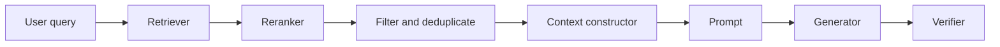

# 01 — Context Construction for RAG

## 1. Definition

In RAG, **context construction** is the transformation from retrieval outputs into a generator-ready evidence bundle. It includes filtering, deduplication, source selection, ordering, token budgeting, metadata formatting, source IDs, compression decisions, and answerability instructions.

A common mistake is to treat the generator prompt as a passive container. In practice, prompt construction changes model behavior. Position, source order, metadata, redundancy, and prompt boundaries all affect whether the model uses the evidence.



## 2. Context construction decisions

| Decision | Options | Why it matters |
|---|---|---|
| Evidence granularity | sentence, passage, chunk, section, parent document | Controls specificity vs surrounding context |
| Selection | fixed top-k, score threshold, token budget, diversity-aware | Controls recall vs distractors |
| Ordering | relevance order, source order, chronological, sandwich, sub-question groups | Affects lost-in-the-middle and synthesis quality |
| Metadata | title, section, page, date, version, authority, source type | Enables citations, recency handling, and conflict resolution |
| Compression | none, extractive, abstractive, token-level, learned filter | Controls cost/window use but can remove evidence |
| Grounding mode | answer-only, cite-every-claim, quote-first, verifier-gated | Controls hallucination and auditability |
| Abstention gate | none, weak, strict, verifier-calibrated | Controls over-answering when evidence is missing |

## 3. Recommended evidence object

```json
{
  "source_id": "policy_2026_refunds",
  "chunk_id": "policy_2026_refunds#annual#p4",
  "title": "Customer Refund Policy",
  "source_type": "policy",
  "authority": 0.95,
  "date": "2026-01-15",
  "effective_date": "2026-02-01",
  "section_path": ["Billing", "Annual subscription refunds"],
  "page": 4,
  "line_start": 12,
  "line_end": 18,
  "retrieval_score": 0.82,
  "rerank_score": 0.91,
  "text": "Annual subscriptions may be refunded on a prorated basis within 30 days of purchase."
}
```

Use stable IDs before generation. A generator cannot cite reliably if source boundaries and source IDs are ambiguous.

## 4. Context formats

### Minimal source-block format

```xml
<SOURCE id="S1" title="Refund Policy" date="2026-01-15" section="Annual subscription refunds" page="4">
Annual subscriptions may be refunded on a prorated basis within 30 days of purchase.
</SOURCE>
```

### Stronger audit format

```xml
<SOURCE id="S1">
  <TITLE>Customer Refund Policy</TITLE>
  <TYPE>policy</TYPE>
  <AUTHORITY>official_current_policy</AUTHORITY>
  <EFFECTIVE_DATE>2026-02-01</EFFECTIVE_DATE>
  <LOCATION>page 4, lines 12-18</LOCATION>
  <TEXT>
  Annual subscriptions may be refunded on a prorated basis within 30 days of purchase.
  </TEXT>
</SOURCE>
```

## 5. Context assembly algorithm

```python
def construct_context(query, retrieved_chunks, budget_tokens):
    chunks = attach_metadata(retrieved_chunks)
    chunks = enforce_access_control(chunks)
    chunks = remove_exact_duplicates(chunks)
    chunks = remove_semantic_duplicates(chunks)
    chunks = cap_per_source(chunks, max_chunks=3)
    chunks = rerank(query, chunks)
    chunks = select_under_budget(chunks, budget_tokens)
    chunks = reorder_for_generation(query, chunks)
    return render_as_source_blocks(chunks)
```

## 6. Ordering strategies

### Relevance order

Use reranker order directly.

**Best for:** short prompts, factoid QA, high-confidence top chunks.  
**Failure mode:** if the prompt is long, the most important evidence may be front-loaded while related evidence is buried later.

### Sandwich order

Place high-value evidence near both the start and end of the context.

```python
def sandwich_order(chunks):
    front = []
    back = []
    for i, chunk in enumerate(chunks):
        if i % 2 == 0:
            front.append(chunk)
        else:
            back.insert(0, chunk)
    return front + back
```

**Best for:** prompts above roughly 8k-16k tokens, queries where a few chunks are decisive, and models that show position sensitivity.

### Sub-question grouping

Use query decomposition, then group evidence under each sub-question.

```text
Sub-question 1: What is the current refund rule?
Sources: S1, S2

Sub-question 2: What are the exceptions?
Sources: S3, S4

Sub-question 3: What changed from the prior policy?
Sources: S5, S6
```

**Best for:** multi-hop QA, comparisons, policy differences, legal/contract QA, technical synthesis.

### Chronological order

Sort by effective date or publication date.

**Best for:** policy evolution, product releases, changelogs, financial filings.  
**Guardrail:** explicitly tell the generator to prefer the current effective source unless historical comparison is requested.

### Authority order

Sort by source authority, then recency, then relevance.

**Best for:** conflicting policy sources, legal material, HR/finance content.  
**Example authority order:** signed contract > current policy > official docs > support article > email/transcript.

## 7. Token budgeting

| Query type | Typical evidence budget | Notes |
|---|---:|---|
| Factoid lookup | 2k-6k | Use high precision; small top-k |
| Policy QA | 4k-16k | Include definitions and exceptions |
| Legal/contract QA | 8k-32k | Preserve exact text and spans |
| Multi-document synthesis | 12k-60k | Use source diversity and grouping |
| Long-document QA | 20k-200k+ | Use section-aware retrieval and maps |
| Summarization | variable | Use hierarchical summaries |
| Codebase QA | variable | Preserve file path and symbols |

Prefer dynamic budgets over fixed top-k. Fixed top-k is simple but brittle.

## 8. Deduplication and diversity

Use both exact and semantic deduplication. Retrieval often returns overlapping chunks from the same document, especially with sliding windows.

Practical controls:

- max chunks per document;
- max chunks per section;
- semantic similarity threshold;
- MMR-style diversity selection;
- source-type balancing;
- mandatory inclusion of authoritative sources.

## 9. Context maps

For long prompts, include a small evidence map before detailed sources.

```text
Evidence map:
- S1: current refund rule
- S2: non-refundable promotion exception
- S3: archived 2024 policy
- S4: support article describing customer-facing language
```

This helps the generator navigate a large evidence bundle and makes the answer easier to audit.

## 10. Query-type-specific construction

### Factoid QA

- small top-k;
- direct evidence only;
- avoid abstractive compression;
- answer in one or two cited sentences.

### Policy/legal QA

- include definitions, exceptions, effective dates, and source authority;
- preserve raw text;
- cite every factual sentence;
- use strict abstention if no direct evidence exists.

### Multi-hop QA

- decompose query;
- retrieve per sub-question;
- include bridge evidence;
- group evidence by sub-question;
- ask generator to cite each step.

### Code RAG

- include file paths, symbol names, dependencies, imports, config values;
- retrieve parent-child chunks;
- order definitions before call sites;
- cite source files/line spans.

### Tables and PDFs

- preserve headers, units, row identifiers, and page numbers;
- avoid flattening tables into ambiguous prose;
- use tools for calculations when possible.

## 11. Prompt template

```text
You are answering using only the provided sources.

Rules:
1. Use only information in SOURCE blocks.
2. Cite every factual claim using [source_id].
3. Do not cite a source unless it directly supports the sentence.
4. If sources conflict, state the conflict and cite both sources.
5. If the answer is not supported, say: "I don't have enough evidence in the provided sources."

Question:
{{question}}

Sources:
{{source_blocks}}

Answer:
```

## 12. Failure modes

| Failure mode | Symptom | Mitigation |
|---|---|---|
| Context dilution | model uses irrelevant distractors | rerank, filter, reduce k |
| Middle neglect | evidence exists but answer ignores it | sandwich order, compression, evidence map |
| Citation laundering | citation exists but does not support claim | claim-source verifier |
| Stale answer | older source used as current | expose effective dates and authority |
| Over-abstention | answerable query refused | calibrate answerability threshold |
| Under-abstention | unsupported answer produced | strict answerability classifier |
| Conflict masking | model silently chooses one source | conflict prompt and authority ranking |
| Access leakage | source from wrong tenant included | enforce ACL before generation |

## 13. Practical defaults

- retrieve 40-80 chunks;
- rerank to 8-20 chunks;
- cap each source at 2-4 chunks;
- preserve title, section, date, source type, page/line;
- use 6k-20k context for ordinary QA;
- use evidence maps for prompts above roughly 16k tokens;
- use sandwich or sub-question ordering for long prompts;
- use strict citation and abstention instructions;
- verify citations after generation.


## References

- [Lost in the Middle](https://arxiv.org/abs/2307.03172)
- [RULER](https://arxiv.org/abs/2404.06654)
- [RAG Best Practices](https://arxiv.org/abs/2501.07391)
- [OpenAI citation formatting](https://developers.openai.com/api/docs/guides/citation-formatting)
- [RAG Survey](https://arxiv.org/abs/2506.00054)
