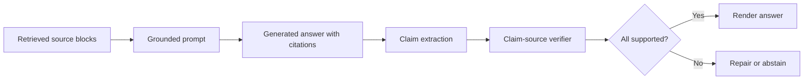

# 02 — Grounding, Citation, and Abstention Prompt Patterns

## 1. Why grounding fails

RAG can reduce hallucinations, but it does not guarantee grounded answers. The generator may:

- use prior knowledge not in the sources;
- combine a sourced fact with an unsupported inference;
- cite a source that is topically related but not actually supportive;
- ignore missing evidence and answer anyway;
- collapse conflicting sources into a single confident answer;
- cite a whole document when only one unsupported sentence matters.

Grounding must be designed as a pipeline: source representation, prompt rules, answerability checks, citation parsing, support verification, and repair/abstention.



## 2. Grounding levels

| Level | Description | Use case |
|---|---|---|
| 0 | No grounding | Creative brainstorming |
| 1 | Model sees context but citations optional | Internal exploration |
| 2 | Answer includes citations | Normal enterprise QA |
| 3 | Every factual sentence cited | Policy, support, knowledge-base QA |
| 4 | Claim-level citation verification | Customer-facing, regulated domains |
| 5 | Full audit trail | Legal, finance, medical, compliance |

## 3. Citable units

Choose citable units before prompting. Common units:

| Citable unit | Precision | Best use |
|---|---:|---|
| Document | Low | Bibliography-level attribution |
| Section | Medium | Manuals/policies |
| Chunk/block | Good | Most RAG systems |
| Sentence | High | Claim-level verification |
| Line/span | Very high | Legal/compliance |
| Table row/cell | Very high | Structured data |

## 4. Source-only prompt

```text
You are a grounded RAG assistant.

Use only the provided sources. Do not use outside knowledge.
Every factual sentence must end with a citation like [S1].
Only cite a source if that source directly supports the sentence.
If the sources do not answer the question, say:
"I don't have enough evidence in the provided sources to answer that."

Question:
{{question}}

Sources:
{{sources}}

Answer:
```

## 5. Quote-first prompt

```text
First extract the minimum excerpts required to answer the question.
Then answer using only those excerpts.

Format:
Relevant excerpts:
- [S1] "..."

Answer:
...
```

Use quote-first when exact wording matters or the cost of unsupported claims is high.

## 6. Answerability-first prompt

```text
Before answering, classify the evidence:
- ANSWERABLE: direct support exists.
- PARTIAL: some evidence exists but important details are missing.
- CONFLICT: sources disagree.
- NOT_ANSWERABLE: no direct support exists.

Then:
- If ANSWERABLE, answer with citations.
- If PARTIAL, answer only the supported portion and list missing evidence.
- If CONFLICT, explain the conflict and cite both sides.
- If NOT_ANSWERABLE, abstain.
```

## 7. Structured answer schema

```json
{
  "answerability": "ANSWERABLE",
  "answer": "Annual subscriptions may be refunded on a prorated basis within 30 days. [S1]",
  "claims": [
    {
      "claim": "Annual subscriptions may be refunded on a prorated basis within 30 days.",
      "source_ids": ["S1"],
      "support_type": "direct"
    }
  ],
  "missing_evidence": [],
  "conflicts": []
}
```

Structured generation makes downstream verification easier.

## 8. Abstention patterns

| Situation | Required behavior |
|---|---|
| No source supports the answer | Abstain |
| Evidence partially answers | Answer only supported part; list missing evidence |
| Sources conflict | State conflict; cite each side |
| Evidence is stale | State latest date available; avoid current claim |
| Query is ambiguous | Ask a targeted clarification or answer conditionally |
| Source is out of scope | Explain scope boundary |
| User asks for inference beyond evidence | Separate source facts from reasoning/recommendation |

## 9. Abstention wording

Recommended wording:

```text
I don't have enough evidence in the provided sources to answer that.
The sources would need to specify: {{missing_information}}.
```

For partial support:

```text
The provided sources support the following: ...
They do not establish: ...
```

For conflict:

```text
The sources conflict. Source S1 states ..., while Source S2 states ...
I cannot resolve the conflict from the provided sources alone.
```

## 10. Claim-citation verification

A verifier should check whether each claim is supported by cited sources.

Support labels:

| Label | Meaning | Action |
|---|---|---|
| DIRECT | source explicitly states claim | allow |
| ENTAILED | simple inference from source | allow depending on risk |
| AGGREGATED | requires multiple cited sources | allow if all cited |
| UNSUPPORTED | source does not support claim | repair/block |
| CONTRADICTED | source says opposite | block |
| UNCLEAR | support ambiguous | repair or abstain |

## 11. Citation precision vs coverage

Two citation metrics are necessary:

- **Citation coverage:** percentage of factual sentences with citations.
- **Citation precision:** percentage of citations that truly support their sentence.

A system can have high coverage and poor precision if it simply attaches citations everywhere. The verifier must check support, not just citation presence.

## 12. Conflict handling

Add explicit authority rules:

```text
When sources conflict, prefer in this order only if metadata is clear:
1. signed contract or current governing policy
2. official product documentation
3. current support article
4. archived documentation
5. informal messages/transcripts

If authority is unclear, do not choose a winner.
```

## 13. Recommendations vs facts

If the answer contains recommendations, split facts from advice:

```text
Source-supported facts:
- ...

Recommendation:
- ...

Basis:
- ...
```

Never cite a source as if it directly supports a subjective recommendation unless the source itself states that recommendation.

## 14. Evaluation

| Metric | Definition |
|---|---|
| Unsupported claim rate | factual claims not supported by cited sources |
| Citation precision | citations that directly support the sentence |
| Citation coverage | factual sentences with at least one citation |
| Abstention recall | unanswerable queries correctly refused |
| Abstention precision | abstentions that were truly unanswerable |
| Conflict detection recall | source conflicts correctly flagged |
| Repair success | failed answers corrected after verifier |
| User trust | human rating of citation usefulness |

## 15. Production checklist

- stable source IDs before generation;
- source blocks include title/date/section/page;
- prompt forbids outside knowledge for factual claims;
- citation format is strict and parseable;
- answerability classes are defined;
- contradiction behavior is explicit;
- citation parser is tested;
- claim-source verifier is deployed;
- unsupported claims trigger repair or abstention;
- logs retain retrieval context and verification results.


## References

- [OpenAI citation formatting](https://developers.openai.com/api/docs/guides/citation-formatting)
- [FACTS Grounding](https://arxiv.org/abs/2501.03200)
- [FActScore](https://arxiv.org/abs/2305.14251)
- [Trustworthy RAG Survey](https://arxiv.org/abs/2502.06872)
- [RAG Survey](https://arxiv.org/abs/2506.00054)
