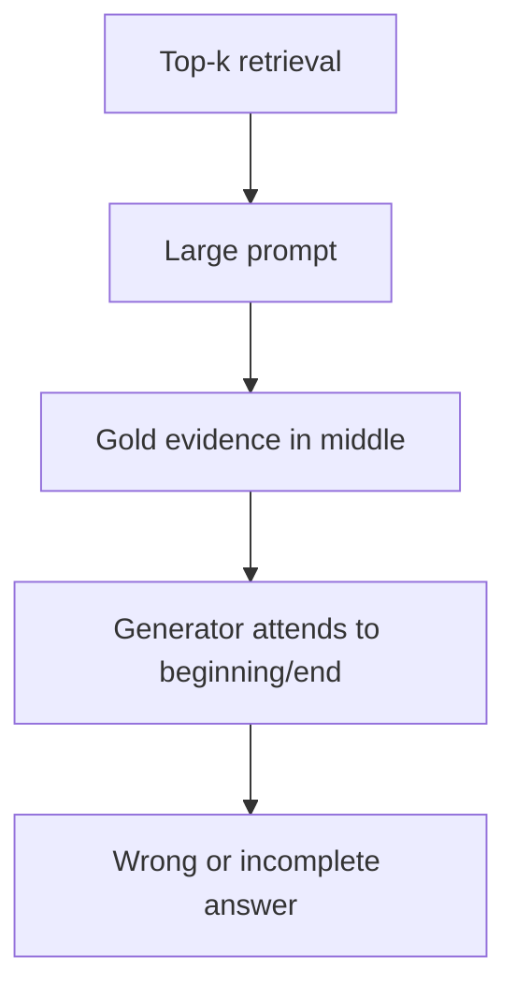
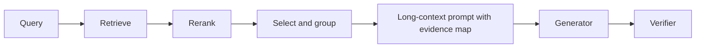

# 03 — Lost-in-the-Middle and Long-Context-vs-Retrieval

## 1. Core finding

Long context is valuable, but advertised context length is not equal to reliable context use. Research on long-context models shows:

- relevant information can be ignored when placed in the middle of long prompts;
- simple needle-in-a-haystack tasks overestimate real long-context reasoning;
- effective context length can be shorter than claimed context length;
- multi-hop, aggregation, and cross-document tasks are harder than isolated retrieval.

## 2. Lost-in-the-middle in RAG

Lost-in-the-middle appears when relevant evidence is included but ignored because it sits in a weak prompt position or is surrounded by distractors.



## 3. Mitigation strategies

### Edge placement

Put decisive evidence near the beginning or end.

```text
[Most important source]
[Supporting sources]
[Background sources]
[Important source recap or direct answer evidence]
```

### Sandwich ordering

```python
def sandwich_order(chunks):
    left = []
    right = []
    for i, chunk in enumerate(chunks):
        if i % 2 == 0:
            left.append(chunk)
        else:
            right.insert(0, chunk)
    return left + right
```

### Evidence map

```text
Evidence map:
- S1: current rule
- S2: exception
- S3: archived policy
- S4: implementation note

Detailed sources:
...
```

### Sub-question grouping

Group evidence by reasoning step rather than by global rerank score.

### Compression

Compress or filter low-value context so decisive evidence is not buried.

### Quote-first generation

Ask the model to identify relevant excerpts before answering.

## 4. Long context vs retrieval

| Scenario | Long context | Retrieval/RAG | Hybrid |
|---|---|---|---|
| One or two uploaded docs | Good | Optional | Often best |
| Millions of documents | Poor | Strong | Strong |
| Frequently updated corpus | Poor | Strong | Strong |
| Need exact citations | Medium | Strong | Strong |
| Need full-document summarization | Strong | Medium | Strong |
| Multi-hop across many docs | Medium | Strong | Strong |
| Tables/calculations | Weak alone | Needs tools | Strong |
| Strict access control | Risky alone | Strong | Strong |
| Low cost/latency | Often weak | Strong | Strong |
| Multimodal PDFs | Strong if model supports inputs | Strong if parsed/indexed | Strong |

## 5. When to use long context

Use long context when:

- the source set is small;
- document continuity matters;
- the task is global summarization or critique;
- retrieval chunking is unreliable;
- evidence is multimodal and the model handles it;
- the context can fit with room for instructions and output.

## 6. When to use retrieval

Use retrieval when:

- corpus is large;
- freshness matters;
- citations and audit logs matter;
- access control matters;
- users ask narrow questions;
- cost and latency matter;
- answerability must be assessed.

## 7. Hybrid pattern



Hybrid RAG uses retrieval to select and structure evidence, then uses long context to preserve enough source continuity.

## 8. Evaluation protocol

Create test variants:

1. gold evidence at beginning;
2. gold evidence in middle;
3. gold evidence at end;
4. multiple gold spans;
5. gold spans separated by distractors;
6. conflicting sources;
7. stale-vs-current sources;
8. unanswerable prompts;
9. long table prompts;
10. compressed vs uncompressed context.

Metrics:

| Metric | Meaning |
|---|---|
| Position sensitivity delta | performance difference by evidence position |
| Gold evidence utilization | whether answer uses required source |
| Citation support | whether cited source supports answer |
| Long-context degradation | score drop as prompt length grows |
| Cost per answer | input + output + verifier cost |
| Latency | P50/P95/P99 |
| Abstention quality | refuses when evidence absent |

## 9. Practical rules

- For prompts under 8k tokens, simple relevance order is often fine.
- From 8k-32k, use evidence maps and position-aware ordering.
- Above 32k, explicitly test lost-in-the-middle.
- Above 200k, use retrieval or staged reading unless the task truly requires full context.
- Do not assume a 1M-token context window means 1M-token reasoning reliability.
- For high-stakes work, combine retrieval, source IDs, citations, and verification.


## References

- [Lost in the Middle](https://arxiv.org/abs/2307.03172)
- [RULER](https://arxiv.org/abs/2404.06654)
- [LongBench](https://arxiv.org/abs/2308.14508)
- [LongBench Pro](https://arxiv.org/abs/2601.02872)
- [RAG Best Practices](https://arxiv.org/abs/2501.07391)
