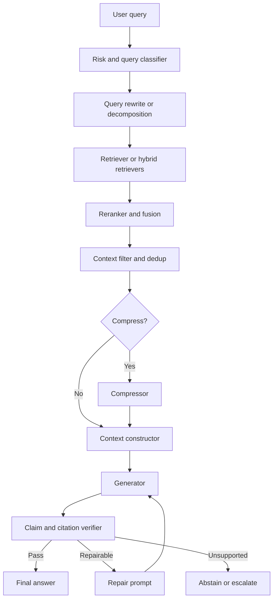

# 06 — Implementation Playbook: Context, Grounding, Compression

## 1. Reference architecture



## 2. Evidence contract

```json
{
  "source_id": "S1",
  "chunk_id": "doc123#section4#chunk2",
  "tenant_id": "tenant_a",
  "title": "Refund Policy",
  "source_type": "policy",
  "authority": 0.95,
  "date": "2026-01-15",
  "effective_date": "2026-02-01",
  "section_path": ["Billing", "Refunds"],
  "page": 4,
  "line_start": 12,
  "line_end": 18,
  "text": "Annual subscriptions may be refunded...",
  "retrieval_score": 0.82,
  "rerank_score": 0.91,
  "permissions": ["tenant_a:employees"]
}
```

## 3. Answer contract

```json
{
  "answerability": "ANSWERABLE",
  "answer": "Annual subscriptions may be refunded on a prorated basis within 30 days. [S1]",
  "claims": [
    {
      "claim": "Annual subscriptions may be refunded on a prorated basis within 30 days.",
      "source_ids": ["S1"],
      "support_type": "direct",
      "confidence": "high"
    }
  ],
  "missing_evidence": [],
  "conflicts": []
}
```

## 4. Routing rules

```python
def choose_rag_mode(query_class, risk, retrieval_confidence, context_tokens):
    if risk in {"legal", "medical", "financial", "hr"}:
        return "strict_grounded_with_verifier"
    if retrieval_confidence < 0.35:
        return "answerability_first"
    if context_tokens > 32000:
        return "long_context_with_reordering"
    if query_class == "multi_hop":
        return "decomposed_retrieval_with_grouped_context"
    return "standard_grounded_qa"
```

## 5. Default configuration

```yaml
retrieval:
  initial_k: 60
  rerank_k: 20
  max_chunks_per_source: 3
  min_rerank_score: 0.35

context:
  default_budget_tokens: 16000
  high_stakes_budget_tokens: 32000
  include_metadata:
    - source_id
    - title
    - section
    - effective_date
    - page
    - line_range
  ordering:
    short_context: rerank_order
    long_context: sandwich_order
    multi_hop: subquestion_grouping

grounding:
  cite_every_factual_sentence: true
  abstain_when_unsupported: true
  verify_claim_citations: true
  max_repair_attempts: 1

compression:
  enable_when_context_tokens_gt: 16000
  allowed_for_high_stakes: extractive_only
  preserve_source_spans: true
```

## 6. Prompt bundle

### Standard grounded QA

```text
Use only the provided sources.
Cite every factual sentence with [source_id].
If no source directly supports the answer, abstain.
If sources conflict, state the conflict and cite both sides.

Question:
{{question}}

Sources:
{{sources}}

Answer:
```

### Verifier prompt

```text
For each claim, decide whether the cited sources support it.
Labels:
- DIRECT
- ENTAILED
- AGGREGATED
- UNSUPPORTED
- CONTRADICTED
- UNCLEAR

Return only JSON.
```

### Repair prompt

```text
The previous answer contained unsupported claims.
Revise it so every factual claim is directly supported by cited sources.
If support is missing, remove the claim or abstain.
```

## 7. Compression gate

```python
def should_compress(context_tokens, model_window, compression_overhead_ms, expected_generation_savings_ms):
    if context_tokens < 8000:
        return False
    if context_tokens > 0.7 * model_window:
        return True
    return expected_generation_savings_ms > compression_overhead_ms
```

## 8. Guardrails

| Guardrail | Trigger | Action |
|---|---|---|
| Low retrieval confidence | top rerank score below threshold | abstain or ask clarification |
| Citation missing | factual sentence lacks citation | repair/block |
| Unsupported citation | verifier rejects support | repair/block |
| Source conflict | contradictory sources retrieved | cite both and avoid unsupported resolution |
| Stale source | older source conflicts with newer | prefer current only if metadata proves authority |
| Access-control mismatch | source tenant != user tenant | remove source and alert |
| Token overflow | context exceeds budget | rerank/filter/compress |
| Repair loop exhausted | answer still unsupported | abstain or human handoff |

## 9. Evaluation dataset

| Bucket | Suggested target |
|---|---:|
| Direct answerable | 100-300 |
| Multi-source answerable | 100-300 |
| Unanswerable | 100-300 |
| Partial evidence | 50-150 |
| Conflicting sources | 50-150 |
| Stale/current | 50-150 |
| Lost-in-middle | 50-150 |
| Compression regression | 50-150 |
| Numeric/table | 50-150 |
| High-stakes policy | 50-150 |

## 10. Metrics

```yaml
grounding:
  - grounded_claim_precision
  - unsupported_claim_rate
  - citation_precision
  - citation_coverage
abstention:
  - abstention_precision
  - abstention_recall
retrieval_context:
  - gold_evidence_recall
  - context_token_count
  - source_diversity
compression:
  - compression_ratio
  - retained_gold_evidence
  - compression_latency
performance:
  - p50_latency
  - p95_latency
  - p99_latency
  - cost_per_request
  - cost_per_verified_answer
```

## 11. Observability logs

Log:

- user query;
- query class and risk tier;
- retrieval parameters;
- index/retriever/reranker versions;
- selected source IDs and scores;
- context token count;
- source ordering strategy;
- compression method/version/ratio;
- generator model/version;
- prompt template/version;
- generated answer;
- citations;
- verifier labels;
- repair attempts;
- final answerability status;
- latency by stage;
- cost estimate.

## 12. Release checklist

- [ ] Access-control tests pass.
- [ ] Source IDs are stable.
- [ ] Citation parser is tested.
- [ ] Verifier is calibrated.
- [ ] Unanswerable evals pass.
- [ ] Conflict evals pass.
- [ ] Lost-in-the-middle evals pass.
- [ ] Compression does not remove gold evidence.
- [ ] P95/P99 latency acceptable.
- [ ] Cost per verified answer acceptable.
- [ ] Model and prompt versions pinned.
- [ ] Rollback plan exists.
- [ ] Monitoring dashboards exist.

## 13. Deployment recipes

### Customer support FAQ

- rerank to 5-10 chunks;
- context budget 6k-12k;
- cite every factual sentence;
- cheap or medium generator;
- verifier enabled for customer-facing answers.

### Internal policy assistant

- authoritative metadata required;
- raw or extractive context only;
- strict abstention;
- claim-level verifier;
- full audit logs.

### Long technical-document QA

- section-aware retrieval;
- evidence map;
- long-context model;
- optional span-preserving compression;
- lost-in-the-middle tests.

### Codebase RAG

- path/symbol-aware retrieval;
- definitions before callers;
- file/line citations;
- optional test/tool execution;
- abstain when relevant code not retrieved.

### Multi-document synthesis

- query decomposition;
- per-sub-question retrieval;
- source diversity caps;
- grouped context;
- conflict detection.


## References

- [RAG Best Practices](https://arxiv.org/abs/2501.07391)
- [RAG Survey](https://arxiv.org/abs/2506.00054)
- [Trustworthy RAG Survey](https://arxiv.org/abs/2502.06872)
- [Lost in the Middle](https://arxiv.org/abs/2307.03172)
- [LLMLingua](https://arxiv.org/abs/2310.05736)
- [LongLLMLingua](https://arxiv.org/abs/2310.06839)
- [RECOMP](https://arxiv.org/abs/2310.04408)
- [FILCO](https://arxiv.org/abs/2311.08377)
- [FACTS Grounding](https://arxiv.org/abs/2501.03200)
- [OpenAI citation formatting](https://developers.openai.com/api/docs/guides/citation-formatting)
