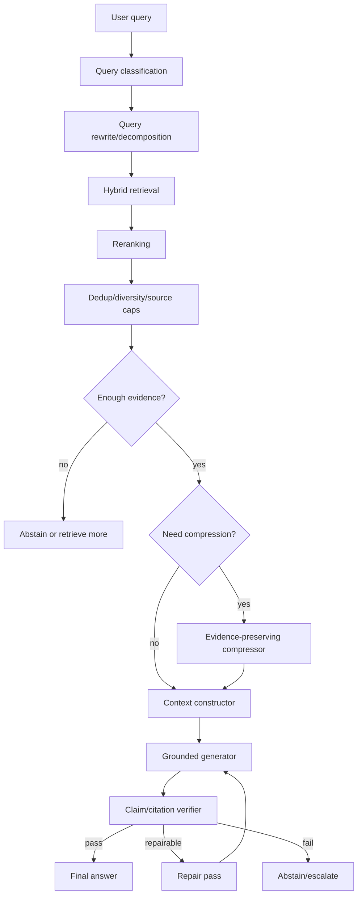

# 00 — Executive Summary

## One-page answer

The second report, **RAG Design Choices for Context, Grounding, Compression, and Generator Selection**, argues that high-quality RAG depends on the generation-side contract between retrieved evidence and the model. Retrieval recall is necessary, but not sufficient. The system must also decide which evidence to show, how much to show, how to order it, how to cite it, when to compress it, when to abstain, and which generator model can reliably follow those rules under the required latency and cost constraints.

## Main conclusions

1. **Context construction is a first-class architecture layer.**  
   Do not pass raw top-k retrieval results directly to the generator. Use reranking, deduplication, diversity constraints, source caps, source metadata, citable IDs, and token budgets.

2. **Long context does not eliminate retrieval.**  
   Long-context models can help when whole-document synthesis is needed, but effective context use can degrade with long prompts, distractors, and evidence in weak positions. Retrieval remains cheaper and often faster for large/dynamic corpora.

3. **Grounding requires a citation contract.**  
   A citation is only useful if it supports the exact sentence it is attached to. Production RAG should use source IDs, stable source spans, support verification, and repair or abstention when claims are unsupported.

4. **Abstention is a model behavior and a system policy.**  
   Prompting alone is not enough. Use answerability classification, evidence sufficiency checks, calibrated thresholds, and escalation paths.

5. **Compression is useful only when it preserves evidence.**  
   Methods such as LLMLingua, LongLLMLingua, LLMLingua-2, RECOMP, and Selective Context can reduce token cost and latency, but they can also destroy citation fidelity if used after evidence selection without preserving source spans.

6. **Generator selection should be workload-specific.**  
   Choose models by groundedness, citation precision, abstention calibration, long-context reliability, structured output adherence, latency, and cost per verified answer.

## Recommended default architecture

## Practical defaults

| Layer | Default starting point | Tune when |
|---|---|---|
| Retrieval | Retrieve broad, rerank narrow | Recall@k is low or distractors dominate |
| Context size | Start with 6k–20k evidence tokens | Long-doc/multi-hop tasks need more |
| Source formatting | Stable source IDs, title, section, date, page/line/span | Citations become vague or unsupported |
| Ordering | Best evidence at boundaries, grouped by sub-question | Lost-in-the-middle or distractor errors appear |
| Grounding prompt | Source-only, cite every factual claim, explicit abstention | Model uses prior knowledge or unsupported claims |
| Compression | Use only after measuring answer support and citation precision | Token cost/latency is a bottleneck |
| Generator | Evaluate at least 3 tiers: cheap, balanced, frontier | Cost per verified answer is too high |
| Verification | Claim-source support check plus citation parsing | High-stakes or customer-facing answers |

## Evaluation metrics

Measure the system, not just the model:

| Metric | Why it matters |
|---|---|
| Retrieval recall@k | Whether answer-bearing evidence enters the pipeline |
| Reranker nDCG/MRR | Whether useful evidence appears early enough |
| Context precision | Fraction of prompt context that is actually useful |
| Faithfulness/support | Whether answer claims are entailed by sources |
| Citation precision | Whether each citation supports the sentence attached to it |
| Abstention accuracy | Whether the system refuses unsupported questions |
| Over-abstention rate | Whether the system refuses answerable questions |
| Latency p50/p95/p99 | Whether UX/SLOs are met |
| Cost per verified answer | True production objective for most RAG systems |

## Decision rule

Use the cheapest model and context strategy that passes your groundedness, citation, and abstention evals. Escalate to larger context, stronger generator models, or human review only when the evidence/task demands it.
