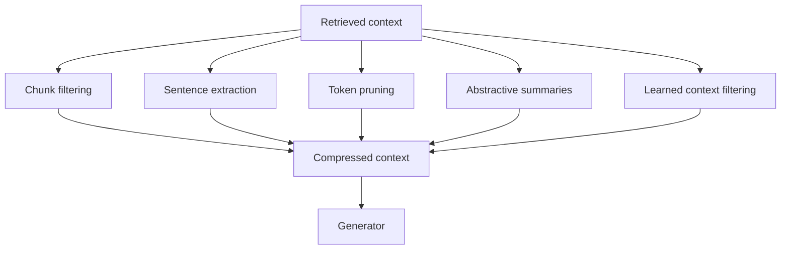

# 04 — Context Compression for RAG

> Part of **Report 02 — RAG Design Choices for Context, Grounding, Compression, and Generator Selection**.

## 1. Definition

Context compression reduces the amount of text passed to the generator while preserving answer-relevant information.

Compression can happen at several levels:



## 2. Why compress context

Compression helps when:

- context exceeds model window;
- input token cost is high;
- generation latency is too high;
- relevant evidence is sparse;
- retrieval returns noisy long chunks;
- lost-in-the-middle is hurting performance;
- many users ask over repeated long documents.

Compression hurts when:

- exact wording matters;
- tables, formulas, or code are distorted;
- citation spans must map precisely to originals;
- compression overhead exceeds generation savings;
- the compressor removes exception clauses or bridge facts.

## 3. Method catalog

| Method | Unit | Best for | Risk |
|---|---|---|---|
| Rerank cutoff | chunk | simple QA | misses low-score evidence |
| Source caps | document | dedup/diversity | may remove needed same-doc context |
| MMR | chunk | diverse synthesis | keeps diverse but weak chunks |
| Sentence extraction | sentence | policy/legal QA | loses definitions |
| Token pruning | token | long natural-language prompts | damages readability |
| Query-focused summary | passage/document | synthesis | can omit exceptions |
| Abstractive summary | document | summarization | may hallucinate |
| Learned filter | sentence/chunk | repeated domains | needs data |
| Selective augmentation | full context | irrelevant retrieval | abstention calibration |

## 4. LLMLingua

LLMLingua is a coarse-to-fine prompt compression method. It uses a budget controller, token-level iterative compression, and instruction tuning to align the compressor with the target LLM. The paper reports up to 20x compression with little performance loss across several tasks.

Use when:

- prompts are long and redundant;
- exact wording is not the core requirement;
- generator token cost is high;
- you can evaluate task-specific quality after compression.

Avoid when:

- source exactness matters;
- citations need original spans;
- tables/code/legal clauses are central;
- prompts are short enough that compression overhead dominates.

## 5. LongLLMLingua

LongLLMLingua adapts compression to long-context settings and explicitly targets position bias, cost, and latency. It is especially relevant when key information is sparse inside long retrieved context.

Use when:

- relevant evidence is buried in long prompts;
- prompts are around 10k+ tokens;
- generation cost dominates compression cost;
- you can preserve source mappings.

## 6. RECOMP

RECOMP trains extractive and abstractive compressors for retrieval-augmented LMs. It can also return empty context when retrieval is irrelevant, implementing selective augmentation.

Use when:

- you can train or tune compressors;
- retrieval returns long documents;
- you want summaries optimized for the downstream LM;
- irrelevant retrieval should sometimes be suppressed.

## 7. Selective Context

Selective Context prunes redundancy from long inputs. It is useful when the main issue is inefficient natural-language context rather than poor retrieval.

Use when:

- inputs include redundancy;
- memory and inference time are bottlenecks;
- semantic preservation matters more than exact span preservation.

## 8. FILCO

FILCO learns to filter context for RAG and addresses over-reliance and under-reliance on imperfect retrieved passages.

Use when:

- retrieval noise is high;
- task types repeat;
- training data exists;
- you want a learned pre-generation context filter.

## 9. Compression break-even

Compression is useful only if:

```text
compression_time + generation_time(compressed_prompt)
<
generation_time(original_prompt)
```

Recent latency-focused work shows that compression can help under the right prompt length, compression ratio, and hardware conditions, but preprocessing overhead can erase the gain outside that operating window.

## 10. Citation-preserving compression

For grounded RAG, prefer extractive compression with source spans:

```json
{
  "source_id": "S1",
  "original_location": "page 4 lines 12-18",
  "compression_type": "extractive",
  "text": "Annual subscriptions may be refunded on a prorated basis within 30 days."
}
```

Avoid abstractive rewriting for citation-critical answers unless the final answer cites the original span and a verifier checks support.

## 11. Compression ratios

| Ratio | Risk | Suggested use |
|---:|---|---|
| 1.2x-2x | low | safe default |
| 2x-4x | moderate | long but redundant prompts |
| 4x-8x | high | sparse evidence, strong evals |
| 8x-20x | very high | specialized use only |
| >20x | extreme | research/prototyping unless heavily validated |

## 12. Evaluation metrics

| Metric | What it measures |
|---|---|
| Retained gold evidence | whether necessary evidence survived |
| Compression ratio | token reduction |
| Compression latency | overhead |
| End-to-end latency | actual user speed |
| Answer quality | downstream task score |
| Faithfulness | no new facts introduced |
| Citation span preservation | original support still traceable |
| Conflict preservation | conflicting evidence not erased |
| Abstention preservation | unanswerable remains unanswerable |

## 13. Production defaults

- filter and rerank before compression;
- use extractive compression for high-stakes RAG;
- use LongLLMLingua-style compression for sparse evidence in long prompts;
- cache compressed context for stable documents;
- keep original spans for citations;
- evaluate compression by cost per verified answer;
- do not compress tables/code/legal clauses without specialized tests;
- log original context, compressed context, compression ratio, compressor version, and verifier result.


## References

- [LLMLingua](https://arxiv.org/abs/2310.05736)
- [LongLLMLingua](https://arxiv.org/abs/2310.06839)
- [Prompt Compression in the Wild](https://arxiv.org/abs/2604.02985)
- [RECOMP](https://arxiv.org/abs/2310.04408)
- [Selective Context](https://arxiv.org/abs/2310.06201)
- [FILCO](https://arxiv.org/abs/2311.08377)
