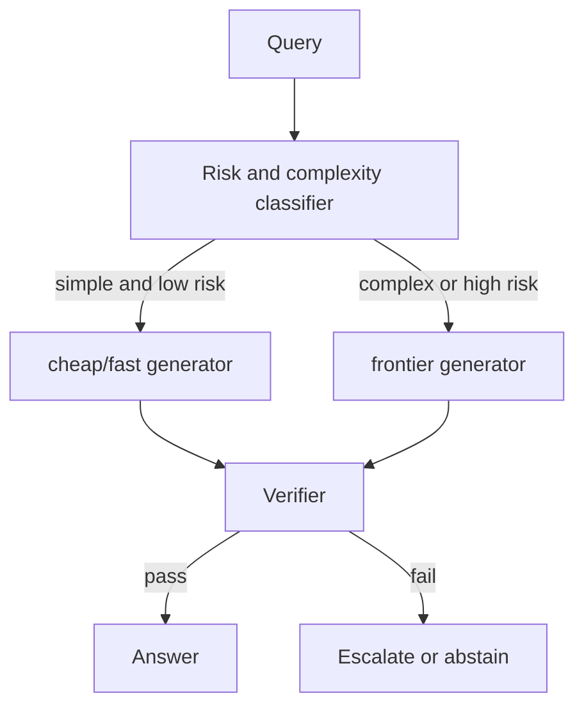

# 05 — Generator Model Selection for RAG

> Part of **Report 02 — RAG Design Choices for Context, Grounding, Compression, and Generator Selection**.

## 1. Why generator choice matters

The generator in RAG must do more than write well. It must use sources correctly, respect missing evidence, cite precisely, handle long context, follow structured output schemas, and meet latency/cost targets.

A model with strong general reasoning can still be a poor RAG generator if it:

- overuses prior knowledge;
- ignores retrieved evidence;
- fabricates or launders citations;
- fails to abstain;
- collapses conflicting sources;
- degrades with long prompts;
- cannot follow JSON/citation schemas.

## 2. Selection criteria

| Criterion | Why it matters |
|---|---|
| Grounded factuality | answer must be supported by context |
| Citation precision | citations must support exact claims |
| Abstention calibration | no answer when evidence absent |
| Long-context reliability | model must use evidence throughout prompt |
| Context window | must fit source blocks and output |
| Tool support | retrieval, file search, web search, calculators, verifiers |
| Structured output | claim tables and JSON schemas |
| Latency | P95/P99 must match product constraints |
| Cost | cost per verified answer matters |
| Prompt caching | repeated context can change economics |
| Multimodal input | PDFs/images/tables when needed |
| Data governance | region, privacy, retention, enterprise controls |

## 3. Managed model snapshot

**Snapshot date:** 2026-05-18. Always verify current vendor docs before production procurement.

| Provider/model | Context window | Max output | Input price | Output price | RAG notes |
|---|---:|---:|---:|---:|---|
| OpenAI `gpt-5.5` | 1M | 128k | $5 / MTok | $30 / MTok | flagship model in OpenAI docs; supports tools such as functions, web search, file search, and computer use |
| OpenAI `gpt-5.4` | 1M | 128k | $2.50 / MTok | $15 / MTok | lower-cost frontier option |
| OpenAI `gpt-5.4-mini` | 400k | 128k | $0.75 / MTok | $4.50 / MTok | cost/latency option for high-volume RAG |
| Claude Opus 4.7 | 1M | 128k | $5 / MTok | $25 / MTok | Anthropic's most capable generally available model in current docs |
| Claude Sonnet 4.6 | 1M | 64k | $3 / MTok | $15 / MTok | balance of intelligence, speed, and cost |
| Claude Haiku 4.5 | 200k | 64k | $1 / MTok | $5 / MTok | fastest/most cost-effective Claude option |
| Gemini 3.1 Pro Preview | 1,048,576 | 65,536 | pricing varies by tier/modality | pricing varies by tier/modality | supports text/image/video/audio/PDF, caching, tools, search grounding, URL context, structured outputs |
| Gemini 3 Flash Preview | 1,048,576 | 65,536 | pricing varies by tier/modality | pricing varies by tier/modality | speed-oriented Gemini 3 option with grounding/tool support |
| Gemini 3.1 Flash-Lite | model page dependent | model page dependent | low-cost paid tiers visible in pricing docs | low-cost paid tiers visible in pricing docs | high-volume/budget candidate; validate grounding carefully |
| Gemini 2.5 Pro | model page dependent | model page dependent | pricing docs list paid standard tiers | pricing docs list paid standard tiers | mature long-context candidate |

## 4. Cost per verified answer

Do not optimize only for raw token price.

```text
pipeline_cost =
  retrieval_cost
+ reranking_cost
+ compression_cost
+ generator_input_cost
+ generator_output_cost
+ verifier_cost
+ retry_or_escalation_cost

cost_per_verified_answer =
  total_pipeline_cost / number_of answers passing support checks
```

A cheaper model can be more expensive if it causes retries, hallucinations, or manual review.

## 5. Evaluation set for generator choice

Build a generator eval set with the same retrieved context for each model.

| Bucket | Purpose |
|---|---|
| Direct answerable | tests simple grounding |
| Multi-source answerable | tests synthesis |
| Unanswerable | tests abstention |
| Partial evidence | tests calibrated partial responses |
| Conflicting sources | tests conflict handling |
| Stale/current sources | tests recency/authority logic |
| Lost-in-middle | tests long-context utilization |
| Citation trap | tests citation precision |
| Numeric/table | tests exact extraction |
| Long distractor | tests robustness to noise |

## 6. Metrics

| Metric | Description |
|---|---|
| Answer accuracy | task-specific correctness |
| Grounded claim precision | percentage of claims supported |
| Unsupported claim rate | factual claims without support |
| Citation precision | citations that support the sentence |
| Citation coverage | factual sentences with citation |
| Abstention recall | unanswerable cases refused |
| Abstention precision | refusals that were warranted |
| Conflict detection recall | contradictions surfaced |
| Schema adherence | valid JSON/structured output |
| P95/P99 latency | production readiness |
| Cost per verified answer | economic quality |

## 7. Routing design



Use smaller models for:

- query rewriting;
- low-risk short answers;
- extraction;
- citation parsing;
- preliminary answerability classification.

Use stronger models for:

- multi-hop synthesis;
- high-stakes domains;
- conflicting sources;
- long-context prompts;
- final answers after failed verification.

## 8. Context window decision rules

| Evidence size | Suggested approach |
|---:|---|
| <8k tokens | choose by cost/quality; long-context not necessary |
| 8k-32k | use position-aware ordering |
| 32k-200k | use long-context model and lost-in-middle eval |
| 200k-1M | use frontier long-context model, evidence map, compression |
| >1M | iterative retrieval/reading, map-reduce, or agentic workflow |

## 9. Prompt caching

Prompt caching changes economics for repeated context. Use it when:

- many queries share the same policy corpus;
- system prompts are long;
- documents are stable;
- workflow uses repeated tool instructions;
- tenant-specific source packs recur.

Avoid relying on caching when:

- every query retrieves unique context;
- source permissions vary per user;
- documents change frequently.

## 10. Recommended workflow

1. Choose candidate models across price tiers.
2. Create a fixed retrieval-context eval set.
3. Evaluate answer quality, support precision, citation precision, abstention, latency, and cost.
4. Add verifier and escalation.
5. Compare cost per verified answer.
6. Select default, fallback, and verifier models.
7. Pin model versions.
8. Re-run evals when model versions or prompts change.


## References

- [OpenAI models](https://developers.openai.com/api/docs/models)
- [OpenAI pricing](https://openai.com/api/pricing/)
- [Anthropic models](https://platform.claude.com/docs/en/about-claude/models/overview)
- [Anthropic API pricing](https://claude.com/platform/api)
- [Gemini models](https://ai.google.dev/gemini-api/docs/models)
- [Gemini 3.1 Pro](https://ai.google.dev/gemini-api/docs/models/gemini-3.1-pro-preview)
- [Gemini 3 Flash](https://ai.google.dev/gemini-api/docs/models/gemini-3-flash-preview)
- [Gemini pricing](https://ai.google.dev/gemini-api/docs/pricing)
- [FACTS Grounding](https://arxiv.org/abs/2501.03200)
- [FActScore](https://arxiv.org/abs/2305.14251)
- [RULER](https://arxiv.org/abs/2404.06654)
