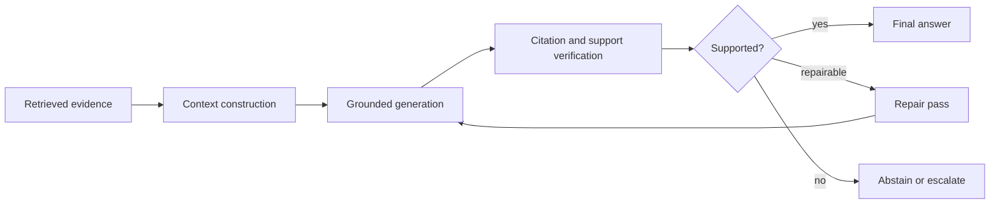

# Report 02 — RAG Design Choices for Context, Grounding, Compression, and Generator Selection

**Generated:** 2026-05-18  
**Format:** Markdown research bundle  
**Audience:** applied ML engineers, AI platform engineers, RAG system designers, technical leads, and research engineers building production RAG systems.

This bundle expands the second RAG report into standalone Markdown files. It focuses on the **generation-side design surface** of RAG: how retrieved evidence is shaped into context, how models are forced to stay grounded, how citations and abstention should be implemented, when context compression helps, how lost-in-the-middle affects long-context prompting, and how to select the generator model for a given RAG workload.

## Bundle contents

| File | What it covers |
|---|---|
| `00_executive_summary.md` | Decision-level summary, system architecture, and recommended defaults. |
| `01_context_construction_and_context_packing.md` | Chunk-to-context pipeline, source schemas, evidence ordering, metadata, token budgets, and failure modes. |
| `02_grounding_citation_abstention_patterns.md` | Evidence-first prompting, citation contracts, abstention logic, conflict handling, and verification loops. |
| `03_lost_in_the_middle_and_long_context_vs_retrieval.md` | Positional bias, context ordering, distractor control, long-context vs RAG tradeoffs, and eval design. |
| `04_context_compression_and_llmlingua.md` | LLMLingua, LongLLMLingua, LLMLingua-2, RECOMP, Selective Context, compression economics, and risks. |
| `05_generator_model_selection_for_rag.md` | Generator selection by faithfulness, abstention, window size, latency, cost, and deployment model. |
| `06_implementation_playbook.md` | End-to-end production blueprint, routing logic, contracts, observability, release checklist, and eval plan. |
| `07_references_and_source_map.md` | Consolidated sources grouped by topic. |
| `FULL_REPORT.md` | All files merged into one long Markdown document. |

## How to use this bundle

Use this as a design document set for building or evaluating a RAG system. A practical reading order is:

1. Start with `00_executive_summary.md` to understand the design recommendations.
2. Use `01_context_construction_and_context_packing.md` before touching prompt templates. Most RAG generation failures begin with bad context construction.
3. Use `02_grounding_citation_abstention_patterns.md` to define source IDs, citation syntax, and support-verification rules.
4. Use `03_lost_in_the_middle_and_long_context_vs_retrieval.md` when deciding between larger context windows and retrieval/reranking.
5. Use `04_context_compression_and_llmlingua.md` when token budget, latency, or prompt length becomes a bottleneck.
6. Use `05_generator_model_selection_for_rag.md` to select default, fallback, and verifier models.
7. Use `06_implementation_playbook.md` as the production checklist.

## Core thesis

A strong RAG generator is not only a more intelligent model. It is the outcome of a **source-aware context contract**:

The best systems optimize for **cost per verified grounded answer**, not just top-line model intelligence or raw token price.
