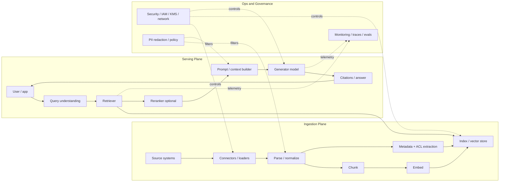
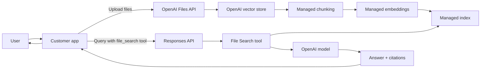
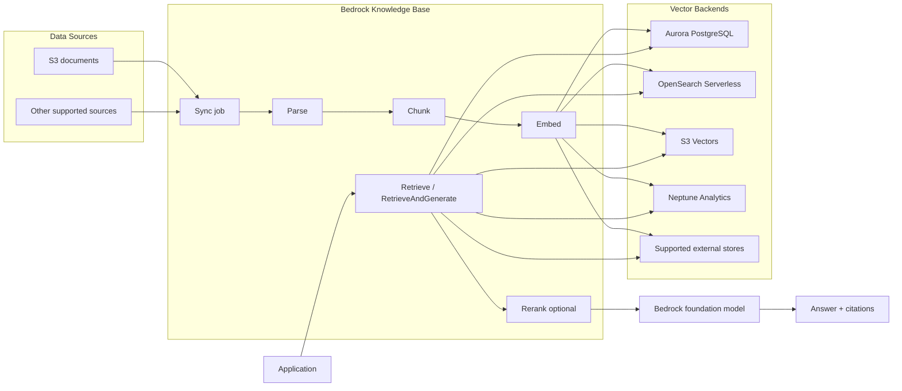
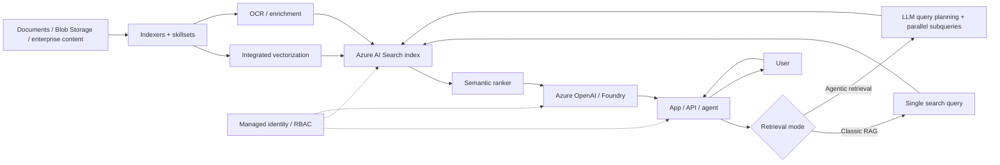
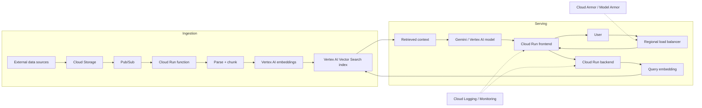
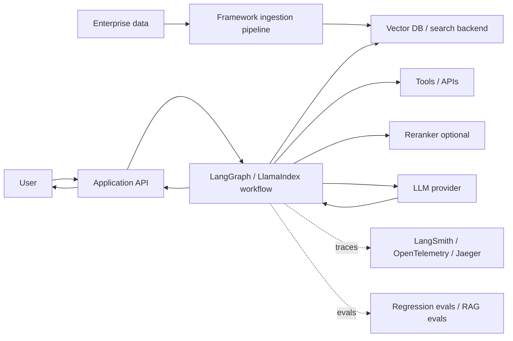

# End-to-End Reference Architectures for RAG and File Search

## 1. Executive summary

The current RAG and file-search market is best understood as a set of architecture families rather than a bag of interchangeable components. The highest-value families are:

1. **Managed retrieval SaaS**: OpenAI File Search.
2. **Managed cloud-native RAG**: AWS Bedrock Knowledge Bases.
3. **Enterprise search-centric RAG**: Azure AI Search with Azure OpenAI or Foundry Agent Service.
4. **Hyperscale vector-search RAG**: Google Cloud Vertex AI with Vector Search.
5. **Framework-centric orchestration**: LangChain/LangGraph/LangSmith or LlamaIndex over a chosen model and retrieval backend.

The advisor value is that these families map to recognizable workload profiles. A legal knowledge assistant with strict tenant isolation looks different from a consumer app with small private file uploads. A billion-vector catalog search workload looks different from an internal AWS chatbot over S3 documents. Treating all of them as “chunk + embed + vector DB + LLM” hides the real platform choice.

## 2. Comparison catalog

| Architecture | Core scope | Deployment shape | Published latency/cost evidence | Scaling characteristics | Security and ops highlights | Best-fit profile |
|---|---|---|---|---|---|---|
| OpenAI File Search | Managed file upload, chunking, embedding, vector stores, semantic and keyword retrieval, ranking, citations | Customer app calls OpenAI Responses API; retrieval plane is OpenAI-hosted | Published storage/tool pricing; official docs do not expose comparable end-to-end latency | Async ingestion; batch ingest up to 500 files; file limits up to 512 MB and 5M tokens | API data not used for training by default; enterprise data controls; encryption in transit and at rest | Fastest path to production with minimum retrieval infrastructure |
| AWS Bedrock Knowledge Bases | Managed ingestion, parsing, chunking, embedding, vector-store integration, retrieval, optional reranking | AWS-managed RAG with selectable vector backends such as Aurora, OpenSearch, Neptune, S3 Vectors, and others | Bedrock pricing examples and S3 Vectors performance/cost positioning | Incremental sync; backend-dependent vector scaling | IAM roles, KMS encryption, CloudWatch ingestion logs, private backends via AWS networking | AWS-native enterprise RAG |
| Azure AI Search + Azure OpenAI | Enterprise retrieval fabric: hybrid/vector search, semantic ranker, agentic retrieval, integrated vectorization | Azure AI Search index/knowledge base plus Azure OpenAI or Foundry Agent Service | Pricing for AI Search/Azure OpenAI; public docs reviewed do not publish a single comparable end-to-end latency benchmark | Replicas and partitions; query-heavy vs indexing-heavy capacity planning | Managed identities, diagnostic logs, security trimming, tenant-isolation guidance | Enterprise search and multitenant RAG |
| Google Cloud Vertex AI + Vector Search | Full ingestion and serving architecture using Cloud Storage, Pub/Sub, Cloud Run, Vertex AI embeddings, Vector Search, and generation | Cloud-native managed/vector architecture with private connectivity variants | Strong official vector search data: 9.6 ms P95, 0.99 recall, ~5K QPS on 1B vectors; eBay <4 ms P95 server-side cited by Google | Streaming updates; replica/node tuning; very large corpus support | Cloud Armor, load balancer, VPC Service Controls, private IP architecture, Cloud Logging/Monitoring | Large-scale, high-QPS, latency-sensitive retrieval |
| LangChain/LangGraph/LangSmith | Orchestration, tracing, evaluation, CI/CD, deployment runtime for RAG and agents | Framework layer over selected model/vector backend; SaaS or self-hosted observability | No single portable latency/cost curve because backend/model choices vary | Workflow and agent scaling depends on runtime, state store, vector DB, and model providers | Tracing, evaluation, deployment workflows, self-hosting options | Custom agent workflows and production evaluation |
| LlamaIndex | Data-centric RAG framework, indexing abstractions, workflows, observability | Framework layer over selected models/vector DBs | Official guidance focuses on production optimization, not a single benchmarked architecture | Suitable for service-based and multi-agent production deployments | Observability hooks, workflow abstractions, OpenTelemetry-style patterns | Flexible private-data RAG and multi-agent systems |

## 3. Universal end-to-end RAG lifecycle

Most reference architectures decompose into the same two planes: an **ingestion plane** and a **serving plane**. The important architectural decisions are which pieces are managed, which are under customer control, and where security boundaries are enforced.

### 3.1 Core design dimensions

| Dimension | Questions to answer | Why it matters |
|---|---|---|
| Managed vs custom retrieval | Is the retriever an API product or a customer-operated stack? | Determines tuning freedom, observability, compliance posture, and operational burden. |
| Retrieval substrate | Search index, vector DB, SQL vector extension, object-store vector index, graph store, or hosted file search? | Determines scale, latency, filtering, ACL enforcement, and cost model. |
| Ingestion model | Batch, incremental sync, CDC, streaming updates, or manual file upload? | Determines freshness, reindex cost, operational failure modes, and user expectations. |
| Metadata and ACL model | Are permissions propagated into the index or applied after retrieval? | Post-filtered permissions can leak ranking signals or degrade recall. |
| Context construction | Top-k chunks, parent-child retrieval, reranking, query decomposition, agentic retrieval, or compression? | Determines answer quality, latency, and hallucination risk. |
| Observability | Can you trace retrieval, context, model calls, and final citations? | Determines whether failures are diagnosable. |
| Cost control | Storage billing, tool-call billing, embedding cost, reranker cost, model tokens, compute nodes? | RAG cost often concentrates outside the obvious LLM generation call. |

## 4. OpenAI File Search reference architecture

OpenAI File Search is a managed retrieval plane inside the OpenAI API ecosystem. It is best treated as a hosted file-search service rather than as a customer-visible vector database architecture.

### 4.1 Architecture profile

| Area | Design |
|---|---|
| Retrieval ownership | OpenAI-hosted. Customer controls files, vector stores, metadata, query settings, and response calls, but not internal index topology. |
| Ingestion | Upload files, attach to vector stores, wait for async processing. Default chunking is 800 tokens with 400-token overlap in the docs reviewed. |
| Retrieval | Semantic and keyword search are both part of the File Search tool. Ranking and result count controls are exposed. |
| Citations | Responses can include annotations and retrieved file references. |
| Cost shape | Storage and tool-call pricing are explicit; model token costs still apply separately. |
| Best fit | Fast deployment, small-to-medium private corpora, app-level document Q&A, internal copilots where managed SaaS is acceptable. |
| Weak fit | Workloads needing custom ANN parameters, private VPC placement, full retriever internals, or database-level ACL logic. |

Key sources: [OpenAI File Search docs](https://developers.openai.com/api/docs/guides/tools-file-search), [OpenAI Retrieval docs](https://developers.openai.com/api/docs/guides/retrieval), [OpenAI Responses API tools update](https://openai.com/index/new-tools-and-features-in-the-responses-api/), [OpenAI API data controls](https://developers.openai.com/api/docs/guides/your-data).

## 5. AWS Bedrock Knowledge Bases reference architecture

AWS Bedrock Knowledge Bases is the strongest AWS-managed RAG reference architecture. It wraps ingestion, parsing, chunking, embedding, vector-store integration, retrieval, prompt augmentation, citations, and optional reranking.

### 5.1 Architecture profile

| Area | Design |
|---|---|
| Retrieval ownership | AWS-managed RAG flow with selectable vector storage. |
| Ingestion | Knowledge Base sync jobs; supports changed-document re-ingestion and re-indexing. |
| Retrieval | Bedrock retrieves from configured vector backend, can augment prompts, generate answers, and return citations. |
| Reranking | Amazon Bedrock reranking can be added to improve result ordering. |
| Operations | CloudWatch logs for ingestion; IAM role and KMS patterns documented. |
| Best fit | AWS-native teams, enterprise document assistants, S3-backed corpora, managed cloud security requirements. |
| Weak fit | Teams needing maximal retriever customizability or non-AWS portability. |

Key sources: [AWS Prescriptive Guidance: fully managed RAG with Bedrock](https://docs.aws.amazon.com/prescriptive-guidance/latest/retrieval-augmented-generation-options/rag-fully-managed-bedrock.html), [Bedrock Knowledge Bases user guide](https://docs.aws.amazon.com/bedrock/latest/userguide/knowledge-base.html), [Bedrock Knowledge Base sync and ingestion](https://docs.aws.amazon.com/bedrock/latest/userguide/kb-data-source-sync-ingest.html), [Bedrock Knowledge Bases logging](https://docs.aws.amazon.com/bedrock/latest/userguide/knowledge-bases-logging.html), [Bedrock Knowledge Bases encryption](https://docs.aws.amazon.com/bedrock/latest/userguide/encryption-kb.html).

## 6. Azure AI Search + Azure OpenAI reference architecture

Azure’s reference pattern centers on Azure AI Search as the retrieval fabric. It supports classic RAG and newer agentic retrieval patterns.

### 6.1 Architecture profile

| Area | Design |
|---|---|
| Retrieval ownership | Azure AI Search index/knowledge base, often combined with Azure OpenAI or Foundry Agent Service. |
| Ingestion | Indexers, skillsets, vectorization, OCR, enrichment, and search schemas. |
| Retrieval | Hybrid/vector search, semantic ranking, classic RAG, or agentic retrieval. |
| Scaling | Replicas for query-heavy workloads; partitions for indexing/storage-heavy workloads. |
| Security | Managed identity, RBAC, security trimming, tenant isolation guidance. |
| Best fit | Enterprise search, multitenant SaaS, permission-aware retrieval, complex conversational retrieval. |
| Weak fit | Teams requiring simple managed file Q&A with minimal infrastructure. |

Key sources: [Azure AI Search RAG overview](https://learn.microsoft.com/en-us/azure/search/retrieval-augmented-generation-overview), [Azure agentic retrieval overview](https://learn.microsoft.com/en-us/azure/search/agentic-retrieval-overview), [Azure secure multitenant RAG guidance](https://learn.microsoft.com/en-us/azure/architecture/ai-ml/guide/secure-multitenant-rag), [Azure AI Search capacity planning](https://learn.microsoft.com/en-us/azure/search/search-capacity-planning), [Azure AI Search monitoring](https://learn.microsoft.com/en-us/azure/search/monitor-azure-cognitive-search).

## 7. Google Cloud Vertex AI + Vector Search reference architecture

Google Cloud publishes one of the clearest cloud-native RAG topologies, split into ingestion and serving subsystems. It is the strongest fit when large-scale vector retrieval performance is a first-class design constraint.

### 7.1 Architecture profile

| Area | Design |
|---|---|
| Retrieval ownership | Managed Vector Search with customer-visible ingestion and serving topology. |
| Ingestion | Cloud Storage, Pub/Sub, Cloud Run function, embeddings, streaming vector index updates. |
| Retrieval | Query embedding + Vector Search + generative model response. |
| Scaling | Replica/node tuning, streaming updates, large-scale vector matching. |
| Published measurements | Google reports 9.6 ms P95, 0.99 recall, about 5K QPS on a 1B-vector benchmark; Google also cites eBay at under 4 ms P95 server-side. |
| Security | Load balancer, Cloud Armor, private connectivity architecture, VPC Service Controls, service account segmentation. |
| Best fit | Very large corpora, high-QPS search/RAG, latency-sensitive retrieval, cloud-native GCP teams. |
| Weak fit | Teams wanting one-click file-search abstraction or minimal cloud topology. |

Key sources: [Google Cloud RAG with Vertex AI Vector Search](https://docs.cloud.google.com/architecture/gen-ai-rag-vertex-ai-vector-search), [Google Cloud Vector Search performance blog](https://cloud.google.com/blog/products/ai-machine-learning/build-fast-and-scalable-ai-applications-with-vertex-ai), [Google private-connectivity RAG architecture](https://docs.cloud.google.com/architecture/private-connectivity-rag-capable-gen-ai), [Vertex AI RAG Engine with Vector Search](https://docs.cloud.google.com/vertex-ai/generative-ai/docs/rag-engine/use-vertexai-vector-search), [RAG Engine billing](https://docs.cloud.google.com/gemini-enterprise-agent-platform/build/rag-engine/rag-engine-billing).

## 8. Framework-centric production RAG

Framework-centric designs are not complete retrieval architectures by themselves. They become complete only after selecting a model provider, retrieval backend, state store, deployment runtime, and observability path. Their strongest use is when the application needs custom orchestration, evaluation, agent behavior, or provider portability.

### 8.1 Architecture profile

| Area | LangChain/LangGraph/LangSmith | LlamaIndex |
|---|---|---|
| Primary value | Orchestration, agent workflows, tracing, evaluations, deployments | Data-centric RAG, indexing abstractions, workflows, observability |
| Retrieval backend | External choice | External choice |
| Best fit | Stateful agents, multi-tool workflows, CI/CD eval gates, production tracing | Private data workflows, multi-index RAG, document agents, custom retrieval strategies |
| Main risk | More moving parts; agent loops; hidden model/tool-call cost | Over-flexibility; too many retrieval choices without eval discipline |

Key sources: [LangChain RAG docs](https://docs.langchain.com/oss/python/langchain/rag), [LangSmith docs](https://docs.langchain.com/langsmith/home), [LangSmith observability](https://docs.langchain.com/langsmith/observability), [LangSmith deployment](https://docs.langchain.com/langsmith/deployment), [LlamaIndex production RAG](https://developers.llamaindex.ai/python/framework/optimizing/production_rag/), [LlamaIndex observability](https://developers.llamaindex.ai/python/framework/module_guides/observability/).

## 9. Pattern-matching summary

| Workload profile | Recommended architecture | Why |
|---|---|---|
| Fast private-file Q&A with minimal infra | OpenAI File Search | Managed ingestion, chunking, vector store, retrieval, ranking, and citations. |
| AWS-native enterprise knowledge assistant | Bedrock Knowledge Bases | Managed RAG, IAM/KMS/CloudWatch integration, S3-friendly ingestion. |
| Permission-aware enterprise search | Azure AI Search + Azure OpenAI | Strong identity, security trimming, and multitenant architecture guidance. |
| Complex conversational search requiring query planning | Azure agentic retrieval | LLM decomposes complex questions into focused retrieval subqueries. |
| Billion-scale, high-QPS retrieval | Google Cloud Vector Search + Vertex AI | Strong published vector-search latency/throughput evidence. |
| SQL-heavy application with metadata joins | PostgreSQL vector extension pattern: Aurora, AlloyDB, Cloud SQL, pgvector | Keeps retrieval close to relational data and app metadata. |
| Custom multi-tool or agentic workflows | LangGraph/LangSmith or LlamaIndex over a selected backend | Framework provides workflow, tracing, evals, and deployment control. |
| Regulated deployment with private networking | Google private-connectivity RAG or AWS private Bedrock backend pattern | Explicit private network/security architecture. |

## 10. Design cautions

1. **Do not confuse vector search latency with answer latency.** Retrieval may be under 10 ms while full response latency is dominated by LLM generation, reranking, query planning, network hops, and context length.
2. **Do not treat metadata filters as full authorization.** For enterprise workloads, permissions should be embedded into retrieval design, not bolted on after retrieval.
3. **Do not skip ingestion observability.** Many RAG failures are indexing failures, stale data, parser failures, or missing ACL metadata.
4. **Do not choose a framework before choosing the operating model.** LangChain and LlamaIndex are powerful, but they do not eliminate the need to select a retrieval substrate, state model, telemetry stack, and deployment topology.
5. **Do not over-agenticize simple retrieval.** A two-step RAG chain is often faster and cheaper than an agentic workflow.
6. **Do not compare vendor benchmark numbers as if they are apples-to-apples.** Published measurements differ in metric definition, workload, corpus size, hardware, and whether the number measures retrieval only or end-to-end answer latency.
