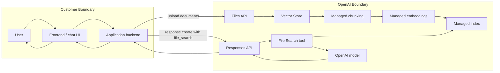
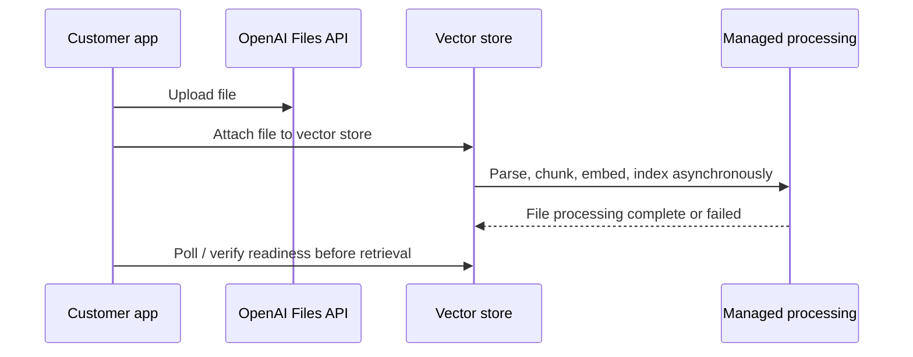
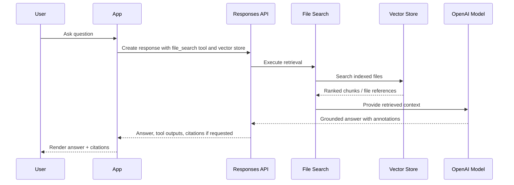

# OpenAI File Search Reference Architecture

## 1. Purpose

OpenAI File Search is a managed file-search and retrieval architecture for applications that need to answer questions over uploaded files without operating a parser, embedding pipeline, vector database, retriever, or ranking service. The correct mental model is **managed retrieval plane inside the OpenAI API**, not “bring your own vector database.”

## 2. Architecture at a glance

## 3. When to use this architecture

Use OpenAI File Search when:

- You need private-file Q&A quickly.
- You want hosted chunking, embedding, indexing, retrieval, and ranking.
- You do not need direct control over ANN index parameters or vector database topology.
- You prefer a per-API/tool-call operating model over cloud infrastructure ownership.
- Your application can tolerate SaaS-managed retrieval and the associated trust/compliance model.

Avoid it when:

- You need private VPC placement of the vector store.
- You need direct index-level authorization logic.
- You need to tune HNSW/IVF/PQ parameters, custom reranking infrastructure, or custom embedding pipelines.
- You require full observability into every retrieval stage.
- You need a cloud-provider-native compliance boundary tied to AWS/Azure/GCP network controls.

## 4. Component model

| Component | Responsibility | Customer-controlled? | Notes |
|---|---|---:|---|
| Files API | Accepts uploaded files | Partly | Customer controls upload and deletion. |
| Vector store | Logical store for indexed files | Partly | Customer creates and manages vector store objects, but not underlying infrastructure. |
| Chunking | Splits files into retrievable units | Mostly no | Official docs describe default chunking behavior. |
| Embeddings | Converts chunks into vector representations | Mostly no | Managed by OpenAI. |
| Index | Enables retrieval over vector store contents | No | No customer-visible ANN topology. |
| File Search tool | Executes retrieval for the Responses API | Partly | Customer can set retrieval options such as result count, ranking options, filters, and included outputs depending API support. |
| Model | Generates answer from retrieved context | Yes, by model selection | Model choice affects quality, latency, and cost. |
| Citations/annotations | Connects answers to file evidence | Partly | Application should surface citations carefully. |

## 5. Ingestion workflow

### 5.1 Design notes

- Ingestion is asynchronous, so the application should avoid querying a newly uploaded file until processing is complete.
- File deletion and index updates can have eventual-consistency behavior. A production UI should avoid promising immediate disappearance unless the underlying API confirms it.
- Store metadata should be designed early. Metadata becomes important for filtering, routing, cost attribution, retention, and user-visible provenance.
- A robust app should track file lifecycle states: `uploaded`, `processing`, `ready`, `failed`, `deleting`, and `deleted`.

## 6. Query workflow

## 7. Scaling and quotas

Relevant official constraints from the docs reviewed include:

- File size limit: up to **512 MB**.
- Token limit: up to **5 million tokens** per file.
- Batch vector-store file operations: up to **500 files** in a batch request.
- Vector-store add-file request rate: documented as **300 requests per minute per vector store** in the reviewed material.

### 7.1 Scaling tactics

| Bottleneck | Mitigation |
|---|---|
| Upload bursts | Use queues, backpressure, file batching, and per-user upload limits. |
| Processing delays | Track readiness states and show users which files are queryable. |
| Retrieval token bloat | Limit `max_num_results`, tune ranking thresholds, use metadata filters, and use concise answer instructions. |
| Tenant isolation | Use separate vector stores per tenant or strict metadata design. For regulated SaaS, validate whether OpenAI controls satisfy the requirement. |
| Cost attribution | Store tenant/project/user metadata and log tool calls per request. |

## 8. Security and governance

OpenAI’s official business/API data pages state that API data is not used for training by default and describe enterprise controls such as data retention options, encryption, and regional residency options for supported configurations. The architecture still requires application-level governance.

### 8.1 Controls to implement in the customer app

| Control | Implementation pattern |
|---|---|
| File access | Enforce user/tenant authorization before selecting a vector store or metadata filter. |
| Retention | Maintain file-retention policy and deletion jobs. |
| Sensitive data | Classify and optionally redact PII before upload if policy requires it. |
| Citation display | Show citations and warn when retrieved support is weak. |
| Prompt injection | Treat retrieved files as untrusted content. Add system rules that retrieved text is evidence, not instructions. |
| Audit | Log upload, delete, query, vector-store ID, file IDs, tool-call IDs, and answer IDs. |

## 9. Observability

OpenAI File Search exposes less internal telemetry than self-managed RAG. Build observability around the application boundary.

| Signal | Why it matters |
|---|---|
| File processing state | Detect failed or incomplete ingestion. |
| Query latency | Separate application, API, retrieval, and generation where possible. |
| Retrieved result count | Detect empty or low-recall retrieval. |
| Citation coverage | Detect unsupported answers. |
| Tool-call count and token usage | Control cost. |
| User feedback | Build eval sets from thumbs-down and correction events. |

## 10. Failure modes and mitigations

| Failure mode | Symptom | Mitigation |
|---|---|---|
| File not indexed yet | User asks about uploaded document and model says it cannot find it | Poll readiness before enabling search. |
| Wrong file retrieved | Answer cites irrelevant source | Improve metadata filters, split stores by tenant/project, lower result count, evaluate chunking implications. |
| Context too broad | Slow response and expensive generation | Restrict result count; use query-specific filters. |
| Stale content | Deleted/updated content appears briefly | Design UI and backend around eventual consistency; verify delete completion. |
| Prompt injection in document | Model follows malicious instructions from retrieved text | Add prompt hierarchy rules; separate document content from instructions; use allowlisted tool behavior. |
| Low citation quality | Answer sounds plausible but evidence is thin | Require citations; abstain when retrieval is insufficient; expose source snippets. |

## 11. Cost model

OpenAI File Search cost has three conceptual components:

1. **Vector store storage**: priced by stored indexed content after free tier according to OpenAI pricing docs.
2. **File Search tool calls**: priced per tool call according to OpenAI pricing docs.
3. **Model tokens**: generation and context tokens are priced by selected model.

### 11.1 Cost levers

| Lever | Effect |
|---|---|
| Fewer stored files | Reduces storage cost. |
| File retention and deduplication | Prevents hidden storage growth. |
| Result count/ranking controls | Reduces context tokens and latency. |
| Metadata filtering | Reduces irrelevant retrieval and token waste. |
| Model selection | Changes answer quality, latency, and generation cost. |
| Caching | Avoids repeated generation for stable, common questions. |

## 12. Production checklist

- [ ] Define tenant/project/user isolation model.
- [ ] Define file retention and deletion policy.
- [ ] Track file processing status in your database.
- [ ] Enforce authorization before retrieval.
- [ ] Add metadata at upload time.
- [ ] Store request-level audit logs.
- [ ] Surface citations in the UI.
- [ ] Add answer abstention rules when retrieval is weak.
- [ ] Add prompt-injection hardening.
- [ ] Monitor tool calls, token usage, response latency, and retrieval quality.
- [ ] Build a small regression eval set from real user questions.

## 13. Sources

- [OpenAI File Search guide](https://developers.openai.com/api/docs/guides/tools-file-search)
- [OpenAI Retrieval guide](https://developers.openai.com/api/docs/guides/retrieval)
- [OpenAI Responses API tools update](https://openai.com/index/new-tools-and-features-in-the-responses-api/)
- [OpenAI API data controls](https://developers.openai.com/api/docs/guides/your-data)
- [OpenAI business data privacy](https://openai.com/business-data/)
