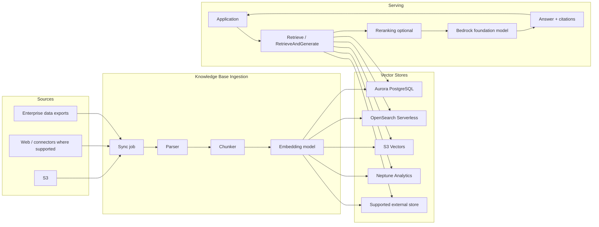
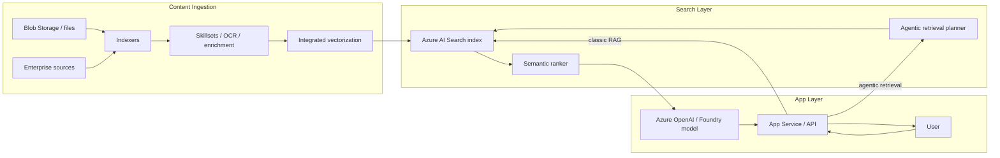
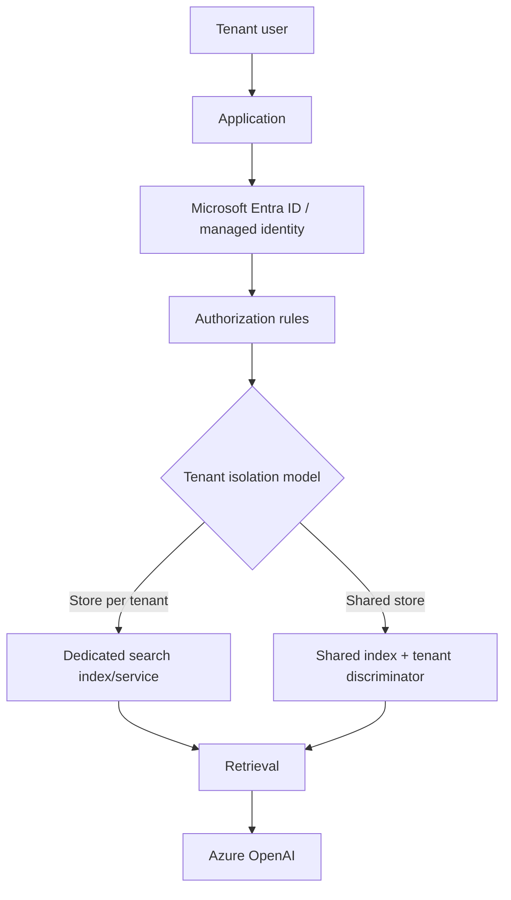
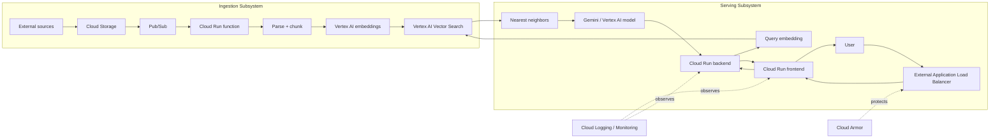
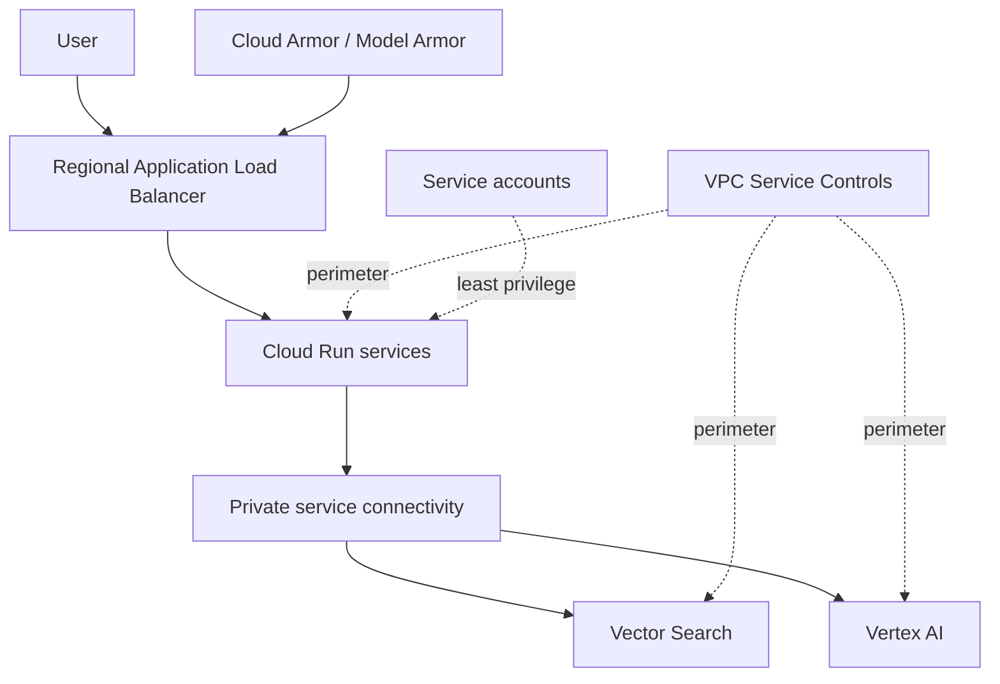

# Cloud RAG Reference Architectures: AWS, Azure, and Google Cloud

## 1. Purpose

This document compares cloud-native RAG reference architectures across AWS, Azure, and Google Cloud. The focus is end-to-end deployment shape: ingestion, indexing, retrieval, generation, scaling, security, observability, and cost.

## 2. Summary matrix

| Provider | Primary reference design | Retrieval substrate | Best-fit workload | Main differentiator |
|---|---|---|---|---|
| AWS | Amazon Bedrock Knowledge Bases | Bedrock-managed integration with Aurora, OpenSearch, Neptune, S3 Vectors, supported external stores | AWS-native enterprise RAG | Managed ingestion + IAM/KMS/CloudWatch integration |
| Azure | Azure AI Search + Azure OpenAI / Foundry | Azure AI Search index, semantic ranker, vector/hybrid search, agentic retrieval | Enterprise search and multitenant RAG | Security trimming, identity-aware retrieval, semantic/agentic retrieval |
| Google Cloud | Vertex AI + Vector Search | Vertex AI Vector Search, RAG Engine, AlloyDB/Cloud SQL vector alternatives | High-scale, high-QPS, latency-sensitive RAG | Strong published vector-search latency/throughput evidence |

## 3. AWS Bedrock Knowledge Bases

### 3.1 End-to-end topology



### 3.2 Component responsibilities

| Component | Responsibility |
|---|---|
| Bedrock Knowledge Base | Coordinates ingestion, embedding, retrieval, and prompt augmentation. |
| Data source | Usually S3 for straightforward enterprise document ingestion. |
| Embedding model | Generates vectors during sync. |
| Vector store | Stores embeddings and metadata; backend choice determines cost, latency, and tuning. |
| Retrieve / RetrieveAndGenerate | Retrieves chunks and optionally generates answer with citations. |
| Reranker | Reorders retrieved results to improve relevance. |
| IAM service role | Grants Bedrock access to sources, embedding models, and vector backend. |
| KMS | Encrypts transient ingestion data and supported storage paths. |
| CloudWatch | Ingestion logs and operational visibility. |

### 3.3 Backend selection

| Backend | Use when | Trade-off |
|---|---|---|
| S3 Vectors | You want low-cost, large-scale vector storage tightly coupled to S3-style economics | Less mature operational familiarity than classic DB/search backends. |
| OpenSearch Serverless | You already operate search workloads and want hybrid/search features | More search-cluster concepts and capacity planning. |
| Aurora PostgreSQL | You want SQL semantics, metadata joins, and app/database integration | Not necessarily the best fit for billion-scale ANN search. |
| Neptune Analytics | You want graph-style relationships plus retrieval | More specialized graph skill set required. |
| External supported store | You already standardized on a third-party vector store | More integration complexity and vendor split. |

### 3.4 Security design

```mermaid
flowchart TB
    APP[Application IAM principal] --> KBROLE[Bedrock Knowledge Base service role]
    KBROLE --> S3[S3 source bucket]
    KBROLE --> EMBED[Embedding model]
    KBROLE --> VDB[Vector backend]
    KMS[KMS key] -. encrypts .-> S3
    KMS -. encrypts .-> VDB
    CW[CloudWatch] <-. ingestion logs .- KBROLE
    PRIV[Private networking / PrivateLink where supported] -.-> VDB
```

Security controls to design explicitly:

- Least-privilege IAM role for Knowledge Base access.
- KMS key policy for data source, transient ingestion, and vector backend paths.
- Private networking for backends such as private OpenSearch Serverless collections where needed.
- Guardrail understanding: guardrails can apply to inputs and generated outputs, but retrieved references themselves must still be treated as untrusted content.

### 3.5 Failure modes

| Failure mode | Detection | Mitigation |
|---|---|---|
| Sync job fails | CloudWatch logs; ingestion job state | Alert on failed syncs; retry or quarantine bad documents. |
| Updated docs not visible immediately | User sees stale answer after update | Communicate freshness SLA; monitor sync completion. |
| Backend throttling | Increased retrieval latency or errors | Tune backend capacity; add backpressure. |
| Reranker cost spike | More retrieval requests invoke reranker | Gate reranking by query complexity or user tier. |
| Retrieved poisoned content | Model follows retrieved instructions | Treat retrieved text as data; add prompt injection defenses. |

### 3.6 Sources

- [AWS Prescriptive Guidance: fully managed RAG with Bedrock](https://docs.aws.amazon.com/prescriptive-guidance/latest/retrieval-augmented-generation-options/rag-fully-managed-bedrock.html)
- [Bedrock Knowledge Bases user guide](https://docs.aws.amazon.com/bedrock/latest/userguide/knowledge-base.html)
- [Knowledge Base sync and ingestion](https://docs.aws.amazon.com/bedrock/latest/userguide/kb-data-source-sync-ingest.html)
- [Knowledge Base security](https://docs.aws.amazon.com/bedrock/latest/userguide/kb-create-security.html)
- [Knowledge Base encryption](https://docs.aws.amazon.com/bedrock/latest/userguide/encryption-kb.html)
- [Knowledge Base logging](https://docs.aws.amazon.com/bedrock/latest/userguide/knowledge-bases-logging.html)
- [Amazon Bedrock pricing](https://aws.amazon.com/bedrock/pricing/)
- [Amazon S3 Vectors](https://aws.amazon.com/s3/features/vectors/)
- [S3 Vectors best practices](https://docs.aws.amazon.com/AmazonS3/latest/userguide/s3-vectors-best-practices.html)

## 4. Azure AI Search + Azure OpenAI / Foundry

### 4.1 End-to-end topology



### 4.2 Classic RAG vs agentic retrieval

| Pattern | How it works | Use when | Trade-off |
|---|---|---|---|
| Classic RAG | Application sends one search query, gets results, sends context to model | Simple Q&A, lower latency, predictable cost | Weaker for multi-hop or ambiguous questions. |
| Agentic retrieval | LLM decomposes a complex question into focused subqueries and returns structured retrieval outputs | Complex enterprise search, conversational questions, multi-hop retrieval | More model/tool calls, higher latency, more cost complexity. |

### 4.3 Scaling model

Azure AI Search capacity planning is based on replicas and partitions:

| Need | Scaling lever |
|---|---|
| Higher query throughput | Add replicas. |
| More storage or heavy indexing | Add partitions. |
| Better availability | Multiple replicas. |
| Complex indexing/enrichment | Plan for indexer runtime, skillset cost, and source throttling. |

### 4.4 Security and multitenancy

Azure has the most explicit public guidance among the reviewed providers for secure multitenant RAG.



Tenant isolation choices:

| Model | Use when | Risk |
|---|---|---|
| Store/service per tenant | Strong isolation, regulated tenants, premium SaaS tier | Higher cost and operational sprawl. |
| Index per tenant | Moderate isolation with shared service | Index count and management complexity. |
| Shared index with tenant discriminator | Cost-efficient multitenancy | Must get filters/security trimming exactly right. |

### 4.5 Observability

Monitor:

- Query latency.
- Query volume and throttling.
- Indexer execution history.
- Skillset/enrichment failures.
- Semantic ranker usage.
- Agentic retrieval usage.
- Azure OpenAI quota and rate-limit behavior.

### 4.6 Sources

- [Azure AI Search RAG overview](https://learn.microsoft.com/en-us/azure/search/retrieval-augmented-generation-overview)
- [Azure agentic retrieval overview](https://learn.microsoft.com/en-us/azure/search/agentic-retrieval-overview)
- [Azure Search capacity planning](https://learn.microsoft.com/en-us/azure/search/search-capacity-planning)
- [Managed identities in Azure AI Search](https://learn.microsoft.com/en-us/azure/search/search-how-to-managed-identities)
- [Secure multitenant RAG on Azure](https://learn.microsoft.com/en-us/azure/architecture/ai-ml/guide/secure-multitenant-rag)
- [Monitor Azure AI Search](https://learn.microsoft.com/en-us/azure/search/monitor-azure-cognitive-search)
- [Monitor queries](https://learn.microsoft.com/en-us/azure/search/search-monitor-queries)
- [Monitor indexers](https://learn.microsoft.com/en-us/azure/search/search-monitor-indexers)
- [Azure OpenAI quotas and limits](https://learn.microsoft.com/en-us/azure/foundry/openai/quotas-limits)
- [Azure OpenAI pricing](https://azure.microsoft.com/en-us/pricing/details/azure-openai/)
- [Azure AI Search pricing](https://azure.microsoft.com/en-us/pricing/details/search/)

## 5. Google Cloud Vertex AI + Vector Search

### 5.1 End-to-end topology



### 5.2 Why this pattern is different

Google Cloud’s reference architecture is strongest when retrieval performance and scale are central. Google has published vector-search measurements including **9.6 ms P95**, **0.99 recall**, and approximately **5K QPS** on a **1B-vector** benchmark, plus a cited eBay production datapoint of **under 4 ms P95** server-side vector search.

This does not mean full RAG answers complete in 4–10 ms. It means the vector-search layer has unusually strong public performance evidence relative to other reviewed official sources.

### 5.3 Security architecture



Security controls:

- Disable default `run.app` URLs when fronting services through a load balancer.
- Use Cloud Armor for edge filtering, rate limiting, and DDoS protections.
- Use private connectivity and VPC Service Controls for high-security deployments.
- Segment service accounts by ingestion, serving, and admin roles.
- Use Cloud Logging/Monitoring and BigQuery for operational analytics where appropriate.

### 5.4 Alternatives inside Google Cloud

| Pattern | Use when |
|---|---|
| Vertex AI Vector Search | High-QPS, low-latency, large vector corpus. |
| Vertex AI RAG Engine | You want more managed RAG components on Google Cloud. |
| AlloyDB vector search | You want PostgreSQL-compatible, relationally integrated retrieval. |
| Cloud SQL pgvector | You want SQL vector search in an existing managed PostgreSQL operational model. |
| Spanner vector search | You need globally scalable relational/vector patterns. |

### 5.5 Sources

- [RAG with Vertex AI Vector Search](https://docs.cloud.google.com/architecture/gen-ai-rag-vertex-ai-vector-search)
- [Private connectivity for RAG-capable gen AI apps](https://docs.cloud.google.com/architecture/private-connectivity-rag-capable-gen-ai)
- [Vertex AI Vector Search performance blog](https://cloud.google.com/blog/products/ai-machine-learning/build-fast-and-scalable-ai-applications-with-vertex-ai)
- [RAG-capable gen AI app using Vertex AI and AlloyDB](https://docs.cloud.google.com/architecture/rag-capable-gen-ai-app-using-vertex-ai)
- [RAG Engine with Vertex AI Vector Search](https://docs.cloud.google.com/vertex-ai/generative-ai/docs/rag-engine/use-vertexai-vector-search)
- [RAG Engine billing](https://docs.cloud.google.com/gemini-enterprise-agent-platform/build/rag-engine/rag-engine-billing)
- [Lightricks Cloud SQL vector case study](https://cloud.google.com/blog/products/databases/lightricks-delivers-dynamic-search-with-cloud-sql-vector-support)
- [Spanner vector search best practices](https://docs.cloud.google.com/spanner/docs/vector-search-best-practices)

## 6. Cloud-provider decision guide

| Requirement | AWS | Azure | Google Cloud |
|---|---|---|---|
| Managed RAG with minimal custom code | Strong: Bedrock Knowledge Bases | Moderate: more search/index design | Moderate: RAG Engine helps, but topology can be broader |
| Enterprise search quality | Strong with OpenSearch/search patterns | Very strong: AI Search is the center | Strong, but more vector-search oriented |
| Permission-aware multitenancy | Good, but design yourself | Very strong official guidance | Good with cloud IAM/VPC patterns, but app-level retrieval auth still needed |
| Published vector retrieval latency evidence | Moderate | Limited in reviewed docs | Strong |
| Cloud-native security controls | Strong IAM/KMS/PrivateLink | Strong Entra/RBAC/managed identity | Strong VPC-SC/private connectivity/Cloud Armor |
| SQL-adjacent RAG | Aurora PostgreSQL | Azure SQL/Postgres patterns possible | AlloyDB/Cloud SQL/Spanner patterns strong |
| Best default choice | AWS-native document RAG | Enterprise search and tenant-aware RAG | High-scale vector retrieval |
