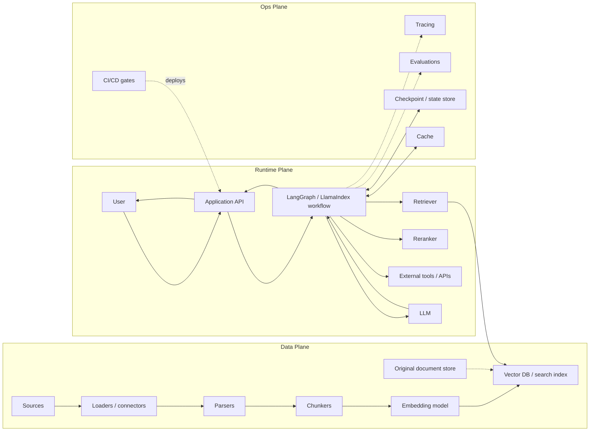
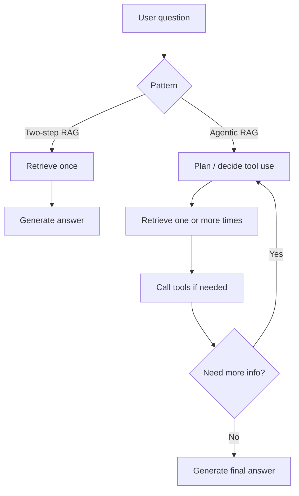
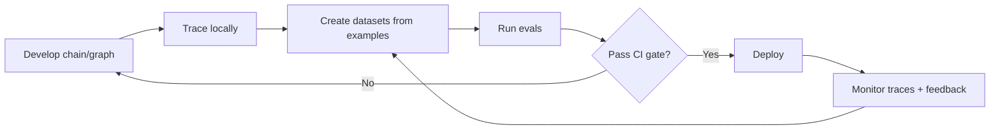
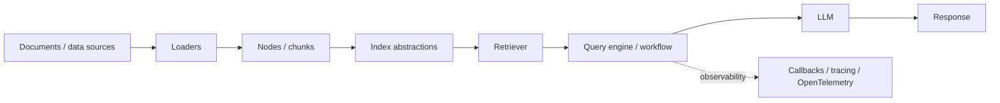

# Framework-Centric Production RAG Architectures

## 1. Purpose

LangChain/LangGraph/LangSmith and LlamaIndex are not the same kind of architecture as OpenAI File Search, Bedrock Knowledge Bases, Azure AI Search, or Vertex AI Vector Search. They are **control-plane and orchestration frameworks**. A production architecture still requires decisions about:

- model provider,
- vector/search backend,
- state store,
- document store,
- deployment runtime,
- observability,
- evaluation gates,
- security model,
- cost controls.

Their main value is making retrieval workflows, agents, evaluations, and observability programmable.

## 2. Generic framework-centric topology

## 3. LangChain / LangGraph / LangSmith architecture

### 3.1 Architectural role

| Layer | Tooling | Responsibility |
|---|---|---|
| Chain/agent logic | LangChain and LangGraph | Deterministic chains, agent loops, tool routing, stateful workflows. |
| Observability | LangSmith | Traces, debugging, aggregate metrics, dataset/eval management. |
| Deployment | LangSmith Deployment or custom infra | Runtime for agent workflows, depending setup. |
| CI/CD | LangSmith evals + standard CI | Regression tests, RAG evals, release gates. |

### 3.2 Two-step RAG vs agentic RAG

| Pattern | Best fit | Cost/latency profile | Failure modes |
|---|---|---|---|
| Two-step RAG | Simple questions, predictable retrieval, low latency | Usually lower: one retrieval pass and one model call | Weak for multi-hop or underspecified queries. |
| Agentic RAG | Multi-step tasks, tools, ambiguous queries, query decomposition | Higher: multiple model/tool/retrieval calls | Tool loops, cost spikes, non-determinism, harder evals. |

### 3.3 LangSmith production loop

### 3.4 Production risks

| Risk | Mitigation |
|---|---|
| Hidden cost from agent loops | Set recursion limits, tool-call budgets, and per-request cost budgets. |
| Weak retrieval quality | Add retrieval evals and trace retrieved chunks. |
| Non-deterministic regressions | Use fixed evaluation datasets and compare against baselines. |
| Missing traces in short-lived jobs | Ensure trace flushing before process shutdown where required. |
| State-store bottlenecks | Capacity-plan checkpoint stores and isolate hot workflows. |
| Prompt injection through tools or retrieved docs | Treat retrieved content and tool outputs as untrusted data. |

### 3.5 Sources

- [LangChain RAG documentation](https://docs.langchain.com/oss/python/langchain/rag)
- [LangSmith documentation](https://docs.langchain.com/langsmith/home)
- [LangSmith observability](https://docs.langchain.com/langsmith/observability)
- [LangSmith deployment](https://docs.langchain.com/langsmith/deployment)
- [LangSmith self-hosted](https://docs.langchain.com/langsmith/self-hosted)
- [LangSmith CI/CD pipeline example](https://docs.langchain.com/langsmith/cicd-pipeline-example)
- [LangSmith RAG evaluation tutorial](https://docs.langchain.com/langsmith/evaluate-rag-tutorial)

## 4. LlamaIndex production RAG architecture

### 4.1 Architectural role

LlamaIndex is best understood as a **data-centric RAG framework**. Its value is in connecting private data to LLM workflows through indexing abstractions, retrieval abstractions, query engines, workflows, and observability integrations.

### 4.2 Production design dimensions

| Dimension | Design question |
|---|---|
| Index strategy | Single index, multiple indexes, hierarchical retrieval, metadata filters, or graph-like retrieval? |
| Chunk/node design | What unit should be retrieved: sentence, paragraph, section, parent document, table, or multimodal object? |
| Query workflow | Single query engine, router, sub-question decomposition, or agent workflow? |
| Observability | Which spans and retrieval artifacts are logged? |
| Evaluation | Which examples define success for retrieval, faithfulness, and answer usefulness? |
| Deployment | Monolith, services, multiple agents, or workflow runtime? |

### 4.3 When LlamaIndex is a good fit

Use LlamaIndex when:

- You need rich private-data ingestion and indexing abstractions.
- You expect multiple retrieval strategies or indexes.
- You want to experiment with retrieval logic while keeping application code organized.
- You need workflow or multi-agent patterns over data.
- You want observability and evaluation around document workflows.

Avoid using it as a substitute for architecture decisions. You still need a backend, deployment runtime, auth model, and cost strategy.

### 4.4 Sources

- [LlamaIndex framework docs](https://developers.llamaindex.ai/python/framework/)
- [LlamaIndex production RAG guide](https://developers.llamaindex.ai/python/framework/optimizing/production_rag/)
- [LlamaIndex observability docs](https://developers.llamaindex.ai/python/framework/module_guides/observability/)
- [LlamaAgents production multi-agent blog](https://www.llamaindex.ai/blog/introducing-llama-agents-a-powerful-framework-for-building-production-multi-agent-ai-systems)
- [Observability in agentic document workflows](https://www.llamaindex.ai/blog/observability-in-agentic-document-workflows)

## 5. Framework decision guide

| Requirement | Prefer LangGraph/LangSmith | Prefer LlamaIndex |
|---|---|---|
| Stateful multi-step agent workflows | Strong | Moderate/strong depending workflow |
| RAG evaluation and trace workflow | Strong via LangSmith | Strong with observability integrations, but stack choice varies |
| Complex data indexing abstractions | Moderate | Strong |
| Multi-index / document-centric retrieval | Moderate | Strong |
| Provider-portable orchestration | Strong | Strong |
| Enterprise deployment control | Strong with self-hosted LangSmith/custom deployment | Strong with custom deployment |

## 6. Recommended production baseline

For a framework-centric RAG system, use this baseline before adding agents:

1. Start with two-step RAG.
2. Use a single retriever and a known vector/search backend.
3. Add tracing from day one.
4. Log retrieved chunks, scores, metadata filters, final prompt size, model, latency, and cost.
5. Build a small golden dataset.
6. Evaluate retrieval hit rate, citation support, answer correctness, and abstention behavior.
7. Add reranking only when retrieval recall is strong but ordering is weak.
8. Add query rewriting only when user queries are poorly specified.
9. Add agentic retrieval only when tasks genuinely require multi-step reasoning or tool use.
10. Set model-call and tool-call budgets before production.
