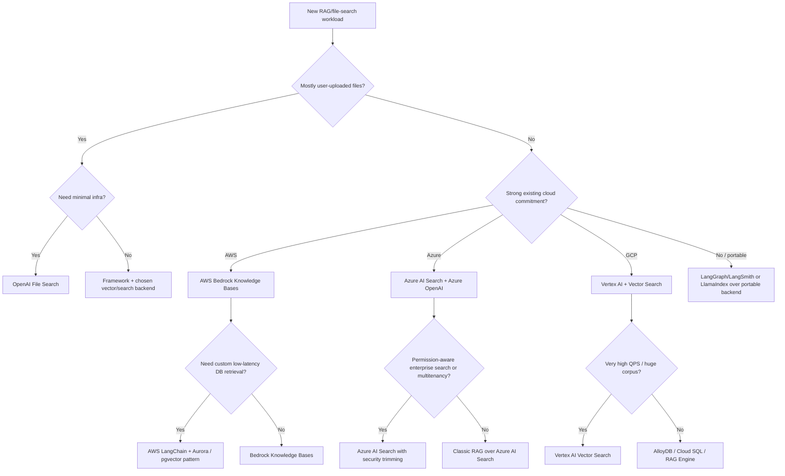

# Pattern-Matching Decision Guide for RAG and File Search Architectures

## 1. Advisor framing

A useful advisor should not ask “Which vector database should we use?” first. It should ask:

1. What is the workload profile?
2. What is the security/compliance boundary?
3. What are the freshness and ingestion requirements?
4. What latency/cost envelope must be met?
5. How much retriever control does the team need?
6. Which cloud/provider constraints already exist?

Once those are known, the architecture choice is usually obvious.

## 2. Decision tree

## 3. Workload profile mapping

| Workload profile | Recommended reference architecture | Reason | Avoid |
|---|---|---|---|
| Chat over uploaded PDFs, docs, and internal files | OpenAI File Search | Lowest operational burden; managed chunking, embedding, indexing, retrieval, and citations | Avoid if private network placement or custom index control is required. |
| AWS enterprise assistant over S3 documents | Bedrock Knowledge Bases | Managed ingestion, retrieval, citations, IAM/KMS/CloudWatch controls | Avoid if your team needs deep retriever internals or non-AWS portability. |
| Azure enterprise search with complex documents | Azure AI Search + Azure OpenAI | Enterprise retrieval fabric, semantic ranking, enrichment, monitoring | Avoid if you want a one-click managed file-search API. |
| Multi-tenant SaaS with document permissions | Azure AI Search secure multitenant RAG pattern | Explicit guidance for store-per-tenant vs shared index with security trimming | Avoid treating authorization as a post-filter only. |
| Very large vector corpus with low retrieval latency | Google Cloud Vector Search + Vertex AI | Strong public vector performance evidence | Avoid if your team cannot operate broader cloud topology. |
| SQL-heavy app with vector retrieval near business data | Aurora pgvector, AlloyDB, Cloud SQL pgvector, or similar | Easier metadata joins, transactional app integration | Avoid for extreme ANN scale without careful benchmarking. |
| Research/prototype requiring retrieval experimentation | LlamaIndex or LangChain | Fast iteration over loaders, retrievers, query engines | Avoid calling it production before adding tracing/evals/security. |
| Multi-step tool-using assistant | LangGraph/LangSmith or LlamaIndex workflows | Explicit workflow/state/tool orchestration | Avoid agentic workflows for simple Q&A. |
| Regulated private-network deployment | Google private-connectivity RAG or AWS private Bedrock backend | Explicit VPC/private access patterns | Avoid opaque SaaS retrieval unless compliance accepts it. |

## 4. Requirements-to-architecture matrix

| Requirement | OpenAI File Search | AWS Bedrock KB | Azure AI Search | Google Vector Search | LangGraph/LlamaIndex |
|---|---:|---:|---:|---:|---:|
| Fastest implementation | 5 | 4 | 3 | 3 | 3 |
| Deep retriever control | 1 | 3 | 4 | 4 | 5 |
| Enterprise authorization patterns | 2 | 4 | 5 | 4 | 4 |
| Private cloud networking | 1-2 | 4 | 4 | 5 | Depends backend |
| Very large vector scale | 3 | 4 | 4 | 5 | Depends backend |
| Published vector latency evidence | 2 | 3 | 2 | 5 | Depends backend |
| Framework portability | 1 | 2 | 2 | 2 | 5 |
| Lowest ops burden | 5 | 4 | 3 | 2-3 | 2 |
| Custom agents/workflows | 2 | 3 | 4 | 3 | 5 |

Scale: 1 = weak fit, 5 = strong fit. Scores are heuristic and should be validated against real workload constraints.

## 5. Architecture anti-patterns

### 5.1 Starting with a vector database before defining retrieval obligations

Bad sequence:

1. Pick vector DB.
2. Pick chunking.
3. Add LLM.
4. Later discover ACLs, freshness, latency, and eval requirements.

Better sequence:

1. Define workload profile.
2. Define security and data boundaries.
3. Define retrieval/eval requirements.
4. Choose reference architecture family.
5. Tune implementation details.

### 5.2 Using agentic retrieval for everything

Agentic retrieval can improve complex query handling, but it adds:

- extra model calls,
- extra retrieval calls,
- non-determinism,
- more failure modes,
- harder cost predictability.

Use simple two-step RAG until there is evidence that query planning is needed.

### 5.3 Treating citations as proof

Citations show what was retrieved or attached. They do not prove:

- the cited text actually supports the claim,
- the retriever found the best source,
- the source is up to date,
- the model did not over-infer.

A production system should evaluate citation support, not only citation presence.

### 5.4 Treating metadata filters as security

Metadata filters can support security, but a secure retrieval system needs:

- identity propagation,
- tenant-aware indexing,
- policy checks before retrieval,
- security trimming during retrieval,
- audit logs,
- tests for cross-tenant leakage.

### 5.5 Ignoring ingestion failures

Many “hallucination” incidents are actually ingestion incidents:

- parser skipped a table,
- OCR failed,
- stale version remained indexed,
- metadata was wrong,
- ACLs were not propagated,
- chunking separated definitions from context.

## 6. Recommended architecture selection workflow

Use this worksheet for a new project.

### 6.1 Workload

- Corpus size:
- Number of tenants:
- Number of documents:
- Update frequency:
- Query volume:
- Required p50/p95/p99 latency:
- Required freshness SLA:
- Required citation behavior:
- Required abstention behavior:

### 6.2 Security

- Data classification:
- PII/PHI/PCI present?
- Required cloud/region:
- Private networking required?
- Customer-managed keys required?
- Tenant isolation model:
- ACL propagation source:
- Deletion/retention requirements:

### 6.3 Retrieval

- Query type: factual, procedural, multi-hop, analytic, conversational, agentic.
- Retrieval mode: semantic, keyword, hybrid, graph, SQL vector, agentic.
- Reranking needed?
- Query transformation needed?
- Context compression needed?
- Evaluation dataset available?

### 6.4 Operations

- Who owns ingestion failures?
- Who owns reindexing?
- How are model upgrades tested?
- What telemetry is logged?
- What is the release gate?
- What is the rollback path?

## 7. Practical default recommendations

| Scenario | Default starting point |
|---|---|
| Prototype over private files | OpenAI File Search. |
| Production internal AWS assistant | Bedrock Knowledge Bases. |
| Enterprise knowledge search with permissions | Azure AI Search + Azure OpenAI. |
| Massive low-latency retrieval workload | Google Vertex AI Vector Search. |
| Custom workflow/agent | LangGraph + LangSmith or LlamaIndex over a stable backend. |
| SQL-heavy product feature | PostgreSQL vector extension pattern first; benchmark before scaling. |
