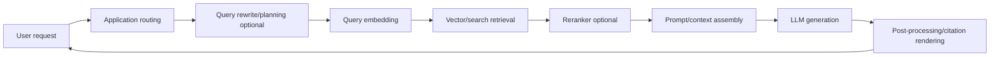

# Latency, Cost, and Case-Study Evidence for RAG Reference Architectures

## 1. Purpose

Published latency and cost evidence for RAG systems is uneven. Vendors often publish product pricing and architectural diagrams, but not comparable end-to-end answer latency. This document separates:

1. **retrieval-layer latency**,
2. **full answer latency**,
3. **storage/index cost**,
4. **tool/model-call cost**,
5. **case-study evidence**.

Do not compare numbers unless the measurement boundary is the same.

## 2. Measurement boundary matters

A published “retrieval latency” number may cover only the `RET` box. A user-visible response includes every box.

## 3. Published evidence from reviewed sources

| Source/pattern | Published datum | Measurement boundary | Architecture implication |
|---|---:|---|---|
| Google Vertex AI Vector Search benchmark | 9.6 ms P95, 0.99 recall, about 4,967 QPS on 1B vectors with two replicas | Vector search layer | Strong fit for hyperscale, latency-sensitive retrieval. |
| Google/eBay Vector Search case | Google cites eBay server-side P95 under 4 ms | Vector search layer | Production evidence for very low-latency retrieval on Google Cloud. |
| Lightricks on Cloud SQL vector support | p90 search improved from 1–4 seconds to under 100 ms; retrieval/template usage increased 40% | Search/retrieval path inside product workflow | Evidence that SQL-vector designs can work well when corpus and access patterns fit. |
| AWS S3 Vectors | AWS positions S3 Vectors as sub-second cold and as low as 100 ms warm search, with up to 90% lower vector cost | Vector search/storage layer | Signals AWS’s low-cost large-corpus vector direction. |
| AWS Bedrock pricing examples | Example pricing includes reranking and structured query examples | Cost examples, not latency | Useful for rough envelopes, not performance guarantees. |
| OpenAI File Search | Published pricing and limits; no comparable official end-to-end latency benchmark in reviewed docs | Managed tool/API cost and limits | Choose for simplicity rather than public benchmark evidence. |
| Azure AI Search | Pricing, capacity, monitoring, and architecture docs; no single comparable end-to-end RAG latency benchmark in reviewed docs | Search platform guidance | Choose for enterprise search/identity patterns rather than benchmark disclosure. |

## 4. Cost centers by architecture

### 4.1 OpenAI File Search

| Cost center | Description | Control lever |
|---|---|---|
| Vector store storage | Indexed file/vector store storage | Deduplication, retention policy, file cleanup. |
| File Search tool calls | Per tool invocation | Cache common answers, avoid unnecessary retrieval, route simple prompts away from file search. |
| Model tokens | Context + output tokens | Limit result count, concise prompts, model selection. |
| Upload/processing overhead | Operational rather than separately exposed in simple model | Batch uploads and track failures. |

### 4.2 AWS Bedrock Knowledge Bases

| Cost center | Description | Control lever |
|---|---|---|
| Embeddings | Ingestion-time embedding model usage | Incremental sync, dedupe, chunking policy. |
| Vector backend | Aurora/OpenSearch/S3 Vectors/etc. | Backend choice, index size, retention, scaling policy. |
| Retrieval/generation | Bedrock model invocation | Model selection, context size, retrieval count. |
| Reranking | Optional reranking model requests | Apply only to high-value/ambiguous queries. |
| Logging/ops | CloudWatch/log storage | Sampling, retention policies. |

### 4.3 Azure AI Search + Azure OpenAI

| Cost center | Description | Control lever |
|---|---|---|
| Search service capacity | Replicas and partitions | Right-size for query/indexing needs. |
| Semantic ranker / agentic retrieval | Optional paid retrieval features | Use classic RAG for simple queries; gate agentic retrieval. |
| Azure OpenAI tokens/PTUs | Model usage or provisioned throughput | Model selection, prompt compression, capacity planning. |
| Indexing/enrichment | Skillsets, OCR, vectorization, indexers | Process only necessary fields; monitor indexer failures. |

### 4.4 Google Cloud Vertex AI + Vector Search

| Cost center | Description | Control lever |
|---|---|---|
| Vector Search index | Index size, nodes, replicas, machine type | Sharding, replica count, index design. |
| Query volume | High QPS can drive serving cost | Batch where possible; cache frequent queries. |
| Embeddings | Ingestion and query embeddings | Cache query embeddings when safe; dedupe documents. |
| Generation | Gemini/Vertex AI model usage | Model selection, context control. |
| Cloud Run / Pub/Sub / Storage | Ingestion and serving infrastructure | Autoscaling settings, lifecycle policies. |

### 4.5 Framework-centric stacks

| Cost center | Description | Control lever |
|---|---|---|
| Extra model calls | Agents, query rewriting, evals, routers | Budget tool/model calls; prefer two-step RAG unless needed. |
| Observability | Trace and dataset storage | Retention policies; sampling in high-volume paths. |
| State/checkpoint storage | Agent state and workflow checkpoints | TTLs, compaction, workflow limits. |
| Backend-dependent retrieval | Vector DB/search cost | Backend-specific tuning. |

## 5. Latency decomposition

| Stage | Typical contributor | Mitigation |
|---|---|---|
| Request routing | App/network overhead | Co-locate services; minimize cross-region hops. |
| Query planning | LLM call for agentic retrieval | Use only when needed; cache plans for common tasks. |
| Query embedding | Embedding model latency | Use low-latency embedding endpoint; cache stable queries. |
| Retrieval | Vector/search backend | Tune index, replicas, filters, top-k, hybrid search settings. |
| Reranking | Cross-encoder or reranker model | Apply selectively; reduce candidate set. |
| Context assembly | Too many chunks or large docs | Parent-child retrieval, compression, stricter filters. |
| Generation | LLM output length and model speed | Model selection, streaming, concise answer policy. |
| Post-processing | Citation rendering, safety checks | Keep deterministic and lightweight. |

## 6. Case-study interpretation notes

### 6.1 Google Vector Search numbers

The Google Vector Search measurements are compelling because they include a large public benchmark scale and explicit P95/QPS/recall numbers. However, they should not be treated as a full chatbot latency guarantee. They support the claim that the retrieval substrate is capable of very low-latency matching.

Source: [Google Cloud Vector Search performance blog](https://cloud.google.com/blog/products/ai-machine-learning/build-fast-and-scalable-ai-applications-with-vertex-ai).

### 6.2 Lightricks Cloud SQL vector case

The Lightricks case is important because it shows a database-centric vector approach improving production workflow latency and increasing feature usage. It is especially relevant when the application’s retrieval workload is close to relational metadata and product data.

Source: [Lightricks Cloud SQL vector case study](https://cloud.google.com/blog/products/databases/lightricks-delivers-dynamic-search-with-cloud-sql-vector-support).

### 6.3 AWS S3 Vectors

S3 Vectors matters because it changes the cost profile for very large vector corpora on AWS. It points toward an object-storage-like vector architecture rather than always relying on a high-cost search cluster or database-backed vector index.

Sources: [Amazon S3 Vectors](https://aws.amazon.com/s3/features/vectors/), [S3 Vectors best practices](https://docs.aws.amazon.com/AmazonS3/latest/userguide/s3-vectors-best-practices.html).

### 6.4 OpenAI and Azure evidence gaps

OpenAI File Search and Azure AI Search have strong architecture and product documentation, but the reviewed official sources do not provide stable, comparable, end-to-end RAG latency benchmarks. That does not make them weak architectures. It means selection should be based on fit:

- OpenAI: managed simplicity and rapid time-to-value.
- Azure: enterprise search, identity, multitenancy, and governance.

Sources: [OpenAI File Search](https://developers.openai.com/api/docs/guides/tools-file-search), [Azure AI Search RAG overview](https://learn.microsoft.com/en-us/azure/search/retrieval-augmented-generation-overview).

## 7. Benchmarking template for your own system

Use the same test set across architectures.

### 7.1 Retrieval metrics

- Recall@k against known relevant documents.
- MRR or nDCG for ranking quality.
- Filter correctness for tenant/ACL constraints.
- Freshness lag after update/delete.
- Empty retrieval rate.

### 7.2 Generation metrics

- Answer correctness.
- Faithfulness to retrieved context.
- Citation support.
- Abstention accuracy.
- Helpfulness/readability.

### 7.3 Latency metrics

- p50/p95/p99 end-to-end answer latency.
- p50/p95/p99 retrieval-only latency.
- p50/p95/p99 generation latency.
- Streaming first-token latency.
- Time-to-index after document update.

### 7.4 Cost metrics

- Cost per 1K queries.
- Cost per tenant/month.
- Storage cost per GB or per million chunks.
- Embedding cost per reindex.
- Reranking cost per 1K queries.
- Model generation cost per answer.

## 8. Recommended reporting table

| Architecture | p50 E2E | p95 E2E | p99 E2E | Retrieval p95 | First token | Cost / 1K queries | Citation support | Recall@k | Notes |
|---|---:|---:|---:|---:|---:|---:|---:|---:|---|
| OpenAI File Search | TBD | TBD | TBD | Not directly exposed | TBD | TBD | TBD | TBD | Measure with your files. |
| Bedrock Knowledge Bases | TBD | TBD | TBD | TBD | TBD | TBD | TBD | TBD | Split by backend. |
| Azure AI Search classic RAG | TBD | TBD | TBD | TBD | TBD | TBD | TBD | TBD | Test semantic ranker on/off. |
| Azure agentic retrieval | TBD | TBD | TBD | TBD | TBD | TBD | TBD | TBD | Include planning latency. |
| Google Vector Search | TBD | TBD | TBD | TBD | TBD | TBD | TBD | TBD | Compare retrieval-only to full answer. |
| LangGraph/LlamaIndex custom | TBD | TBD | TBD | TBD | TBD | TBD | TBD | TBD | Track model/tool-call count. |
