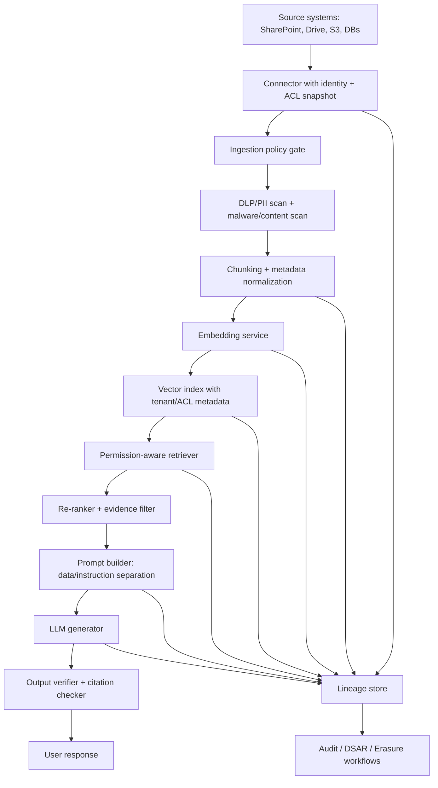

# Executive Summary — Security & Governance for RAG Systems

## Main thesis

A production RAG system should be treated as a **regulated data-processing system**, not merely as an LLM prompt pattern. The hard security boundary is not the LLM itself; it is the chain that moves sensitive documents through ingestion, parsing, embedding, vector indexing, retrieval, context construction, generation, logging, and user-facing citation. Each step can break confidentiality, violate access control, leak PII, poison answers, or make deletion impossible to prove.

The highest-value interview answer is this: **secure RAG is mostly about preserving enterprise data controls after documents become vectors and prompt context**. Existing IAM, KMS, RBAC, DLP, audit, and retention programs usually protect the source systems. RAG breaks those assumptions unless their controls are propagated into the derived artifacts: chunks, embeddings, metadata rows, index postings, prompt traces, generated answers, caches, and logs.

## Priority risks

| Risk | Why it is uniquely serious in RAG | Strong mitigation pattern |
|---|---|---|
| Unauthorized retrieval | Users can receive content from documents they cannot access if ACLs are not enforced at retrieval time. | Permission-aware retrieval with pre-filtering, tenant/role partitions, and post-retrieval authorization checks. |
| ACL drift | Source document permissions change after indexing, but vector metadata remains stale. | Event-driven ACL sync, versioned ACL snapshots, policy-decision logs, and periodic reconciliation. |
| PII leakage | PII can appear in raw text, chunks, embeddings, prompts, outputs, traces, and feedback datasets. | DLP at ingestion, redaction/tokenization before embedding where feasible, prompt/log scrubbers, retention minimization. |
| Erasure failure | Deleting the source file does not necessarily delete chunks, embeddings, caches, logs, generated snippets, or HNSW graph traces. | Subject-to-artifact lineage, tombstones, deletion manifests, namespace/key destruction, periodic compaction/rebuild. |
| Poisoned retrieval | Malicious documents can be retrieved as “evidence” and instruct the LLM to ignore system rules or exfiltrate data. | Treat retrieved text as untrusted data; instruction/data separation, sanitization, source trust scoring, retrieval anomaly detection. |
| Audit gaps | Teams cannot reconstruct which documents produced an answer or why a user saw a claim. | Retrieval provenance, citable chunk IDs, signed logs, prompt/run IDs, model/version capture, retention policy. |

## Recommended default architecture

The design principle is: **every derived object gets a lineage record and a policy record**. A chunk should not just have text and an embedding; it should have source ID, source version, chunk ID, tenant ID, ACL hash, data classification, PII class, retention class, embedding model version, index version, and deletion status.

## Five design rules

1. **Never use vector similarity as authorization.** A vector result is only a candidate; authorization must be checked using explicit policy metadata or a policy engine.
2. **Prefer pre-filtering when access is strict.** Post-filtering can leak through recall gaps, timing, debug traces, and accidental prompt inclusion.
3. **Treat retrieved documents as hostile input.** Prompt injection risk is highest when the model cannot distinguish system instructions from retrieved text.
4. **Design deletion before launch.** If you cannot map a data subject or document to all chunks, embeddings, caches, prompts, logs, and generated artifacts, you cannot reliably fulfill erasure requests.
5. **Audit the retrieval decision, not just the final answer.** The critical question is not only “what did the model say?” but “which artifacts were retrieved, under which policy snapshot, and why were they allowed?”

## Security maturity model

| Level | Description | Typical failure |
|---|---|---|
| Level 0 — Demo RAG | Source docs embedded into one shared index. No real auth propagation. | Cross-user data leakage. |
| Level 1 — Tenant RAG | Tenant namespaces or indexes; coarse isolation. | ACL changes inside a tenant are not respected. |
| Level 2 — Permission-aware RAG | ACL metadata filters, source permission sync, policy checks. | Recall/cost problems with large ACL filters. |
| Level 3 — Governed RAG | DLP, lineage, audit, deletion workflows, prompt-injection controls. | Operational overhead and stale policy drift. |
| Level 4 — Regulated RAG | Evidence-grade audit, continuous evals, red-team suites, human review, formal retention/deletion SLAs. | Expensive, but necessary for high-risk domains. |

## Core recommendation

For most enterprise RAG systems, the defensible default is:

- **Separate tenants by namespace/index** when tenant isolation is strict.
- **Store ACL groups, not user lists, as metadata** where possible.
- **Use a policy engine at query time** to compute authorized scopes.
- **Apply pre-filtered retrieval** using tenant/role/project/document-scope predicates.
- **Use post-retrieval authorization as a second guardrail**, not as the only guardrail.
- **Keep a lineage store outside the vector DB** so erasure and audit do not depend on ANN internals.
- **Rebuild or compact indexes on a schedule** to remove tombstoned/deleted vectors physically.
- **Treat retrieved text as untrusted data** and use instruction/data separation plus verification.

## High interview-value phrasing

> “The tricky part is that RAG creates derivative data products. The source document may be encrypted, access-controlled, and deletable, but the derived chunks, embeddings, ANN graph nodes, cached prompts, logs, and generated snippets may not inherit those controls automatically. So I would design the RAG platform around policy propagation and lineage: every chunk and vector carries tenant, ACL, data classification, retention, source version, embedding version, and deletion state. Retrieval is only candidate generation; authorization is an explicit decision made against a policy snapshot.”

---

## Source note

See `09_references_and_source_map.md` for the full source map. Key sources for this section include vendor documentation and papers listed there.
