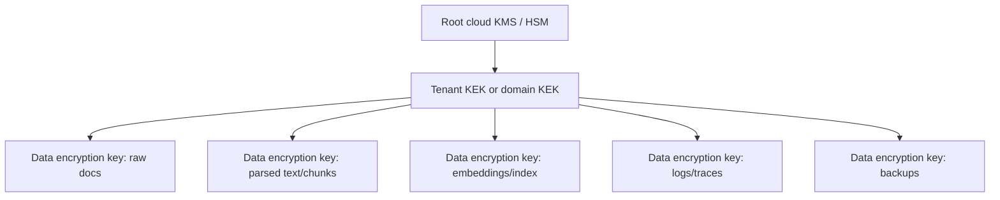

# Encryption, KMS, and Key Architecture for RAG

## Why encryption is different in RAG

Standard cloud encryption protects storage and transport, but RAG adds several new copies of the data:

1. raw source documents;
2. parsed text;
3. chunks;
4. embeddings;
5. vector indexes and graph structures;
6. prompt payloads sent to model APIs;
7. cached prompts and responses;
8. observability traces;
9. evaluation datasets and human feedback exports.

A secure design must protect every derived artifact. Encrypting the original S3 bucket or SharePoint repository is insufficient if the vector database, prompt logs, or traces contain sensitive reconstructed text.

## Baseline controls

| Layer | Required control | Notes |
|---|---|---|
| Source storage | Existing platform encryption + IAM | Preserve original access and classification metadata. |
| Connector | TLS/mTLS, scoped service identity | Avoid broad admin tokens; use incremental scopes and short-lived credentials. |
| Staging storage | Customer-managed KMS keys | Parsed text is often more sensitive than the source because it is easier to search. |
| Embedding service | TLS, private networking where possible | If using external APIs, ensure contractual data-use controls and no-training settings. |
| Vector DB | Encryption at rest + encrypted snapshots/backups | Validate whether metadata and payload fields are encrypted, not just vectors. |
| Prompt builder | In-memory minimization | Avoid persistent prompt bodies unless required for audit. |
| Logs/traces | Field-level redaction + encrypted log store | Logs are frequently the largest accidental leak channel. |
| Backups | Separate KMS policy + retention | Deletion workflows must include backups or documented delayed purge. |

## KMS key options

AWS KMS distinguishes customer-managed keys, AWS-managed keys, and AWS-owned keys. Customer-managed keys provide the strongest customer control over lifecycle, key policy, grants, rotation, deletion scheduling, and CloudTrail auditability, while AWS-owned keys are convenient but not visible or controllable by the customer. For regulated RAG workloads, customer-managed keys are usually the right default for staging stores, vector DB storage, snapshots, and audit logs because the organization can prove who used the key and when.

### Recommended key hierarchy

Use **envelope encryption**: large data objects are encrypted with data encryption keys (DEKs); DEKs are wrapped by KMS-managed key-encryption keys (KEKs). This reduces KMS call volume, enables key rotation without rewriting every object immediately, and supports cryptographic erasure by destroying or disabling selected key material.

## Tenant keying patterns

| Pattern | Description | Pros | Cons | Best fit |
|---|---|---|---|---|
| One global key | All RAG artifacts encrypted under one key. | Simple. | Weak blast-radius control; poor tenant offboarding. | Internal demos only. |
| Key per environment | Separate keys for dev/stage/prod. | Basic isolation. | No tenant separation. | Low-sensitivity internal RAG. |
| Key per tenant | Each tenant has its own KEK. | Strong isolation and offboarding; supports crypto-erasure. | More key management and quotas. | SaaS / regulated clients. |
| Key per tenant + class | Separate keys for PII, confidential, public data. | Better policy and deletion control. | Operationally complex. | High-risk domains. |
| BYOK/HYOK | Customer supplies or controls key material. | Strong enterprise trust story. | Integration and availability complexity. | Enterprise SaaS and regulated buyers. |

## Encryption in transit

At minimum:

- use TLS for all client-to-service traffic;
- use mTLS or private service networking for connectors and vector DB clusters;
- prevent public ingress to vector stores unless explicitly required;
- rotate API keys and service credentials;
- avoid sending API keys over unencrypted channels.

Qdrant’s security guidance is a useful vector-DB example: it recommends API-key authentication, binding to private interfaces, and enabling TLS because sending API keys over unencrypted channels is insecure. Qdrant also supports JWT-based granular access control, which can be used to build RBAC-style authorization on top of vector operations.

## Model API encryption and contractual controls

When the generator or embedding model is a hosted API, encryption is only one part of the control plane. Also verify:

- data retention defaults;
- whether prompts/completions are used for training;
- regional processing location;
- subprocessors;
- audit logs available to the customer;
- private networking options;
- customer-managed key support;
- legal terms for confidential information and personal data.

For sensitive RAG, the embedding model is often as important as the generator. Embeddings can leak information through membership inference or nearest-neighbor reconstruction attacks, and they may encode sensitive attributes even if raw text is not stored in the vector DB payload.

## Backup and snapshot encryption

Backups are a common governance blind spot. A deletion workflow that removes a vector from the online index but leaves it in encrypted snapshots indefinitely may not satisfy the organization’s data-retention policy. The practical pattern is:

1. encrypt every backup under a backup-specific key;
2. include source IDs and index version in backup manifests;
3. define a maximum backup retention window;
4. document when deleted data ages out of immutable backups;
5. for strict tenant offboarding, use tenant-scoped keys so disabling/deleting a tenant key renders remaining ciphertext inaccessible.

## Key rotation

Key rotation has two meanings:

- **KMS backing-key rotation**, where the KMS provider rotates key material but old material remains available for decrypting older ciphertext.
- **Application re-encryption**, where objects are actively decrypted and re-encrypted under a new DEK or KEK.

For RAG, application re-encryption may be required after tenant offboarding, key compromise, a change in data classification, or migration to a new vector store. Keep a manifest mapping artifact ID → key ID → key version → creation time.

## Controls checklist

- [ ] Customer-managed KMS keys for staging data, vector DB storage, prompt traces, and backups.
- [ ] Separate keys by environment and tenant for high-risk workloads.
- [ ] TLS/mTLS for all service-to-service calls.
- [ ] Private networking for vector DB and model endpoints where possible.
- [ ] Encrypted temporary files during parsing and chunking.
- [ ] Prompt and trace logs encrypted with stricter retention than application logs.
- [ ] Key ID and key version stored in lineage metadata.
- [ ] Backup encryption and purge windows documented.
- [ ] Key compromise runbook tested.
- [ ] Tenant offboarding includes key disable/delete decision.

## Interview-ready answer

> “For RAG I would not only encrypt the source documents. I would encrypt every derived layer: parsed text, chunks, embeddings, vector indexes, snapshots, prompt traces, and evaluation exports. I would use envelope encryption with customer-managed KMS keys, ideally scoped by tenant and data class. Key IDs and versions become part of lineage, so erasure and audit can prove which artifacts were protected by which key. For sensitive tenants, crypto-erasure by deleting a tenant KEK can be a fallback, but it does not replace logical deletion and index compaction.”

---

## Source note

See `09_references_and_source_map.md` for the full source map. Key sources for this section include vendor documentation and papers listed there.
