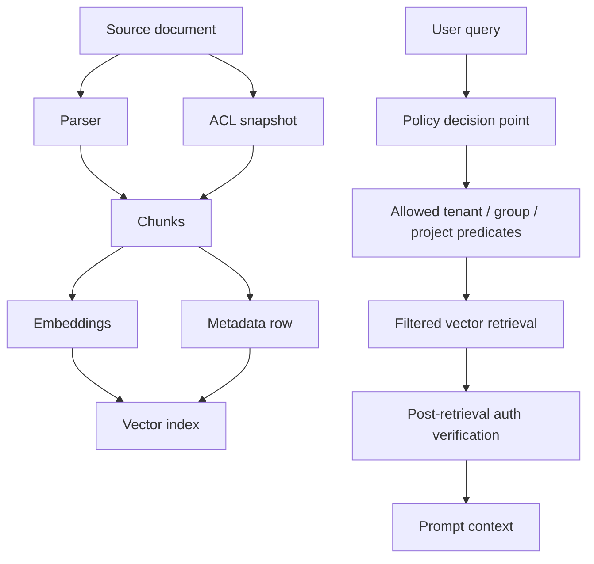

# RBAC and Permission-Aware Retrieval

## The hard problem

Permission-aware retrieval is one of the hardest production RAG problems because vector search is designed to answer: **what is semantically close?** Enterprise authorization asks: **what is this user allowed to see right now?** Those are different computations.

A source system such as SharePoint, Google Drive, Confluence, Jira, S3, or a database already has permissions. Once content is chunked and embedded, those permissions must be propagated into the RAG artifacts. If they are not, the vector database becomes a bypass around the original access-control system.

## Core design principle

**Retrieval is candidate generation, not authorization.**

Every retrieved chunk must pass an explicit authorization check before it enters the prompt. Similarity score cannot be used as a security decision.

## ACL propagation model



Each chunk should carry at least:

- `tenant_id`;
- `source_system`;
- `source_doc_id`;
- `source_doc_version`;
- `chunk_id`;
- `acl_snapshot_id`;
- `allowed_groups` or policy label;
- `data_classification`;
- `retention_policy_id`;
- `pii_profile`;
- `created_at`, `updated_at`, and `deleted_at`;
- `embedding_model_version`;
- `index_version`.

## Main implementation patterns

| Pattern | How it works | Pros | Cons | Use when |
|---|---|---|---|---|
| Separate index per tenant | Each tenant has its own vector index. | Strong isolation; simple deletion. | Expensive and operationally heavy at high tenant counts. | Regulated SaaS, small number of large tenants. |
| Namespace per tenant | One index with tenant namespaces. | Stronger isolation than metadata-only; easy offboarding. | Cross-tenant queries require fan-out. | Most multi-tenant SaaS RAG. |
| Metadata pre-filter | Store ACL/tenant/group fields; pass filter into ANN query. | Flexible; fewer indexes. | Large filters can hurt latency/recall/cost. | Moderate ACL complexity. |
| Post-filter only | Retrieve top-k, then remove unauthorized chunks. | Simple to implement. | Dangerous: recall collapse and possible prompt/log leakage if implemented badly. | Only as secondary defense. |
| Role/partition-aware indexing | Build partitions around roles/groups/policies. | Better latency/recall for RBAC workloads. | More complex; may duplicate vectors. | Enterprise RBAC with repeated roles/groups. |
| Policy engine + hybrid search | Query-time policy decision produces allowed predicates. | Central governance and audit. | Requires careful integration. | Mature enterprise systems. |

Pinecone’s current guidance recommends namespaces for multitenancy and notes that metadata filtering can be more expensive and slower for tenant isolation because queries can scan larger namespaces. It also warns against filtering by large lists of individual user IDs and recommends access-control groups such as organization, project, or role. This aligns with the broader systems literature: role/group-level partitioning is usually more scalable than user-level filtering.

## Why user-level ACL filters are brittle

A naive implementation stores `allowed_user_ids` in each chunk and sends a filter like:

```json
{"allowed_user_ids": {"$in": ["user_123"]}}
```

This works for demos but breaks at enterprise scale:

- documents can have thousands of users;
- users can belong to many groups;
- group expansion at query time creates huge filter clauses;
- vector DBs may have filter-size limits;
- large filters reduce ANN pruning efficiency;
- stale user lists cause overexposure or underexposure;
- user-level fields make access-control changes expensive to reindex.

Better pattern:

1. Normalize source ACLs into stable groups/roles/projects.
2. Store compact policy labels on chunks.
3. At query time, compute the user’s effective groups.
4. Retrieve with tenant + policy-label filters.
5. Re-check returned chunks against a policy decision point before prompting.

## Pre-filter vs post-filter

### Pre-filtering

Pre-filtering applies authorization predicates during ANN search.

**Benefits:**

- unauthorized chunks should never be returned;
- less chance of leaking into prompts/logs;
- better compliance posture;
- more explainable policy boundary.

**Costs:**

- filtered ANN can reduce recall;
- complex predicates can increase latency;
- not all vector stores implement filters equally;
- very selective filters can make HNSW traversal inefficient.

### Post-filtering

Post-filtering retrieves candidates first and removes unauthorized results after.

**Benefits:**

- easy to implement;
- works even when vector DB filtering is limited;
- can be used as a secondary guard.

**Risks:**

- if top-k is filled with unauthorized chunks, final recall may be poor;
- unauthorized chunks might appear in debug logs or traces;
- bugs can accidentally pass them to the prompt;
- timing/metadata side channels can leak existence.

**Recommendation:** use post-filtering only as a second line of defense, not the primary authorization boundary.

## Current research direction

The recent vector-database literature frames permission-aware retrieval as a filtered vector search problem. Curator describes the fundamental tradeoff: a single shared index is memory efficient but can hurt filtered-query performance, while per-tenant indexes improve query performance but increase memory overhead. HoneyBee extends the idea to RBAC workloads, using dynamic partitioning and controlled vector replication to improve role-filtered search latency with manageable storage overhead. ACORN proposes predicate-aware HNSW traversal for hybrid vector + structured-predicate search, showing that predicate handling should be part of ANN traversal rather than an afterthought.

## ACL drift and synchronization

ACL drift happens when source permissions change but the vector index still reflects the old permissions. This is a common enterprise failure mode.

Controls:

- subscribe to source-system permission-change events;
- store `acl_snapshot_id` on each chunk;
- reconcile source ACLs and vector metadata periodically;
- block or quarantine chunks with stale ACL snapshots;
- record policy version in retrieval logs;
- run synthetic “canary users” to test access boundaries.

## Deletion/offboarding

Tenant offboarding should delete or disable:

- source connector credentials;
- chunk text;
- embeddings;
- vector namespace/index;
- reranker caches;
- prompt caches;
- evaluation exports;
- logs where allowed by policy;
- tenant keys where crypto-erasure is required.

Namespace-per-tenant designs make this easier because deletion can be scoped to a namespace. Metadata-only designs require careful deletion queries and later index compaction.

## Authorization test suite

Create a test corpus with:

- public documents;
- team-only documents;
- manager-only documents;
- cross-project documents;
- documents with inherited permissions;
- documents with permission changes;
- deleted documents;
- documents with overlapping semantic content but different ACLs.

Run tests such as:

1. user with no access asks exact question from restricted document;
2. user with partial access asks a cross-document question;
3. user loses access after indexing;
4. user gains access after indexing;
5. document is deleted but semantically similar text remains;
6. group membership changes mid-session;
7. retriever returns unauthorized chunks but post-filter should remove them;
8. prompt trace must not contain unauthorized candidates.

## Interview-ready answer

> “I would propagate ACLs into the chunk metadata, but I would avoid storing massive user lists. I would normalize permissions into tenant, project, group, and role labels, use a policy engine to compute authorized scopes at query time, pre-filter retrieval by those scopes, and then post-check each returned chunk before it enters the prompt. I would log the ACL snapshot and policy version for every answer. The hard part is keeping ACL metadata fresh and avoiding recall loss from highly selective filters, which is why namespace/partition design matters.”

---

## Source note

See `09_references_and_source_map.md` for the full source map. Key sources for this section include vendor documentation and papers listed there.
