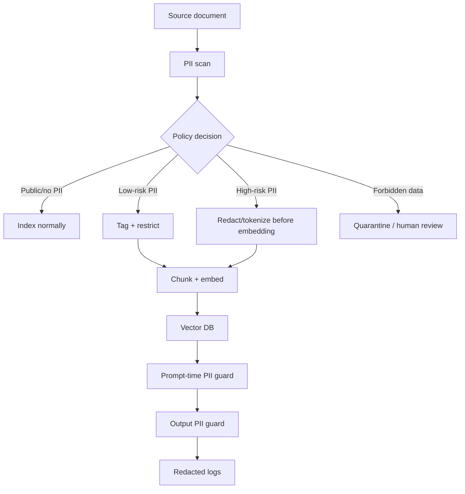

# PII Detection, Redaction, and Log Hygiene

## PII risk surface in RAG

PII does not only live in source documents. A RAG system can copy, transform, and leak PII through:

- connector payloads;
- parser outputs;
- chunks;
- embeddings;
- vector metadata and payload fields;
- retrieval results;
- reranker inputs;
- prompts;
- model outputs;
- citations;
- chat history;
- traces and logs;
- evaluation datasets;
- human feedback queues;
- cached responses;
- analytics dashboards.

The practical governance rule is: **every place that stores or transmits text is a PII processing location**.

## DLP pipeline design

## Where to redact

| Stage | Redact? | Rationale |
|---|---|---|
| Before parsing | Sometimes | Useful for binary files or known fields, but may hurt extraction quality. |
| After parsing, before chunking | Often | Best stage for text-level PII recognition. |
| Before embedding | For high-risk PII | Prevents sensitive values from entering embedding space. |
| Before prompt construction | Always for policy-forbidden PII | Avoid sending unnecessary personal data to LLM APIs. |
| Before logging | Always | Logs should be minimized and scrubbed by default. |
| Before evaluation export | Always | Evaluation sets often persist longer than production traces. |

## Redaction vs masking vs tokenization

| Technique | Example | Pros | Cons | Best use |
|---|---|---|---|---|
| Redaction | `[REDACTED_NAME]` | Simple and safe. | Loses utility. | Logs, low-need PII. |
| Masking | `***-**-1234` | Preserves some debugging value. | Can still identify people. | Operational support. |
| Tokenization | `PERSON_0421` | Supports consistency across chunks. | Requires secure token vault. | RAG over case files or customer histories. |
| Format-preserving encryption | `fake-looking value` | Preserves schema shape. | Complex and risky if misused. | Structured records. |
| Differential privacy | Aggregate/noisy output | Strong for analytics. | Not a simple fix for document QA. | Aggregate reporting. |

## Embeddings and PII

A common misconception is that embeddings are “anonymous” because they are numeric. They should instead be treated as **derived personal data when generated from personal data**. Embeddings can preserve semantic information about individuals, support similarity search over sensitive attributes, and may be vulnerable to membership inference or reconstruction-style attacks.

Practical controls:

- avoid embedding raw secrets, credentials, government IDs, medical identifiers, and highly sensitive free text;
- tokenize high-risk identifiers before embedding;
- store raw text payloads separately from vectors when possible;
- encrypt embeddings and restrict vector DB access;
- avoid putting PII values into metadata filters unless required;
- log vector IDs and source IDs rather than raw text;
- maintain lineage from embedding to original source and data subject.

## Detection tooling

Microsoft Presidio and Google Cloud Sensitive Data Protection are useful reference implementations for PII detection and anonymization. The recent literature also shows that domain-specific PII detection may outperform generic detectors, especially in education, healthcare, finance, and informal text. The key operational point is that detection should be tuned and evaluated on your domain, not assumed to be solved by one regex/NLP pass.

## PII policy classes

| Class | Examples | RAG handling |
|---|---|---|
| Public | published staff bios, public policy docs | Index normally; still cite source. |
| Internal personal data | employee names, emails, internal IDs | Index with access controls; redact from logs. |
| Sensitive personal data | health, biometrics, ethnicity, union membership | Restrict; tokenize/redact before embedding when feasible. |
| Regulated identifiers | SSN/SIN, passport, banking IDs | Usually do not embed raw; tokenize or quarantine. |
| Secrets | passwords, API keys, private keys | Do not index; rotate if discovered. |

## Prompt-time PII minimization

The prompt builder should include the minimum evidence needed for the answer. Avoid passing entire documents when a few snippets are enough. For user-specific questions, include only the records the user is authorized to see and only the fields needed.

Prompt-time controls:

- retrieval budget;
- PII classifier on candidate context;
- redaction policy based on user purpose and role;
- citations to source IDs rather than full sensitive identifiers;
- output policy that forbids exposing unnecessary PII;
- secondary verifier that checks whether output includes disallowed entities.

## Log hygiene

Logs are often the most dangerous part of a RAG system because developers enable verbose prompt tracing during debugging.

Recommended logging tiers:

| Tier | Store | Do not store |
|---|---|---|
| Default production | request ID, user ID hash, policy version, chunk IDs, model/version, latency, scores | full prompt, full retrieved text, full answer with PII |
| Debug gated | limited prompt snippets, redacted context, sampled traces | raw secrets, regulated IDs, unauthorized candidates |
| Forensic break-glass | encrypted full traces for approved incidents | broad long-term access; non-expiring traces |

## Human review and feedback loops

Human feedback queues can accidentally become shadow datasets containing PII. Controls:

- redact before sending to reviewers;
- restrict reviewers by data class;
- watermark/canary sensitive data;
- set retention limits;
- exclude sensitive traces from training/fine-tuning unless separately approved;
- record reviewer access in audit logs.

## Evaluation metrics

Track:

- PII detection precision/recall by entity type;
- false-negative rate for high-risk identifiers;
- prompt PII exposure rate;
- output PII leakage rate;
- log PII leakage rate;
- deletion coverage for PII-containing artifacts;
- number of quarantined documents by source;
- time to remediate discovered secrets.

## Interview-ready answer

> “I would treat PII as a full-pipeline property. It can appear in parsed text, embeddings, vector payloads, prompts, outputs, logs, caches, and evaluation data. I would scan at ingestion, classify documents, redact or tokenize high-risk identifiers before embedding, run a prompt-time PII guard, and aggressively scrub logs. I would also keep lineage so that if a data subject asks for deletion, I can find every chunk, embedding, prompt trace, and feedback record derived from their data.”

---

## Source note

See `09_references_and_source_map.md` for the full source map. Key sources for this section include vendor documentation and papers listed there.
