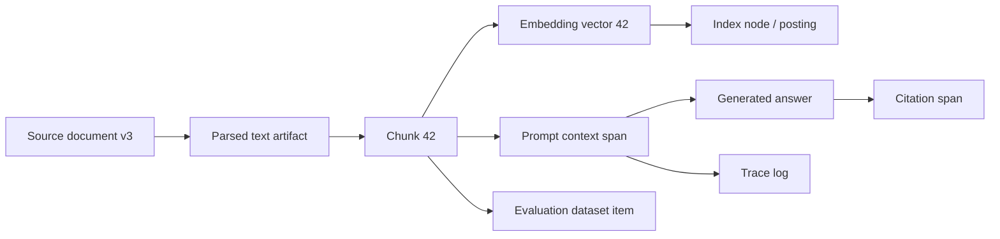

# Audit, Lineage, and Logging

## Why audit matters in RAG

A normal application log says who called an endpoint and whether it succeeded. A governed RAG audit log must answer a deeper question:

> “Why did this user receive this answer, and which controlled data artifacts influenced it?”

That requires retrieval-level provenance, not just final-message logging.

## Minimum audit record

For each RAG response, capture:

- request ID and session ID;
- user/principal ID or pseudonymous user ID;
- tenant ID;
- user groups/roles hash;
- policy-decision ID;
- policy version;
- query text hash and optionally redacted query text;
- retriever version;
- embedding model version;
- vector index ID/version;
- filters applied;
- candidate chunk IDs and scores;
- rejected chunk IDs and rejection reasons where safe;
- final context chunk IDs;
- source document IDs and versions;
- prompt template version;
- generator model/version;
- output verifier version;
- citation map;
- response hash;
- latency/cost metrics;
- data classification tags;
- retention class.

## Lineage graph



A good lineage system lets you traverse both directions:

- from a response back to the chunks and sources that supported it;
- from a source document or data subject forward to all derived artifacts.

## Audit store design

The audit store should usually be separate from the vector database. Vector DBs are optimized for similarity search, not compliance evidence. Use an append-only log, event store, or relational metadata store with strong access controls.

Recommended properties:

- append-only writes;
- tamper-evident hashes or signed log batches;
- encryption with customer-managed keys;
- retention policies by data class;
- separate access path for auditors/security;
- queryable by source ID, user ID, chunk ID, request ID, and deletion request ID;
- export support for investigations.

## What not to log by default

Avoid default logging of:

- full raw prompts;
- full retrieved text;
- unauthorized candidates;
- secrets or API keys;
- full personal identifiers;
- raw embeddings unless needed;
- chain-of-thought or hidden reasoning traces;
- unredacted user uploads;
- long-lived conversation histories.

Instead, store IDs, hashes, policy versions, and redacted snippets. Full trace capture should be a gated, encrypted, time-limited incident mode.

## Citation as audit evidence

Citations are not just UX. They are also governance evidence. A citation system should preserve:

- source document ID;
- source version;
- chunk ID;
- character/page/line offsets where available;
- retrieval score;
- whether the cited span was actually included in the prompt;
- whether the output claim was verified against the cited span.

Weak citation pattern: “Sources: Document A, Document B.”

Strong citation pattern: answer sentence → source span → chunk ID → source version → policy snapshot.

## Data-retention policy

Different artifacts should have different retention windows:

| Artifact | Suggested retention logic |
|---|---|
| Source documents | Governed by source system. |
| Parsed text/chunks | Same or shorter than source, unless needed for index operation. |
| Embeddings | Same as chunk retention; delete/compact on source deletion. |
| Prompt traces | Short by default; longer only for approved audit use. |
| User queries | Minimize and redact; retain aggregated metrics when possible. |
| Generated answers | Retain if required for product history; otherwise summarize/hash. |
| Evaluation datasets | Curated and redacted; separate approval for personal data. |
| Security events | Longer retention, but still scrub content fields. |

## Tamper evidence

For high-risk systems, log batches can be chained:

```text
batch_hash_n = SHA256(batch_payload_n || batch_hash_n-1)
signature_n = Sign(KMS_or_HSM_key, batch_hash_n)
```

This provides evidence that logs were not silently altered after the fact. Store signatures and batch hashes separately from operational logs.

## Audit queries you should be able to answer

- Which users saw chunks from document `D` after date `T`?
- Which answers cited source version `v3` after it was superseded by `v4`?
- Which chunks were retrieved but rejected due to authorization?
- Which model version generated answers for tenant `X` last week?
- Which prompts contained high-risk PII?
- Which artifacts derive from data subject `S`?
- Was a deleted document still retrievable after deletion time?
- Did any answer include a citation from a stale ACL snapshot?

## Interview-ready answer

> “I would build RAG audit around lineage. Each response should be traceable to the user, policy snapshot, index version, retrieved chunk IDs, source document versions, prompt template, model version, and citation map. I would not log full prompts by default because those logs become a sensitive data store. I would log IDs, hashes, redacted snippets, and policy decisions, with encrypted break-glass full tracing only for approved incidents.”

---

## Source note

See `09_references_and_source_map.md` for the full source map. Key sources for this section include vendor documentation and papers listed there.
