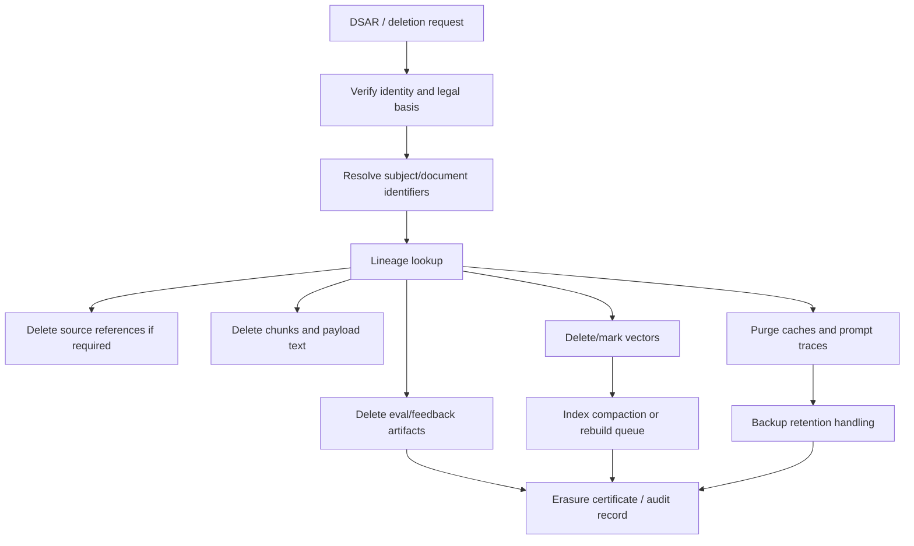
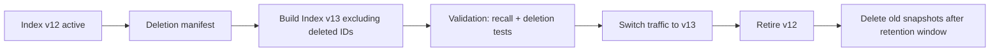

# GDPR Right-to-Erasure in ANN and HNSW Indexes

## The problem

GDPR Article 17 gives data subjects a right to erasure in defined circumstances. In a RAG system, deleting the source document is not enough because the personal data may have been copied or transformed into:

- parsed text;
- chunks;
- embeddings;
- vector index nodes;
- metadata records;
- prompt caches;
- conversation histories;
- answer caches;
- logs/traces;
- evaluation datasets;
- model fine-tuning datasets;
- backups and snapshots.

The technical challenge is most visible in graph-based ANN indexes such as HNSW. HNSW deletion is often implemented by marking nodes as deleted and omitting them from future search, but the graph structure and storage may not be physically compacted immediately. hnswlib, for example, supports `mark_deleted(label)` so an element is omitted from search results, and can later reuse deleted slots if replacement is enabled. That is a useful operational deletion primitive, but it is not the same as proving immediate physical erasure from every layer.

## HNSW-specific deletion issues

| Issue | Explanation | Governance implication |
|---|---|---|
| Logical deletion | Vector is marked deleted and hidden from results. | Good for serving, insufficient for physical erasure proof. |
| Graph residue | Neighbor links and graph topology may retain traces until rebuild/compaction. | Harder to prove complete removal. |
| Unreachable points | Updates/deletions can degrade graph quality and create unreachable nodes. | Long-lived indexes need rebuild hygiene. |
| Snapshot residue | Old snapshots/backups may contain deleted vectors. | Need retention windows and deletion manifests. |
| Cache residue | Query/result/prompt caches may preserve sensitive snippets. | Erasure must include caches. |
| Derived outputs | Answers may include personal data copied from source. | Need response/history retention controls. |

Recent work on HNSW updates highlights that graph-based indexes can suffer performance and accuracy degradation under repeated deletions and updates, including unreachable-point phenomena. This supports the operational recommendation that deletion-heavy workloads should use tombstones plus scheduled compaction/rebuild rather than assuming indefinite incremental updates are risk-free.

## Erasure workflow

## Deletion strategies

| Strategy | What it does | Pros | Cons | Use when |
|---|---|---|---|---|
| Logical tombstone | Mark chunks/vectors as deleted; block retrieval. | Fast; low downtime. | Physical bytes remain until compaction. | First response to deletion request. |
| Physical delete API | Use vector DB delete/remove operation. | Better than tombstone-only. | Index implementation may still need compaction. | Stores with strong delete support. |
| Namespace delete | Delete whole tenant/source namespace. | Clean and fast for offboarding. | Requires namespace design. | Tenant or collection deletion. |
| Blue-green rebuild | Build new index excluding deleted artifacts. | Strongest technical cleanup. | Expensive; operational lag. | Regulated/high-risk indexes. |
| Crypto-erasure | Destroy tenant/source key. | Fast inaccessibility guarantee for encrypted data. | Does not remove plaintext copies/logs; legal fit depends on context. | Tenant offboarding, backups. |
| Retention aging | Let immutable backups expire. | Practical for backup systems. | Must be documented and legally reviewed. | Immutable backup constraints. |

## Recommended architecture

1. **Lineage-first design**: every chunk/vector maps to source document, source version, data subject where possible, key ID, and index version.
2. **Deletion manifest**: erasure request creates a signed manifest listing all artifacts to delete.
3. **Immediate serving block**: set tombstone status in metadata and policy store immediately.
4. **Vector delete**: call vector DB delete/remove for matching chunk IDs.
5. **Cache purge**: invalidate query caches, result caches, prompt caches, and response caches.
6. **Log handling**: redact or delete logs according to legal retention policy.
7. **Compaction/rebuild**: schedule index rebuild or compaction to physically remove deleted vectors and graph residue.
8. **Verification query suite**: test that deleted terms and subject identifiers are not retrievable.
9. **Audit certificate**: record deletion time, artifacts affected, index versions, backups exceptions, and next purge date.

## Blue-green rebuild pattern

This pattern is expensive but highly defensible. It also improves performance hygiene when HNSW has accumulated many tombstones or updates.

## Deletion SLAs

Use separate SLAs for different guarantees:

| Guarantee | Example SLA | Meaning |
|---|---|---|
| Retrieval suppression | minutes/hours | Deleted data no longer returned to users. |
| Online physical delete | hours/days | Vector DB delete completed on active index. |
| Cache purge | minutes/hours | Prompt/result caches invalidated. |
| Log redaction | days | Content-bearing logs redacted/deleted where permitted. |
| Index compaction/rebuild | days/weeks | Old graph/index files replaced. |
| Backup expiry | policy-defined | Immutable backups age out. |

Be explicit: a system can suppress retrieval quickly while physical erasure from backups and old index snapshots follows a documented retention window.

## Edge cases

- **Shared chunks**: if a chunk contains multiple people’s data, deletion may require redaction and re-embedding rather than deleting the whole source.
- **Generated answers**: if an answer copied personal data, deleting the source vector does not delete the answer history.
- **Embedding-only systems**: even if raw text is not stored, embeddings derived from personal data may still be in scope.
- **External model APIs**: verify provider retention and deletion terms.
- **Fine-tuning datasets**: if RAG traces were reused for fine-tuning, erasure becomes much harder and may require model unlearning or exclusion from future training.

## Interview-ready answer

> “For GDPR erasure in RAG, I would separate immediate retrieval suppression from eventual physical erasure. The first step is a tombstone and policy block so the data cannot be retrieved. Then I delete chunk payloads, vectors, caches, and traces, and schedule HNSW compaction or blue-green index rebuild because graph indexes often mark deletions rather than immediately rewriting all graph structure. The key is lineage: without source-to-chunk-to-vector-to-cache mapping, you cannot prove what was deleted.”

---

## Source note

See `09_references_and_source_map.md` for the full source map. Key sources for this section include vendor documentation and papers listed there.
