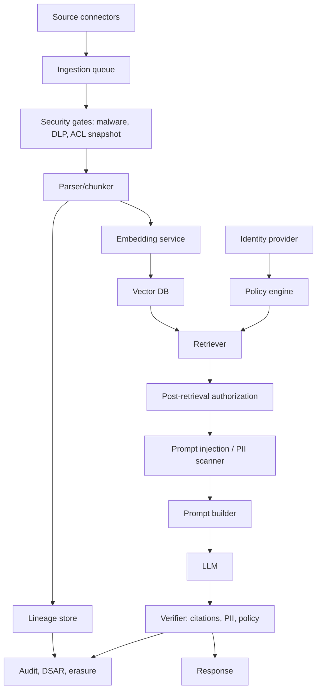

# Implementation Playbook

## Target architecture

## Phase 1 — MVP with guardrails

Goal: stop obvious data leaks while proving product value.

- Use tenant namespaces or separate indexes.
- Store source IDs, chunk IDs, tenant IDs, and source URLs.
- Enforce query-time tenant filtering.
- Disable full prompt logging by default.
- Add basic PII detection for high-risk identifiers.
- Add retrieved-text delimiters and prompt-injection warnings.
- Keep raw source links for citations.
- Implement delete-by-source-document.

Exit criteria:

- user cannot retrieve another tenant’s docs;
- deleted document is blocked from retrieval;
- prompts/logs do not contain unrestricted PII;
- answer citations map to chunk IDs.

## Phase 2 — Enterprise authorization

Goal: preserve source-system permissions.

- Normalize source ACLs into groups/roles/projects.
- Store `acl_snapshot_id` on every chunk.
- Use policy engine to compute allowed retrieval scopes.
- Pre-filter by tenant + group/role/project.
- Post-check every retrieved chunk.
- Subscribe to ACL-change events.
- Add canary authorization tests.
- Log policy version and allowed predicates.

Exit criteria:

- permission changes are reflected within SLA;
- stale ACL chunks are quarantined;
- unauthorized chunks never enter prompt context;
- audit can explain why each chunk was allowed.

## Phase 3 — Privacy and compliance

Goal: handle PII, retention, and erasure.

- Add DLP classification at ingestion.
- Redact/tokenize high-risk identifiers before embedding.
- Add prompt-time PII minimization.
- Add output PII policy checker.
- Build subject/document-to-artifact lineage.
- Implement deletion manifest workflow.
- Add cache/log purge for deletion requests.
- Schedule index compaction or blue-green rebuild.

Exit criteria:

- DSAR lookup finds source/chunks/vectors/logs/caches;
- erasure workflow produces audit certificate;
- PII exposure metrics are tracked;
- backups have documented retention and key policy.

## Phase 4 — Adversarial robustness

Goal: resist poisoned retrieval and indirect prompt injection.

- Add source trust scoring.
- Scan chunks for instruction-like content.
- Detect duplicate/cluster poisoning.
- Require corroboration for high-impact claims.
- Add citation support verification.
- Add red-team test corpus.
- Add tool-use policy enforcement independent of LLM.
- Monitor attack success rate over time.

Exit criteria:

- known malicious docs do not change answer policy;
- model refuses or ignores retrieved instructions;
- low-trust evidence cannot trigger side-effecting tools;
- attack metrics are part of CI/CD.

## Security test checklist

### Access control

- [ ] User without access asks exact wording from restricted document.
- [ ] User with partial access asks multi-document question.
- [ ] User loses access after indexing.
- [ ] Group membership changes during active session.
- [ ] Deleted document is semantically similar to allowed document.
- [ ] Metadata filter returns zero but post-filter would have found allowed docs.

### PII

- [ ] Source contains SSN/SIN/passport/bank fields.
- [ ] Prompt trace is sampled and inspected for PII.
- [ ] Output contains unnecessary personal data.
- [ ] PII-containing document is deleted.
- [ ] Evaluation export excludes raw PII.

### Prompt injection

- [ ] Retrieved doc says “ignore previous instructions.”
- [ ] Retrieved doc includes hidden HTML/PDF text.
- [ ] Retrieved doc asks for data exfiltration.
- [ ] Retrieved doc asks model to hide citation.
- [ ] Retrieved doc asks model to call a tool.
- [ ] Many similar poisoned docs are inserted.

### Erasure

- [ ] Delete source document.
- [ ] Delete one chunk from a multi-person document.
- [ ] Delete tenant namespace.
- [ ] Rebuild index excluding deleted vectors.
- [ ] Verify old caches no longer serve deleted content.
- [ ] Verify audit certificate lists backups and expiry windows.

## Production monitoring

| Metric | Why it matters |
|---|---|
| Unauthorized retrieval attempts | Detect auth bugs and probing. |
| Stale ACL chunk count | Measures permission-sync health. |
| PII prompt exposure rate | Tracks privacy risk. |
| Prompt injection detection rate | Monitors attack surface. |
| Low-trust citation rate | Identifies risky answers. |
| Tombstone count in index | Signals rebuild/compaction need. |
| Deleted content retrieval tests | Measures erasure effectiveness. |
| Cross-tenant query attempts | Finds app-layer mistakes and abuse. |
| Full-trace logging events | Ensures break-glass use is rare and approved. |

## Vendor evaluation checklist

Ask every vector DB / RAG platform vendor:

- Does metadata filtering happen before or after ANN candidate generation?
- Can filters express tenant, group, and document-level ACLs efficiently?
- What are filter-size limits?
- Are namespaces physically isolated?
- How are deletes implemented for HNSW or graph indexes?
- Is there compaction? How often?
- Are vectors, metadata, payload text, and snapshots encrypted?
- Are customer-managed keys supported?
- Can audit logs show query filters and returned object IDs?
- Can we delete all artifacts by source ID or tenant ID?
- Are prompt traces stored? For how long? Are they redacted?
- Are embeddings/model inputs used for training by default?
- Is private networking supported?

## Final recommendation

Build the platform as if every RAG answer may later need to be explained to a security reviewer, privacy officer, customer admin, or regulator. That means authorization, lineage, PII controls, deletion, and prompt-injection defenses must be designed into the retrieval path rather than added as prompt text at the end.

---

## Source note

See `09_references_and_source_map.md` for the full source map. Key sources for this section include vendor documentation and papers listed there.
