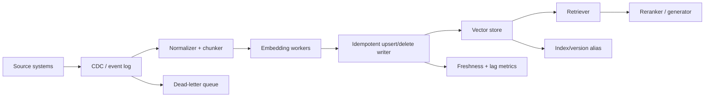

# Ops and Freshness in Vector Stores

This bundle is a detailed Markdown report on operational design choices for production vector stores: incremental ingestion and CDC, tombstones and compaction, re-embedding after model upgrades, blue-green reindexing, multi-tenancy, caching, invalidation, and vendor-specific operational primitives.

The core thesis is simple: **vector retrieval quality is not only a modeling problem; it is a data lifecycle problem.** Most production failures come from stale chunks, non-idempotent updates, forgotten deletes, access-control leakage across tenants, cache keys that ignore index/model versions, or unsafe index swaps.

## Report files

| File | Purpose |
|---|---|
| `01_incremental_ingestion_cdc.md` | How to design streaming and micro-batch ingestion with CDC, idempotent upserts, freshness SLOs, and replay safety. |
| `02_deletes_tombstones_compaction.md` | Delete semantics, tombstones, physical compaction, stale retrieval risks, and vendor-specific cleanup behavior. |
| `03_reembedding_model_upgrades.md` | How to re-embed safely when embedding model, chunker, parser, metadata schema, or vector dimension changes. |
| `04_blue_green_reindex_index_versioning.md` | Index versioning, alias swaps, dual-write, replay logs, rollback, and zero/low-downtime migration patterns. |
| `05_multi_tenancy_patterns.md` | Namespace vs metadata filter vs separate index/collection/database/cluster, with isolation and cost tradeoffs. |
| `06_caching_and_invalidation.md` | Embedding cache, semantic cache, result cache, reranker cache, invalidation, TTLs, versioned keys, and privacy. |
| `07_vendor_ops_profiles.md` | Operational decision profiles for Pinecone, Weaviate, Milvus/Zilliz, Qdrant, pgvector, Elastic/OpenSearch, Vespa, LanceDB, Chroma, Redis, MongoDB Atlas, Vertex AI Vector Search, and Azure AI Search. |
| `08_studies_articles_sources.md` | Annotated sources and research/articles relevant to CDC, indexing, multi-tenancy, reindexing, and caching. |
| `09_checklists_runbooks.md` | Production checklists and incident runbooks for freshness, deletion, reindexing, tenant isolation, and caches. |

## Recommended defaults

For a serious RAG or neural search system, the safest default architecture is:



Use **stable document IDs**, **stable chunk IDs**, **embedding model version**, **chunker/parser version**, **source commit timestamp**, and **tombstone status** in every record. Treat the vector store as a derived serving index unless it is also your system of record, as in pgvector or MongoDB Atlas.

## The operational decision tree

1. **How fresh must retrieval be?**
   - Seconds to sub-minute: CDC/streaming, idempotent upsert, exactly-once or effectively-once processing, aggressive cache invalidation.
   - Minutes to hours: micro-batch ingestion with watermark tracking.
   - Daily/weekly: bulk rebuild and blue-green swap is usually cheaper and simpler.

2. **How often do documents mutate or delete?**
   - Append-heavy and rare deletes: simple upsert plus periodic cleanup works.
   - Frequent edits/deletes: tombstone discipline, record versioning, and delete-lag alerts are mandatory.
   - Legal deletion requirements: separate tenant/index/cluster and auditable physical cleanup policies may be required.

3. **How many tenants and how strict is isolation?**
   - Many small tenants: namespace/tenant primitive is usually cheapest.
   - Medium tenants with shared schema: separate collections/indexes may be cleaner.
   - Regulated or noisy tenants: separate cluster/database/account/project.

4. **Will embedding models change?**
   - If yes, design for model-versioned dual indexes from day one. A vector dimension change almost always requires a parallel index or collection.

5. **Can you tolerate eventual consistency?**
   - Most managed vector services are optimized for serving, not transactional read-after-write guarantees.
   - If strict read-after-write matters, co-located systems like pgvector or MongoDB Atlas can be operationally simpler.

## Core metadata contract

Every vector record should carry metadata like:

```json
{
  "tenant_id": "tenant_123",
  "source_system": "postgres/customers",
  "source_doc_id": "doc_456",
  "chunk_id": "doc_456#chunk_003",
  "source_version": 42,
  "source_updated_at": "2026-05-18T19:24:00Z",
  "ingested_at": "2026-05-18T19:24:18Z",
  "embedding_model": "text-embedding-3-large",
  "embedding_model_version": "2026-01-25",
  "embedding_dim": 3072,
  "chunker_version": "recursive-v4",
  "parser_version": "unstructured-v2.1",
  "schema_version": "rag-doc-v3",
  "index_version": "kb-v12",
  "is_deleted": false,
  "acl_hash": "...",
  "content_hash": "sha256:..."
}
```

This metadata contract enables idempotency, replay, rollback, cache invalidation, tenant isolation, stale-record detection, and offline evaluation.

## High-level recommendations

| Situation | Recommended pattern |
|---|---|
| Low-latency freshness from databases | CDC stream → event log → idempotent writer → freshness probes. |
| High-volume daily documents | Micro-batch with watermarks, backfill tables, and batch import APIs. |
| Frequent document edits | Stable IDs plus versioned upsert. Never create random IDs on edit. |
| Hard deletes or compliance deletion | Tombstone immediately, query-filter tombstones, then physical compaction/purge with audit logs. |
| Embedding model upgrade | Build parallel vNext index; shadow evaluate; dual-read or sampled canary; alias swap. |
| Many small tenants | Namespace/tenant primitive if the vendor supports efficient isolation and delete-by-tenant. |
| Strict isolation | Separate index/collection/database/cluster; accept higher cost. |
| Query result caching | Include tenant, ACL, query normalization, filters, top_k, index version, embedding model, reranker version, and prompt policy in the cache key. |

## Key sources

- [Debezium features](https://debezium.io/documentation/reference/stable/features.html)
- [Kafka delivery semantics](https://docs.confluent.io/kafka/design/delivery-semantics.html)
- [Google Pub/Sub exactly once](https://docs.cloud.google.com/pubsub/docs/exactly-once-delivery)
- [Pinecone freshness](https://docs.pinecone.io/guides/index-data/check-data-freshness)
- [Pinecone multitenancy](https://docs.pinecone.io/guides/index-data/implement-multitenancy)
- [Weaviate multitenancy](https://docs.weaviate.io/weaviate/manage-collections/multi-tenancy)
- [Weaviate aliases](https://docs.weaviate.io/weaviate/manage-collections/collection-aliases)
- [Elastic aliases](https://www.elastic.co/docs/manage-data/data-store/aliases)
- [OpenSearch aliases](https://docs.opensearch.org/latest/im-plugin/index-alias/)
- [Vespa reindexing](https://docs.vespa.ai/en/operations/reindexing.html)
- [Vertex update/rebuild index](https://docs.cloud.google.com/vertex-ai/docs/vector-search/update-rebuild-index)
- [Azure Search aliases](https://learn.microsoft.com/en-us/azure/search/search-how-to-alias)
