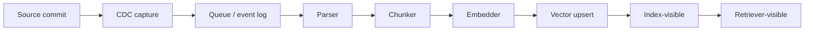
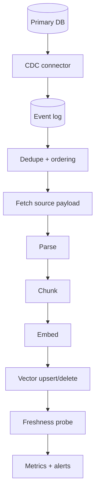
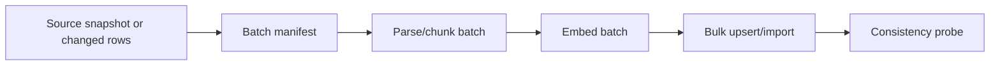

# 01 — Incremental Ingestion and CDC for Vector Stores

## Why freshness is hard in vector stores

A vector index is usually a **derived representation** of source data. The source document may change in a database, object store, CMS, file share, ticketing system, or SaaS application, but the vector store only sees the transformed output: parsed text, chunks, metadata, embeddings, sparse terms, ACLs, and index-specific payloads. Freshness therefore has multiple lag components:



A document is not truly fresh until the latest allowed version is visible to retrieval and stale versions are no longer returned. This distinction matters because many systems can **acknowledge writes before the index is query-visible**, and some index algorithms incorporate updates asynchronously.

## Freshness SLOs

Define freshness as a measurable SLO, not a vague property.

| Metric | Definition | Why it matters |
|---|---|---|
| `source_to_cdc_lag` | Time from source commit to CDC event creation. | Detects source connector lag. |
| `cdc_to_embed_lag` | Time from event availability to embedding job start/finish. | Detects worker saturation or rate-limit pressure. |
| `embed_to_upsert_lag` | Time from embedding completion to vector DB write acknowledgement. | Detects write throughput bottlenecks. |
| `write_to_query_visible_lag` | Time from vector DB write acknowledgement to searchable result. | Detects indexing lag or eventual consistency. |
| `end_to_end_freshness_lag` | Source commit → successful retrieval of the new version. | The user-visible freshness SLO. |
| `delete_visibility_lag` | Source delete → old chunk no longer retrievable. | Critical for compliance and correctness. |
| `stale_hit_rate` | Fraction of retrieval hits with outdated `source_version`. | Directly measures semantic staleness. |

Pinecone, for example, exposes a specific concept of checking data freshness after writes, which is useful because acknowledging writes and retrieval visibility are not always the same operational moment. See Pinecone's freshness guide.

## CDC versus scheduled crawls

| Pattern | Use when | Avoid when |
|---|---|---|
| Full crawl | Small corpus, infrequent updates, no need for near-real-time freshness. | Large data or strict freshness/deletion requirements. |
| Incremental crawl by `updated_at` | Source supports reliable update timestamps and deletes can be detected. | Clock skew, missing deletes, or mutable ACLs without updated timestamps. |
| Database CDC | Source is a database and row-level changes matter. | Source lacks stable primary keys or downstream cannot handle replay. |
| Event-driven webhooks | SaaS source emits reliable events. | Webhooks are lossy, unordered, or lack retry semantics. |
| Periodic full rebuild | Corpus changes are large but infrequent; blue-green swap is acceptable. | Users require minute-level freshness. |

CDC is usually superior when correctness matters because it observes the source's change log rather than inferring changes from timestamps. Debezium's design is the canonical open-source reference point for log-based CDC across databases. Kafka and Pub/Sub documentation are useful for understanding delivery guarantees, ordering, retries, and duplicate delivery constraints.

## Canonical event schema

A vector ingestion event should be self-describing and replayable:

```json
{
  "event_id": "uuid",
  "op": "upsert|delete|acl_update|reembed",
  "tenant_id": "tenant_123",
  "source_system": "postgres.public.documents",
  "source_doc_id": "doc_456",
  "source_pk": {"id": 456},
  "source_version": 42,
  "source_updated_at": "2026-05-18T19:24:00Z",
  "payload_ref": "s3://bucket/doc_456/version_42.json",
  "content_hash": "sha256:...",
  "acl_hash": "sha256:...",
  "emitted_at": "2026-05-18T19:24:02Z",
  "trace_id": "..."
}
```

The event should not rely on mutable state outside the event unless it also provides a stable pointer to that state. For large documents, store content in object storage and pass a content-addressed pointer.

## Idempotent upsert design

A vector write should be safe to retry. The safest record identity is deterministic:

```text
vector_id = tenant_id + "/" + source_doc_id + "/" + chunker_version + "/" + chunk_ordinal_or_chunk_hash
```

For edited documents, avoid generating random IDs for new chunks unless you have a separate cleanup process. Random IDs create duplicate stale chunks. Stable IDs let an upsert replace the previous vector for the same logical chunk. When chunk boundaries change, either use content-hash IDs plus a manifest that deletes missing chunks, or create a new `chunker_version`/`index_version` and perform a blue-green migration.

Recommended write contract:

```python
# pseudo-code
if incoming.source_version < existing.source_version:
    ignore_event_as_stale()
elif incoming.content_hash == existing.content_hash and incoming.acl_hash == existing.acl_hash:
    skip_embedding_and_touch_watermark()
else:
    embed_and_upsert(vector_id, vector, metadata)
```

## Ordering and duplicates

Most practical message systems are at-least-once at the application level. Even when a platform offers exactly-once delivery features, your vector writer must still be idempotent because downstream calls can timeout after a successful write.

Required protections:

- **Deduplication table** keyed by `event_id` or source LSN/offset.
- **Version check** so older events cannot overwrite newer vectors.
- **Per-document ordering** when source events for the same document must be processed serially.
- **Retry-safe writer** that treats duplicate upserts/deletes as success.
- **Dead-letter queue** with replay tooling.

Kafka's delivery-semantics documentation is the right conceptual reference for at-least-once, at-most-once, and exactly-once processing boundaries. Pub/Sub's ordering and exactly-once docs are useful when using GCP-native ingestion.

## Streaming ingestion pattern

Use streaming when freshness matters and document sizes are manageable.



Use this when:

- users expect updates within seconds or minutes;
- deletes must propagate quickly;
- ACLs change often;
- the corpus is large enough that full rebuilds are expensive;
- you need replayable lineage for audits.

Failure modes:

- embedding API rate limits create backlog;
- updates arrive faster than workers can parse/embed;
- poison documents block ordered partitions;
- large documents cause tail-latency spikes;
- repeated edits create churn and unnecessary re-embedding.

Mitigations:

- split by tenant/source partition;
- use dead-letter queues;
- debounce hot documents;
- skip re-embedding if only non-retrieval metadata changes;
- prioritize deletes and ACL updates ahead of low-priority embeddings.

## Micro-batch ingestion pattern

Use micro-batch when throughput and cost matter more than second-level freshness.



Good candidates:

- nightly knowledge-base refresh;
- backfills;
- large PDF/library ingestion;
- bulk re-embedding after model upgrade;
- sources with weak event APIs.

Key controls:

- **watermark table**: last successful source timestamp/LSN;
- **manifest file**: exact list of source records in the batch;
- **checksum comparison**: skip unchanged content;
- **batch-level audit**: rows read, chunks created, embeddings written, deletes issued;
- **partial retry**: failed documents do not force the entire batch to restart.

## Freshness probes

Freshness should be tested actively. Passive metrics can show that workers are idle, but they do not prove the vector store is returning the latest version.

Recommended probes:

1. Insert a synthetic document with a unique token.
2. Wait for ingestion and query it by vector and/or keyword.
3. Confirm the latest `source_version` and `index_version` are returned.
4. Delete it and confirm it no longer appears.
5. Record source-to-visible lag and delete-visible lag.

Use one probe per major tenant class and per deployment region if the system is multi-region.

## Backpressure and prioritization

Not all events are equal. In production, prioritize:

1. legal/security deletes;
2. ACL updates;
3. high-priority customer edits;
4. new documents;
5. low-priority re-embedding/backfills.

A practical architecture uses separate queues or priority lanes:

```text
critical-delete-queue
acl-update-queue
normal-upsert-queue
bulk-reembed-queue
```

Embedding workers should enforce rate limits per tenant and per model provider. Without tenant-aware throttling, a single tenant's backfill can starve all other tenants.

## When to use which ingestion pattern

| Need | Best pattern | Reason |
|---|---|---|
| Strict freshness and delete propagation | CDC streaming | Captures source changes continuously. |
| Cheap daily refresh | Micro-batch | Better throughput and lower operational complexity. |
| Large one-time migration | Bulk import + blue-green | Avoids polluting live index during build. |
| Sources without reliable CDC | Incremental crawl + periodic reconciliation | Better than full crawl, but must reconcile missed deletes. |
| Highly mutable documents | CDC + debounce + stable IDs | Prevents duplicate stale chunks and excessive re-embedding. |
| ACL-heavy enterprise data | CDC for ACL changes + query-time ACL filter | Prevents unauthorized stale access. |

## Sources

- [Debezium features](https://debezium.io/documentation/reference/stable/features.html)
- [Debezium PostgreSQL connector](https://debezium.io/documentation/reference/stable/connectors/postgresql.html)
- [Kafka delivery semantics](https://docs.confluent.io/kafka/design/delivery-semantics.html)
- [Google Pub/Sub exactly once](https://docs.cloud.google.com/pubsub/docs/exactly-once-delivery)
- [Google Pub/Sub ordering](https://docs.cloud.google.com/pubsub/docs/ordering)
- [Pinecone freshness](https://docs.pinecone.io/guides/index-data/check-data-freshness)
- [MongoDB change streams](https://www.mongodb.com/docs/manual/changestreams/)
