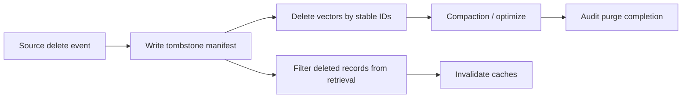

# 02 — Deletes, Tombstones, and Compaction

## The delete problem in vector search

Deletes are harder in vector systems than they appear. A source delete must remove or hide:

- the document-level record;
- all chunk-level vectors;
- sparse/keyword terms if hybrid retrieval is used;
- cached query results;
- cached embeddings for sensitive content;
- reranker or semantic-cache artifacts;
- ACL snapshots;
- replicas, backups, and snapshots according to retention policy.

Most systems implement deletion as **logical deletion first** and **physical reclamation later**. This is not unusual: search engines and LSM-style systems commonly mark records as deleted and reclaim space during background merge/compaction. The operational risk is that users assume a delete is physically gone when it is merely not query-visible.

## Logical delete versus physical purge

| Delete stage | Meaning | Typical latency | Risk |
|---|---|---:|---|
| Query-hidden tombstone | Record is marked deleted or removed from query path. | Seconds to minutes. | Stale caches may still expose it. |
| Segment/index cleanup | Deleted records are removed from active index structures. | Minutes to hours. | Storage and recall/latency may degrade until cleanup. |
| Snapshot/backup expiry | Deleted content ages out of backups. | Days to months. | Compliance policies must account for retention. |
| Cryptographic erasure | Encryption key destroyed or tenant data separately encrypted. | Operationally immediate after key deletion. | Requires key design up front. |

For compliance-sensitive systems, document which stage satisfies which policy. "Not returned in search" is not the same as "irrecoverably erased."

## Tombstone-first pattern

Use tombstones to make deletes replayable, auditable, and safe under eventual consistency.



A tombstone record should include:

```json
{
  "tenant_id": "tenant_123",
  "source_doc_id": "doc_456",
  "deleted_at": "2026-05-18T20:01:00Z",
  "delete_reason": "source_delete|gdpr|acl_revoke|superseded",
  "source_version": 43,
  "chunk_ids": ["doc_456#chunk_001", "doc_456#chunk_002"],
  "index_versions_affected": ["kb-v11", "kb-v12"],
  "purge_deadline": "2026-05-19T20:01:00Z"
}
```

The tombstone should be durable outside the vector DB so that a rebuild cannot accidentally resurrect deleted records from old source snapshots.

## Delete by ID versus delete by filter

| Method | Best for | Weakness |
|---|---|---|
| Delete by vector/chunk ID | Precise deletes, stable chunk IDs. | Requires manifest of all chunk IDs. |
| Delete by document ID metadata filter | Removes all chunks for a document. | Depends on vendor filter-delete support and metadata indexing. |
| Delete by tenant namespace/index | Offboarding a tenant. | Coarse; expensive if tenant shares index and only partial delete is needed. |
| Tombstone filter at query time | Immediate safety layer. | Adds filter overhead and does not reclaim space. |
| Blue-green rebuild excluding deleted docs | Large cleanup or model/schema migration. | Requires duplicate capacity and swap process. |

The safest pattern is usually **tombstone immediately + delete by stable IDs + periodic reconciliation**.

## Vendor-specific delete/cleanup notes

| Vendor | Operational delete notes |
|---|---|
| Pinecone | Supports deletes and namespaces; freshness should be checked. Physical internals and atomic swap semantics are not fully exposed in public docs. |
| Weaviate | Public docs expose tombstone and cleanup-related vector index configuration; multi-tenant collection design can limit delete blast radius. |
| Milvus/Zilliz | Milvus uses delete records and compaction mechanisms; release notes mention L0 compaction improvements. Operational tuning around compaction matters for high-delete workloads. |
| Qdrant | Supports point deletes and snapshots. Collections/shards influence cleanup and blast radius. |
| pgvector | Deletes are PostgreSQL deletes; MVCC, autovacuum, index bloat, and VACUUM/REINDEX practices apply. |
| Elastic/OpenSearch | Deletes are marked and reclaimed during segment merges; force-merge can reclaim disk but is operationally expensive and should be used carefully. |
| Vespa | Document feed/delete operations are part of serving; reindexing is a separate managed process for schema/index changes. |
| LanceDB | Documentation describes update/delete behavior and table versioning; deleted rows may remain until optimize/cleanup depending on table lifecycle. |
| Chroma | Upsert/delete semantics exist; for Cloud/OSS internals, verify current behavior for physical retention and backups. |
| Redis | Key deletion or index deletion can be immediate for active keys; persistence/backups and replicas must be considered. |
| MongoDB Atlas Vector Search | Deletes follow MongoDB document semantics; vector search index propagation is a serving-index concern. Change streams can drive downstream invalidation. |
| Vertex AI Vector Search | Supports batch/stream update paths depending on index type; update/rebuild docs should guide delete propagation and rebuild choices. |
| Azure AI Search | Deletes can be pushed through indexing APIs; aliases help swap indexes during cleanup/rebuild. |

## Stale-delete failure modes

1. **Chunk leak**: document deleted but old chunk IDs were random and cannot be enumerated.
2. **Cache leak**: vector DB no longer returns content, but result cache still does.
3. **ACL leak**: content remains but access revoked; old ACL metadata remains in index/cache.
4. **Backup mismatch**: user-facing system says deleted, but backups retain content beyond policy.
5. **Dual-index mismatch**: old index version still contains deleted content during migration.
6. **Filter-only delete**: tombstone filter hides data but high tombstone ratio degrades search/storage.

## Reconciliation job

Run a periodic delete reconciliation job:

```text
For each tombstone not confirmed_purged:
  1. Query by source_doc_id and chunk IDs across all active index versions.
  2. Confirm no hits are returned without admin override.
  3. Confirm caches do not contain keys for the document/tenant/version.
  4. Confirm the tombstone is included in rebuild exclusion manifests.
  5. Mark purge stage: query_hidden, index_deleted, backup_expired, fully_purged.
```

## Delete SLOs

| SLO | Typical target |
|---|---:|
| Security/ACL delete hidden from search | < 60 seconds for sensitive systems. |
| Normal source delete hidden from search | < 5–15 minutes. |
| Physical compaction | Hours to days, workload-dependent. |
| Backup expiry | Policy-driven; document explicitly. |
| Tenant offboarding purge | Contract-driven; often needs dedicated runbook. |

## When to use which delete pattern

| Situation | Recommended delete pattern |
|---|---|
| Normal document edit | Upsert new chunks, delete missing old chunk IDs from manifest. |
| Hard source delete | Tombstone + delete all known chunk IDs + cache invalidation. |
| ACL revoke | Treat like critical delete for unauthorized users; update ACL metadata and invalidate results. |
| Tenant offboarding | Namespace/index/collection drop if possible; separate cluster/database makes this simplest. |
| High tombstone ratio | Blue-green rebuild or compaction/optimize window. |
| Compliance purge | Dedicated tombstone ledger, audit proof, backup retention policy, and possibly crypto-erasure. |

## Sources

- [Weaviate vector index config](https://docs.weaviate.io/weaviate/config-refs/indexing/vector-index)
- [Milvus release notes](https://milvus.io/docs/v2.4.x/release_notes.md)
- [Elastic disk usage](https://www.elastic.co/docs/deploy-manage/production-guidance/optimize-performance/disk-usage)
- [LanceDB updates](https://docs.lancedb.com/tables/update)
- [Qdrant fundamentals](https://qdrant.tech/documentation/faq/qdrant-fundamentals/)
- [Elastic aliases](https://www.elastic.co/docs/manage-data/data-store/aliases)
- [OpenSearch aliases](https://docs.opensearch.org/latest/im-plugin/index-alias/)
- [Azure Search aliases](https://learn.microsoft.com/en-us/azure/search/search-how-to-alias)
- [Weaviate aliases](https://docs.weaviate.io/weaviate/manage-collections/collection-aliases)
- [Vespa reindexing](https://docs.vespa.ai/en/operations/reindexing.html)
- [Vertex update/rebuild index](https://docs.cloud.google.com/vertex-ai/docs/vector-search/update-rebuild-index)
