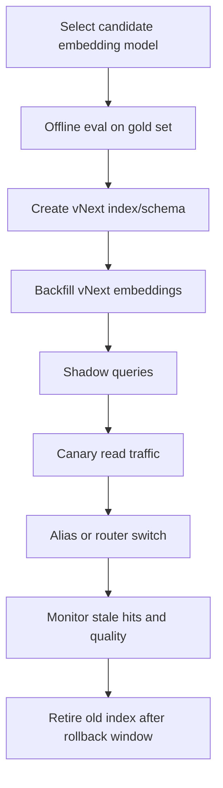

# 03 — Re-embedding and Model Upgrades

## Why model upgrades are operational migrations

Changing an embedding model is not a small parameter update. It can change:

- vector dimension;
- distance metric suitability;
- similarity score distribution;
- multilingual behavior;
- query/document alignment;
- recall and precision under filters;
- storage size and index memory;
- cache keys;
- reranker calibration;
- downstream prompt grounding.

If vector dimension changes, most vector databases require a new field, collection, or index. Even when dimensions match, mixing vectors from different embedding models in the same ANN space is usually invalid unless explicitly calibrated.

## Version every representation

Every stored vector should include at least:

```json
{
  "embedding_model": "model-name",
  "embedding_model_version": "provider-or-internal-version",
  "embedding_dim": 1536,
  "distance_metric": "cosine",
  "chunker_version": "recursive-v4",
  "parser_version": "pdf-layout-v2",
  "normalizer_version": "html-clean-v3",
  "schema_version": "kb-doc-v5",
  "index_version": "kb-v12"
}
```

Do not treat the embedding model as the only version. Parser and chunker changes can alter the retrieval unit as much as the embedding model.

## Three upgrade types

| Upgrade type | Example | Operational impact |
|---|---|---|
| Same model, same dimensions | Provider patch or internal deployment change. | Re-embedding may be optional but evaluate drift. |
| New model, same dimensions | Switch model but dimension remains 768/1536/etc. | Requires parallel evaluation; avoid mixing unless validated. |
| New model, different dimensions | 1536 → 3072 or dense+sparse schema change. | Requires new vector field/index/collection and migration. |

## Recommended upgrade path



## Offline evaluation before re-embedding

Before spending money on a full re-embed, sample representative data:

- head queries, torso queries, and tail queries;
- short and long documents;
- noisy PDFs/tables/code if present;
- multilingual examples;
- high-filter-selectivity queries;
- tenants with unusual domains;
- known failure cases.

Evaluate:

- recall@k;
- MRR/NDCG;
- answer faithfulness after generation;
- citation correctness;
- latency and p95/p99;
- storage and memory footprint;
- cost per million documents and per million queries;
- score distribution shift.

## Backfill strategy

| Strategy | Use when | Tradeoff |
|---|---|---|
| Full backfill into vNext | Model/schema change is major. | Highest cost but safest. |
| Lazy re-embedding on access | Huge corpus, most documents cold. | Mixed freshness; requires fallback to old index. |
| Priority backfill | Hot documents first, cold later. | Better user impact/cost balance. |
| Dual-write new updates only | You are preparing migration gradually. | Old corpus still must be backfilled or routed. |
| Hybrid old+new retrieval | During transition only. | Hard to calibrate scores across embedding spaces. |

## Dual-index migration

For most production systems, use dual indexes:

```text
kb_v11: old model, old chunking
kb_v12: new model, maybe new chunking
alias/read_router: determines active or canary index
```

Steps:

1. Freeze schema contract for vNext.
2. Create vNext index/collection/vector field.
3. Backfill from source-of-truth, not from old vector store.
4. Apply tombstone ledger so deleted documents are not resurrected.
5. Replay CDC from a known watermark.
6. Run shadow queries against both indexes.
7. Canary a small percentage of tenants or traffic.
8. Swap alias/router.
9. Keep old index for rollback until confidence window passes.
10. Retire old index and invalidate caches keyed to it.

## Mixed-model retrieval warning

Do not put different embedding models into the same vector field unless you have a strong reason and proof. Approximate nearest neighbor search assumes distances are comparable within the indexed space. Mixing models breaks that assumption.

Bad pattern:

```text
same index:
  doc A vector from model_v1
  doc B vector from model_v2
  query vector from model_v2
```

Better pattern:

```text
index_v1: model_v1
index_v2: model_v2
router/alias decides active version
```

## Re-embedding when only metadata changes

Not every source update should trigger embedding. Separate update classes:

| Change | Re-embed? | Action |
|---|---|---|
| Body text changed | Yes | Re-parse, re-chunk, re-embed affected chunks. |
| Title changed | Usually yes if title is part of chunk text. | Re-embed chunks that include title. |
| ACL changed | No | Update metadata and invalidate result caches. |
| Tag/category changed | No | Update metadata/filter index. |
| Typo/minor whitespace | Maybe no | Use normalized content hash threshold. |
| Parser/chunker changed | Yes | Treat as representation migration. |
| Embedding model changed | Yes | New index or vector field. |

## Cost controls

Re-embedding can dominate operational cost. Use:

- content hashes to skip unchanged text;
- chunk-level hashes to avoid re-embedding stable chunks;
- priority queues for hot documents;
- embedding cache keyed by `(normalized_text_hash, embedding_model_version)`;
- batch APIs where available;
- throttles per tenant and source;
- resumable manifests;
- spot/low-priority compute for backfill when feasible.

## Rollback plan

A model upgrade is not complete until rollback is tested.

Rollback checklist:

- old index still exists and is queryable;
- old index received CDC during migration or can be replayed;
- aliases/router can switch back quickly;
- caches include index/model version in keys, so rollback does not serve mixed results;
- evaluation dashboards compare old versus new retrieval;
- tombstones apply to both old and new indexes.

## When to upgrade

Upgrade when:

- offline evaluation shows meaningful recall or faithfulness gains;
- current model lacks language/domain support;
- dimension reduction materially lowers cost with acceptable quality;
- provider deprecates a model;
- new model supports needed truncation or multilingual behavior;
- security/compliance requires moving model provider.

Do not upgrade just because a benchmark score is higher. A retrieval system is shaped by chunking, filters, reranking, prompt patterns, and tenant data distribution.

## Sources

- [Pinecone indexing overview](https://docs.pinecone.io/guides/index-data/indexing-overview)
- [Pinecone freshness](https://docs.pinecone.io/guides/index-data/check-data-freshness)
- [Weaviate aliases](https://docs.weaviate.io/weaviate/manage-collections/collection-aliases)
- [Elastic aliases](https://www.elastic.co/docs/manage-data/data-store/aliases)
- [OpenSearch aliases](https://docs.opensearch.org/latest/im-plugin/index-alias/)
- [Azure Search aliases](https://learn.microsoft.com/en-us/azure/search/search-how-to-alias)
- [Vertex update/rebuild index](https://docs.cloud.google.com/vertex-ai/docs/vector-search/update-rebuild-index)
- [LanceDB versioning](https://docs.lancedb.com/tables/versioning)
- [pgvector README](https://github.com/pgvector/pgvector/blob/master/README.md)
