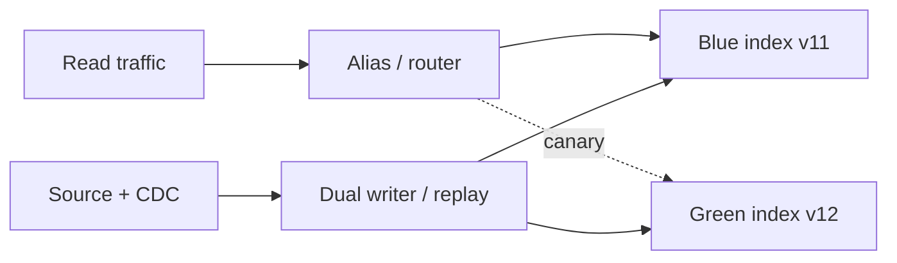

# 04 — Blue-Green Reindexing and Index Versioning

## What blue-green means for vector indexes

Blue-green indexing means you maintain an existing production index (**blue**) while building a replacement index (**green**) in parallel. When green passes validation, you atomically or near-atomically route reads to green. If problems appear, you route back to blue.



This is the safest pattern for embedding model upgrades, chunker changes, ANN parameter changes, schema changes, and large tombstone cleanup.

## Why in-place mutation is risky

In-place index mutation can be fine for normal upserts, but it is risky for structural changes:

- vector dimension cannot usually change in place;
- HNSW/IVF/quantization parameters may require rebuild;
- parser/chunker changes alter chunk IDs and counts;
- delete cleanup may require compaction or segment merge;
- hybrid retrieval changes may require sparse/keyword index changes;
- rollback is hard if old representation is overwritten.

Blue-green gives you a rollback path and a controlled validation window.

## Index version naming

Use predictable names:

```text
kb_prod_v001
kb_prod_v002
tenant_123_kb_v007
search_docs_modelA_chunker4_2026_05_18
```

Store a manifest:

```json
{
  "index_version": "kb_prod_v012",
  "created_at": "2026-05-18T12:00:00Z",
  "source_snapshot": "s3://snapshots/kb/2026-05-18/manifest.json",
  "cdc_start_offset": "postgres-lsn:0/16B6C50",
  "embedding_model": "...",
  "chunker_version": "...",
  "parser_version": "...",
  "vector_db": "...",
  "index_params": {"algorithm": "hnsw", "M": 32},
  "status": "building|shadow|canary|active|retired"
}
```

## The safe migration sequence

1. **Snapshot source state** or record a CDC watermark.
2. **Create green index** with the new schema/index configuration.
3. **Bulk backfill** green from the source snapshot, excluding tombstones.
4. **Replay CDC** from the watermark into green.
5. **Dual-write** new events to blue and green if migration window is long.
6. **Shadow-read** green without exposing answers to users.
7. **Canary-read** a small traffic slice or a few tenants.
8. **Swap alias/router** to green.
9. **Monitor quality, latency, freshness, and delete leakage.**
10. **Retain blue** for rollback until the confidence window expires.
11. **Retire blue** after snapshots/backups and compliance policies are satisfied.

## Alias versus router

| Mechanism | Description | Best for |
|---|---|---|
| Database-native alias | Vendor supports index/collection alias that points to active backing index. | Elastic, OpenSearch, Azure AI Search, Weaviate-like alias-capable systems. |
| Application router | App maps logical corpus name to physical index. | Vendor lacks native atomic alias or you need tenant-level canaries. |
| DNS/service routing | Route whole service endpoint to new deployment. | Separate cluster migration. |
| Feature flag | Per-tenant or per-user routing. | Safe canaries and A/B testing. |

Native aliases are convenient, but application routers are more flexible for multi-tenant canaries.

## Validation gates

Green should not become active until it passes these gates:

| Gate | Example check |
|---|---|
| Cardinality | Number of docs/chunks within expected range. |
| Tombstone exclusion | Deleted docs absent from green. |
| Freshness | Green caught up to CDC watermark. |
| Query quality | Recall/NDCG/answer faithfulness not degraded beyond threshold. |
| Latency | p50/p95/p99 within budget. |
| Filter correctness | Metadata/ACL filters match blue or expected behavior. |
| Tenant isolation | Cross-tenant queries return zero leakage. |
| Cost | Memory/storage/QPS cost within plan. |

## Dual-write versus replay-only

| Pattern | Pros | Cons |
|---|---|---|
| Replay-only | Simpler writer; deterministic migration. | Green can fall behind if replay is slow. |
| Dual-write | Keeps green closer to live. | More code paths; must handle partial failures. |
| Freeze writes | Simplest consistency model. | Usually unacceptable for production. |

Use replay-only for short migrations. Use dual-write for long migrations or very large corpora.

## Rollback

Rollback should be a practiced operation:

```text
if green_quality_degrades or p99_explodes:
  1. switch alias/router back to blue
  2. stop green-only writes
  3. confirm blue CDC lag is acceptable
  4. invalidate result caches with index_version=green
  5. write incident report and diff failing queries
```

Do not delete blue immediately after the first successful swap.

## Vendor notes

| Vendor | Blue-green/index-version support pattern |
|---|---|
| Elastic | Native aliases are a standard mechanism for read/write routing and index swaps. |
| OpenSearch | Index aliases support blue-green-style routing. |
| Azure AI Search | Index aliases let clients point to an alias instead of a physical index. |
| Weaviate | Collection aliases can support active-collection routing. |
| Vespa | Reindexing is a built-in operational process for schema/index changes; deployment model differs from alias-swap search engines. |
| Vertex AI Vector Search | Docs support update/rebuild paths; treat large representation migrations as parallel index deployments. |
| LanceDB | Table versioning supports reproducible snapshots and rollback-like data operations; application routing may still be needed. |
| Pinecone | Namespaces/indexes can be versioned at application level; native atomic alias semantics were not clearly specified in the public docs reviewed. |
| Qdrant | Use collection aliases/application routing if available in your deployment version; otherwise version physical collections and route in application. |
| pgvector | Use table/view/schema versioning, transactional DDL where possible, and application routing. |

## When to use blue-green

Use blue-green for:

- embedding model upgrades;
- dimension changes;
- ANN parameter rebuilds;
- chunking/parser changes;
- major metadata schema changes;
- index compression changes;
- large tombstone cleanup;
- vendor migration.

In-place update is acceptable for:

- normal document content update with same chunking/model;
- metadata-only update;
- small deletes;
- small additions.

## Sources

- [Elastic aliases](https://www.elastic.co/docs/manage-data/data-store/aliases)
- [OpenSearch aliases](https://docs.opensearch.org/latest/im-plugin/index-alias/)
- [Azure Search aliases](https://learn.microsoft.com/en-us/azure/search/search-how-to-alias)
- [Weaviate aliases](https://docs.weaviate.io/weaviate/manage-collections/collection-aliases)
- [Vespa reindexing](https://docs.vespa.ai/en/operations/reindexing.html)
- [Vertex update/rebuild index](https://docs.cloud.google.com/vertex-ai/docs/vector-search/update-rebuild-index)
- [LanceDB versioning](https://docs.lancedb.com/tables/versioning)
- [Pinecone freshness](https://docs.pinecone.io/guides/index-data/check-data-freshness)
